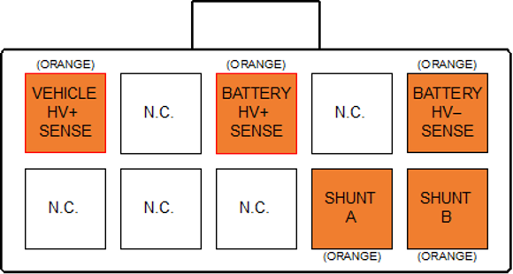

# High Voltage Sense

The HV Sense connector allows the BMU to measure the total pack voltage (pack side of the contactors), total DC bus voltage (vehicle side of the contactors), and total pack current flow.  This information is used to control precharge and pack safety, and to calculate pack Amp-Hours (Ah) usage and SOC. 

The BMU provides a mechanism for measuring pack current using a resistive shunt.  This is preferred over hall-effect based sensors as it provides much lower drift, allowing more accurate State of Charge (SOC) integration calculation.   

The HV Sense connector and associated electronics are isolated from the remainder of the BMU.  Take care when routing wiring around this connector to maintain good isolation between it and the rest of the vehicle system. 

Wire the Vehicle HV+ and Battery HV+ sense wires to their respective sides of Contactor 2 in the positive rail.  Wire the Battery HV– and Shunt sense wires to their respective sides of the current shunt in the negative rail.  Refer to the BMS wiring diagram in the [Appendix](../../Appendix/70_Appendix_A.md) for more details.   

Please note that this sense wiring must be rated for the full pack voltage, although it is low current so a small gauge wire can be used.  Check the relevant wiring standards regarding wire rating and colours, for example NCOP14 (in Australia) specifies Orange wire for all battery pack and other HV system wiring. 

The Battery HV– and Shunt sense wires should be twisted together to minimise noise pickup between the BMU and the shunt.  It is suggested to have these wires no longer than 300-400mm. 

## High Voltage Sense Connector

The connector used for the HV Sense is a 10-way 4.2mm pitch Molex MiniFit Jr connector.  The pinout is shown below, as viewed from the wire side – as you would look at it while inserting crimps.  The colours shown match those recommended in most EV wiring standards for HV DC wiring. 

<figure markdown>

<figcaption>BMU Connectors</figcaption>
</figure>

<figure markdown>

<figcaption>High Voltage Sense Connector</figcaption>
</figure>

| Sense                 | Location                     |               
| --------------------- | ---------------------------- |
| `Vehicle HV+ Sense`   | Vehicle side of Contactor 2 | 
| `Battery HV+ Sense`   | Battery side of Contactor 2 |
| `Battery HV- Sense`   | Battery side of 25mV Shunt   |             
| `Shunt A`             | Vehicle side of 25mV Shunt   |          
| `Shunt B`             | Battery side of 25mV Shunt   |       

## HV Sense Fusing 

All HV Sense connections should be fused with an appropriately rated fuse for the type of wire used for the sense connection.  This fuse should be low current (since the sense wiring uses small wires) and rated for the full DC pack voltage.  The fuse should be located towards the supply end of the sense wiring. See [Fusing](../../10_Warnings.md). 

## Shunt Selection

The BMU Shunt Sense input has a full-scale range of ±25mV, relative to the Battery HV– Sense input.  This allows the use of a standard 50mV shunt running at half its rated current to minimise heat buildup and thermal drift effects, since it will be installed inside the battery pack.   

Choose a full-scale range slightly over the expected maximum battery current.  As an example, a Prohelion [WaveSculptor200](../../../../Motor_Controllers/WaveSculptor200/User_Manual/index.md) motor controller driving an induction motor may have an expected maximum power consumption of 90kW.  At a 400V battery voltage, this is 225A.  Choose a full scale of 250A to allow some headroom on the measurement.  Since we wish to use a standard 50mV shunt at half rating, you would therefore select a 500A/50mV shunt. 

The value of the shunt can be set in the user-interface software. 