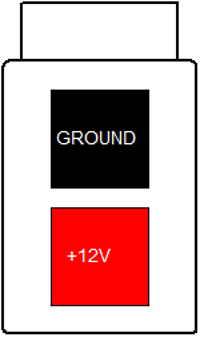
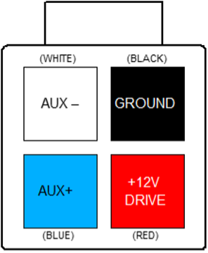

# Contactors

The BMU provides three outputs for driving HV contactors with 12V coils.  At a minimum Contactors 1 & 2 are required for pack safety, although this option still presents a shock hazard (via the precharge resistor) in a single-fault situation to the rest of the system.  A professional design will use all three contactors.   

The contactors are energised in sequence (1, 3, 2) during precharge, and de-energised when shutting down the system both under user command and due to a fault being detected by the BMS.  The BMU operates the contactors to protect the cells above all other priorities. 

Each contactor output connector also has pins for feedback from contactors with auxilliary sense contacts.  These can be used by the BMU to detect failed contactors, both failed open or welded shut.  Do not connect these pins to anything other than auxilliary contact output terminals – they are not rated for anything more than the 12V supplied by the BMU. 

Contactors without integrated electronics must have a diode fitted across their coil terminals to limit flyback voltage at turn-off.   

## Contactor Selection

The three contactors used to break the HV DC connections must be appropriately rated for the currents and voltages seen during both normal use and during fault situations.  Typical parts used in automotive sized packs are the Tyco EV200 or the __Gigavac GX11__ or __GX12 series__.  Selection of these parts is beyond the scope of this document. 

## Contractor 12V Supply Connector

The connector used for the Contactor 12V supply input is a 2-way 4.2mm pitch Molex MiniFit Jr connector.  The pinout is shown below, as viewed from the wire side – as you would look at it while inserting crimps. 

<figure markdown>

<figcaption>BMU Connectors</figcaption>
</figure>

<figure markdown>

<figcaption>Contractor 12V Input Connector</figcaption>
</figure>

This connection should be wired to the vehicle 12V DC supply via the emergency stop switch (if fitted), the G-force impact switch, an optional HV disable switch, and a fuse.  It requires a low impedance connection to the vehicle battery, since most contactors draw a large current inrush during turn-on, and a poor connection will result in contactor chattering and/or precharge fault trips.   

This connection draws no current when the BMS is in the off state, and does not have to be routed via the ignition key.  Connecting it to a permanent source of power (rather than via the ignition key) allows the BMS to operate the contactors without the ignition key switched on, for example during charging. 

## Contactor Output Connectors

The connectors used for the Contactor drive outputs are a 4-way 4.2mm pitch Molex MiniFit Jr connector.  The pinout is shown below, as viewed from the wire side – as you would look at it while inserting crimps. The colours shown match those used by the Gigavac GX11 and GX12 family of contactors. 

<figure markdown>

<figcaption>BMU Connectors</figcaption>
</figure>

<figure markdown>

<figcaption>Contractor Output Connector</figcaption>
</figure>