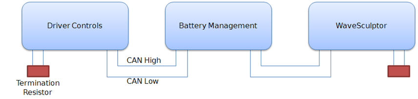
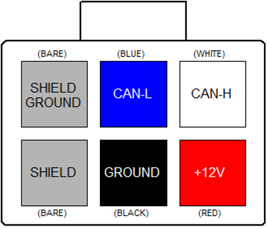

# CAN Bus Network
The CAN bus is structured as a linear network, with short stubs branching from 'T' connectors on the main bus backbone to each device.  The CAN bus data lines must be terminated at each end of the main bus with 120 ohm resistors between the CAN-H and CAN-L signals. 

In the range of Prohelion EV products, including EV Driver Controls and BMU, the CAN connections are implemented with an 'in' and an 'out' connector, therefore placing the 'T' on the device, resulting in a very short fixed-length stub on the circuit board of each device.  This is ideal from a signal integrity and network performance point of view. 

<figure markdown>

<figcaption>CAN Network Topology</figcaption>
</figure>

The BMU uses the vehicle CAN bus to receive operating and configuration commands and transmit telemetry, as well as a source of low-voltage DC power to operate the electronics. 

## CAN Wiring

The CAN data lines (CAN-H and CAN-L) must be implemented with twisted-pair wire for proper data integrity.  The wire should have a characteristic impedance of 120 ohms.   

Power should also be provided along the CAN cable, ideally with another twisted pair to minimise noise pickup.  An overall shield can also be advantageous.   

The optimal choice of cable is 7mm Devicenet CANbus 'thin' cable, with 24AWG (data) + 22AWG (power) twisted pairs and a braided shield.  Using this cable will result in a robust installation, with high immunity to noise, low voltage drop in the power cable, and reliable CAN communications.  Using alternative cabling will usually result in problems during operation. 

## Vehicle CAN Bus Connectors

The connector used on the BMU and other Prohelion devices for the CAN connection is a 6-way 3mm pitch Molex MicroFit connector.  The pinout is shown below, as viewed from the wire side – as you would look at it while inserting crimps.  The colours shown match those in the standard DeviceNet CAN cabling pairs. 

<figure markdown>

<figcaption>DeviceNet CAN Cabling Pairs</figcaption>
</figure>

## CAN Shielding

If the recommended braided shield is used in the cable, then terminate it to the SHIELD pin (lower-left corner on the connector) on both CAN IN and CAN OUT connectors on each device.   

On __ one device only in the network,__ instead of using the SHIELD pin, terminate the shield to the SHIELD GROUND pin (upper-left corner on the connector) on both CAN IN and CAN OUT connectors, to ground the shield for the entire network at this single point.  The usual place to do this is where power is fed into the network, typically at Prohelion's __EV Driver Controls __product. 

## CAN Termination

To implement the required 120 Ohm termination resistor at each end of the CAN bus, plug a connector into the unused CAN connector on the last device at each end of the network with a resistor crimped into the appropriate locations. 

## Communication

The CAN standard does not specify high-level message protocols. Prohelion devices use a custom protocol, outlined in the communication specification document for each device. 

By default, each device operates at 500 kbits/second and comes programmed from the factory with a CAN base address that will allow it to work in unison with other Prohelion devices. The CAN bit rate and base address can be set with the Windows BMS configuration software. 

## Power Supply

The BMS electronics operate from 12V supplied on the CAN bus connector, which is switched on by the Prohelion EV Driver Controls when it is in accessories or run key switch positions.   

A second high-current 12V supply connection is present for contactor and fan operating power, refer to the precharge section of this document for more details.  The CAN Ground and Contactor Supply Ground must be both tied to the vehicle chassis at some point in the system. 

The allowable voltage range for both supplies is 10-15V. 