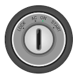

# Incoming CAN Packets

The BMU is expecting regular (>5Hz) CAN packets from Prohelion's EV Driver Controls or another control system, with the current state of the switches. Note that even for ground mounted or non-vehicle use of the BMU the concept of a Driver Control is still used as the foundation of how to engage the BMU. Specifically, the BMU is looking for the current state of the IGNITION RUN and IGNITION START switches as per a motor vehicle, to use in controlling the pre-charge state machine.  

The base ID of the EVDC can be set in the BMS configuration software, with the switch position packet being sent at +5 above the base ID.  By default, the EVDC base ID is 0x500, making the switch position ID at 0x505.

## EV Driver Controls Switch Position

The BMU is controlled by commands that come from either an Electric Vehicle Driver Control or an external control system that sends the EVDC packet via CAN bus.

EVDC packet contains Boolean flags that indicate the switch positions of the Electric Vehicle Driver Control unit. This set of flags is intended to replicate the set of key positions from an automotive ignition key barrel. 

| CAN ID:       | 0x505 - Interval 10Hz                                                                               | 
|---------------|-----------------------------------------------------------------------------------------------------|
| `data_u16[0]` | 0x0000 = Off/Safe  0x0010 = Accessories   0x0020 = Ignition Run   0x0040 = Ignition Start |
| `data_u16[1]` | Unused by BMU                                                                                       | 
| `data_u16[2]` | Unused by the BMU                                                                                   | 
| `data_u16[3]` | Unused by the BMU                                                                                   | 
  
## Engaging the BMU using CAN

The BMU requires regular packets from the controller (>5Hz) and will engage based on instructions provided in the Driver Control Switch Position from the table above where the values are supplied on the 0x505 (by default) packet in the data_u16[0] position.

The following table outlines the sequence of switch flags that must be sent to engage the BMU.

| Signal:                                                                            | Behaviour: |
|------------------------------------------------------------------------------------|------------|
| `0x0000 = Off`                                                                     | __Off/Safe:__   If no errors are present, this will move the BMU to the IDLE state. In IDLE state no contactors will be engaged and the BMU is ready to commence the pre-charge process.                                                               |
| `0x0010 = Accessories (0x10)`                                                      | __Accessories:__   This flag is unused by the BMU but is used by other Prohelion products.                                     |
| `0x0070 = Accessories (0x10) + Ignition run (0x20) + Ignition Start (0x40)`| __Start (Momentary):__   If no errors are present, the BMU will commence the pre-charge sequence. The pre-charge sequence will engage the negative and pre-charge contactors until the load is charged to the pre-charge voltage threshold. Once successful the BMU will enter the RUN state.  If the load does not charge up to the recharge voltage threshold, then the BMU will move to ERROR state.                                                                                            |
| `0x0030 = Accessories (0x10) + Ignition run (0x20)`                            | __Run:__   Once the BMU has entered the RUN state, the Ignition Start (0x40) flag should be removed. This is an additional safety precaution to prevent the BMU from commencing the pre-charge process after an unexpected power cycle or reboot. This set of flags should be sent for the entire duration that the main contactors should be engaged. If the system is required to disengage the main contactors, then then all flags should be cleared.                             |

Alternatively, Prohelion’s Profinity software solution can be used to engage the pack via the Battery Controller panel.  When using Profinity it transitions through these states to engage your pack.

## BMU Engagement State Diagram 

The following diagram shows how the BMU transitions though the various states on the way to either being successfully engaged or not, using the CAN messages outlined above.

