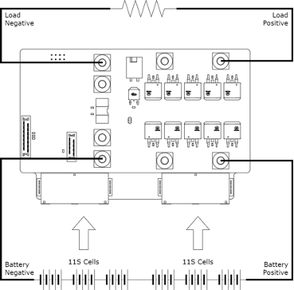
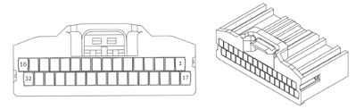
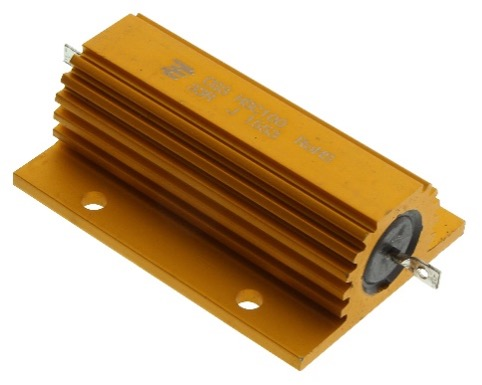

# Connectors

This section specifies the connector types and connector pinouts for the external connections of the Prohelion 48V BMS.

## Connector Part Numbers

The table below lists the part numbers for each connector used by the Prohelion 48V BMS.

| Connector Name                                      | Receptacle Part Number | Plug Part Number      | 
|-----------------------------------------------------|------------------------|-----------------------|
| `Data and Front Panel`                              | N/A | WR-WST REDFIT IDC  SKEDD 490107671412    |
| `Cell Voltage and Temperature Sense, Most Positive` | JAE Electronics MX34R32HF4T (32 pin, dual row) | JAE Electronics MX34032SF1 |
| `Cell Voltage and Temperature Sense, Most Negative` | JAE Electronics MX34R32HF4T (32 pin, dual row) | JAE Electronics MX34032SF1 |
| `Load Negative and Load Positive`                   | Wurth Elektronik 7460408 (M5 internal thread)  | Generic M5 terminal lug |
| `Battery Negative and Battery Positive`             | Wurth Elektronik 7460408 (M5 internal thread)  | Generic M5 terminal lug |
| `Precharge Resistor`                                | Wurth Elektronik 649002127222 (WR-MPC4 4.20 mm Dual Row 2-Pin) | Wurth Elektronik 649002113322 |

## Connector Viewing Direction

All connector diagrams in this document assume that the end-user is viewing the connector receptacle from the rear. The pin numbering in the connector diagrams is in alignment with the pin numbering specified in the datasheet of each connector type.

Figure 4: Connector Viewing Direction

## High-Current Connections

There are four high current connections between the BMS, the battery cells and the load:

- Battery Negative: Connected to the negative terminal of the most negative cell in the battery.
- Battery positive: Connected to the positive terminal of the most positive cell in the battery.
- Load negative: Connected to the negative (ground) terminal of the load.
- Load positive: Connected to the positive terminal of the load.

The simplified system diagram below shows the arrangement of these high-current connections.

Figure 5: High Current Connections for Prohelion 48V BMS

## Front Panel Connector

The Front Panel Connector provides an interface for the CAN bus communication, Status LEDs and BMS power switch that is exposed on the front panel PCB of a battery system. The selection of the front-panel connector is intended to make to wiring and connection of the front panel PCB simple and easy. The 14-way SKEDD connector and associated 14-way IDC ribbon cable ensures that the pin-out between the BMS and the front-panel PCB is not mistakenly swapped around or inserted in the wrong orientation. 

When crimping the SKEDD connectors onto the IDC ribbon, always ensure that pin-1 of the first connector is connected to pin-1 of the second connector. IDC ribbons typically have the first conductor marked with red to indicate that it is pin-1. The pin number labels apply for both the BMS side and the Front Panel PCB side of the harness.

Figure 6: Front Panel Connector Pinout

| Pin Number | Label                               |
|------------|-------------------------------------|
| `1`        | GND                                 |
| `2`        | 3.3V Output                         |
| `3`        | Power Enable In (Batt+ Fused at 1A) |
| `4`        | Power Enable Out                    |
| `5`        | NC                                  |
| `6`        | SoC20% LED                          |
| `7`        | SoC40% LED                          |
| `8`        | SoC60% LED                          |
| `9`        | SoC80% LED                          |
| `10`       | SoC100% LED                         |
| `11`       | Error LED                           |
| `12`       | Status LED                          |
| `13`       | CAN High                            |
| `14`       | CAN Low                             |

## Cell Sense Connector A

The Cell Sense Connector A provides an interface for the cell sense connections to the 11 most-negative cells of a 22S battery system (Cells 1-11).

The pins labelled as TOPSTACKA (Pin 3) and GNDA (Pin 27) provide the power required to run the cell monitoring chip when the microcontroller is enabled. Ideally, these connections are independent of the cells sense connections (Pins 5 and 27) and are wired as separate electrical conductors directly to the cells. This reduces the impact of voltage drop caused by the power consumption of the cell monitoring chip that would interfere with the voltage sense readings and cell balancing.

Only a Murata Electronics NXFT15XH103FA2B100 thermistor should be used for temperature sense. Any other part will have a different B-Constant and result in incorrect temperature readings. 

Figure 7: Cell Sense Connector A Pinout

| Pin Number | Label                       | Pin Number | Label          |
|------------|-----------------------------|------------|----------------|
| `1`        | NC                          | `17`       | NC             |
| `2`        | NC                          | `18`       | NC             |
| `3`        | BATT 11+ (TOPSTACKA) (PIN4) | `19`       | NC             |
| `4`        | NC                          | `20`       | NC             |
| `5`        | BATT 11+                    | `21`       | BATT 10+       |
| `6`        | BATT 9+                     | `22`       | BATT 8+        |
| `7`        | BATT 7+                     | `23`       | BATT 6+        |
| `8`        | BATT 5+                     | `24`       | BATT 4+        |
| `9`        | BATT 3+                     | `25`       | BATT 2+        |
| `10`       | BATT 1+                     | `26`       | BATT 1- (GNDA) |
| `11`       | NC                          | `27`       | BATT 1- (GNDA) |
| `12`       | NC                          | `28`       | NC             |
| `13`       | GNDA (Temp A4) (see note)   | `29`       | Temp A4        |
| `14`       | GNDA (Temp A3) (see note)   | `30`       | Temp A3        |
| `15`       | GNDA (Temp A2) (see note)   | `31`       | Temp A2        | 
| `16`       | GNDA (Temp A1) (see note)   | `32`       | Temp A1        | 

__NOTES:__
The pins labelled as GNDA (Temp X) on the temp sense connector is not to be used for anything other than providing a ground for the respective thermistor on the same connector. They are not the same as battery ground or any other ground.  A short-circuit between battery ground (or GNDB) and the thermistor ground could result in damage.

## Cell Sense Connector B

The Cell Sense Connector B provides an interface for the cell sense connections to the 11 most-positive cells of a 22S battery system (Cells 12-22).

The pins labelled as TOPSTACKB (Pin 3) and GNDB (Pin 27) provide the power required to run the cell monitoring chip when the microcontroller is enabled. Ideally, these connections are independent of the cells sense connections (Pins 5 and 26) and are wired as separate electrical conductors directly to the cells. This reduces the impact of voltage drop caused by the power consumption of the cell monitoring chip that would interfere with the voltage sense readings and cell balancing. 

Only a Murata Electronics NXFT15XH103FA2B100 thermistor should be used for temperature sense. Any other part will have a different B-Constant and result in incorrect temperature readings. 

Figure 8: Most positive cell sense Connector pinout

| Pin Number | Label                       | Pin Number | Label           |
|------------|-----------------------------|------------|-----------------|
| `1`        | NC                          | `17`       | NC              |
| `2`        | NC                          | `18`       | NC              |
| `3`        | BATT 22+ (TOPSTACKB) (PIN4) | `19`       | NC              |
| `4`        | NC                          | `20`       | NC              |
| `5`        | BATT 22+                    | `21`       | BATT 21+        |
| `6`        | BATT 20+                    | `22`       | BATT 19+        |
| `7`        | BATT 18+                    | `23`       | BATT 17+        |
| `8`        | BATT 16+                    | `24`       | BATT 15+        |
| `9`        | BATT 14+                    | `25`       | BATT 13+        |
| `10`       | BATT 12+                    | `26`       | BATT 11+ (GNDB) |
| `11`       | NC                          | `27`       | BATT 11+ (GNDB) |
| `12`       | NC                          | `28`       | NC              |
| `13`       | GNDA (Temp B4) (see note)   | `29`       | Temp B4         |
| `14`       | GNDA (Temp B3) (see note)   | `30`       | Temp B3         |
| `15`       | GNDA (Temp B2) (see note)   | `31`       | Temp B2         | 
| `16`       | GNDA (Temp B1) (see note)   | `32`       | Temp B1         | 

__NOTES:__
The pins labelled as GNDB (Temp X) on the temp sense connector is not to be used for anything other than providing a ground for the respective thermistor on the same connector. They are not the same as battery ground or any other ground.  A short-circuit between battery ground (or GNDA) and the thermistor ground could result in damage.

## Precharge Resistor Connector

The precharge resistor connector allows for external precharge resistor of varying resistance and power ratings to be added to the BMS depending on the intended use-case. The BMS does not include an internal precharge resistor. The most suitable precharge resistor may vary depending on the exact capacitance, bleed resistance and precharge timing requirements of the system. 

Figure 9: Precharge Resistor Connector

| Pin Number | Label                         | 
|------------|-------------------------------|
| `1`        | Precharge Resistor terminal A | 
| `2`        | Precharge Resistor terminal B |

The generally recommended precharge resistor is a 33-ohm 100W chassis mount resistor, such as the ARCOL HS100 33R F or TE HSC10033RJ. A 33-ohm 100W resistor is an ideal balance between precharge time, safety, and component longevity. It allows the BMS to maintain the maximum precharge current (~1.75A) for the entire precharge timeout without excessively overloading the precharge resistor in the event of a short-circuited load output. The precharge voltage delta and precharge timeout are critical configuration parameters which need to be set according to the selected precharge resistor and the connector load. 

Figure 10: Recommended precharge resistor

A smaller precharge resistor (of lesser resistance or power rating) can be used if the failure conditions are properly considered. Do not exceed a maximum precharge current of 5A

# CAN Bus Wiring

The Front-Panel PCB provides CAN bus connection via two RJ45 connectors. The RJ45 connectors have the following pin allocations. This allows for the BMS the be compatible with both the Victron Type-A and Type-B cables. 
See [here](https://www.victronenergy.com/live/battery_compatibility:can-bus_bms-cable)

| Pin Number | Label    | 
|------------|----------|
| `1`        | NC       | 
| `2`        | GND      |
| `3`        | NC       |
| `4`        | CAN High | 
| `5`        | CAN Low  | 
| `6`        | GND      | 
| `7`        | NC       |
| `8`        | NC       |

If the BMS is connected to the same CAN bus as several other BMS units, make sure that there is only two 120-Ohm bus terminating resistor at either end of the bus. The Front-Panel PCB includes a switch which allows a 120-Ohm resistor to be switched between Can high and CAN low. This is a convenient mechanism to include a terminating resistor without the need to add special RJ45 terminators. Before turning on a system, make sure that exactly 60-Ohms can be measured between CAN High and CAN Low. 

The SAE J1939 standard specifies that the CAN bus network is intended to be a single linear bus which runs between each CAN controller on the vehicle.  The bus is required to have exactly two terminating resistors and a short stub is permitted between each controller and the bus. There are several components in the ESS system that have a single CAN connector with a relatively short stub cable on the end. These components need to be connected to the bus correctly for the system to operate properly. 

For more information on how to integrate these components, refer to the official [SAE J1939 standard documentation](https://www.sae.org/standardsdev/groundvehicle/j1939a.htm.) 