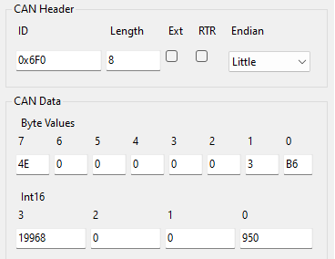
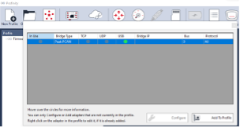
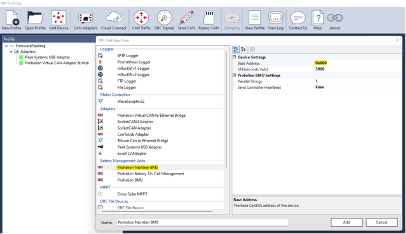
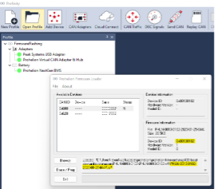
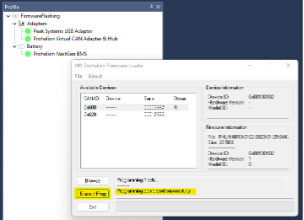

# Software Specifications

This section documents the software and firmware related behaviours, configuration, and telemetry specifications of the 48V BMS. 

## BMS State Machine

The Prohelion 48V BMS firmware uses a finite state machine to control the outputs of the BMS. The finite state machine consists of a set of BMS states in which the BMS can operate. Each state can transition to another state through a set of transitions. Transitions can be triggered by combinations of BMS events. 

The diagram below shows the operational behaviour of the BMS State Machine. It shows each of the states and all the transitions between the states. 

Figure 11: BMS State Machine

### BMS Outputs

The BMS state machine can control the following outputs to safely manage the battery pack.

| Output      | Description                                                                         | 
|-------------|-------------------------------------------------------------------------------------|
| `Precharge` | This output enables the pre-charge MOSFET to enable the battery to discharge through the pre-charge resistor   The pre-charge circuit allows for capacitive loads to be charged up to the battery voltage through a resistor in a controlled manner. This prevents high inrush currents which may cause damage to the cells, BMS and loads.                                                                                               | 
| `Discharge` | This output enables the discharge MOSFET array which allows current to flow from the battery and into a load (conventional current flow). This will allow the battery to be discharged.                      |
| `Charge`    | This output enables the charge MOSFET array which allows current to flow from the load and into the battery (conventional current flow). This will allow the battery to be charged.                      |
| `Balance`   | This output is a virtual output which signals to other firmware modules that cell balancing is allowed in the current state. The other firmware modules will perform additional checks to ensure that balancing is only enabled when it is safe and necessary to balance the individual cell State of Charges using the balance resistors. It is important to note that all balance resistors may be disabled while the balance output may be on.   |

### BMS States

The BMS state machine consists of the following finite states. Each state defines the set of outputs which should be enabled when the BMS is in that state. 

| ID    | State                 | Description                            | Outputs                                 | 
|-------|-----------------------|----------------------------------------|-----------------------------------------|
| `S0`  | INIT                  | The initialisation state               | All outputs off                         |
| `S1`  | PRECHARGE             | Pre-Charge State                       | PRECHARGE On                            |
| `S2`  | DISCHARGE ENABLED     | Discharge enabled state                | DISCHARGE On BALANCE On              |
| `S3`  | CHARGE ENABLED        | Charge enabled state                   | CHARGE On Balancing On               |
| `S4`  | ALL ENABLED           | All enabled state                      | DISCHARGE On CHARGE On BALANCE On |
| `S5`  | DISCHARGE ENABLED PRE | Discharge enabled state with Precharge | DISCHARGE On PRECHARGE On            |
| `S6`  | CHARGE ENABLED PRE    | Charge enabled state with Precharge    | CHARGE On PRECHARGE On               |
| `S7`  | ALL ENABLED PRE       | All enabled state with Precharge       | DISCHARGE On PRECHARGE On            |
| `S99` | ERROR                 | Error State                            | All Outputs off                         |

### BMS Events

The BMS state machine can be triggered by several internal events.  Each event is a Boolean flag that can be either true (set) or false (cleared) by submodules in the BMS firmware. There are two types of events that the BMS state machine uses:

-	The BMS state machine can be triggered by several internal events.  Each event is a Boolean flag that can be either true (set) or false (cleared) by submodules in the BMS firmware. There are two types of events that the BMS state machine uses:
    -	Normal – Events of this type will be set when a condition is present and will automatically be cleared if the condition that is causing the event has corrected itself and the event is no longer present.
    -	Latching – Events of this type will be set by a condition and will remain set until the event has been explicitly cleared by the user or the BMS has been rebooted.  

| HEX Value  | Event                 | Event Type | Description |
|------------|-----------------------|------------|-------------|
| `0x100`    | CALIBRATED            |            | This indicates that the BMS has been calibrated and issued a valid __serial number__ |
| `0x200`    | CONNECTED             |            |  This indicates that the BMS is connected to a CAN bus network and is receiving messages on the configured __CAN Switches ID__ |
| `0x400`    | STANDALONE            |            | This indicates that the __Standalone BMS Mode__ is enabled |
| `0x800`    | SENSE ERROR           |            | This indicates that there is a low-level sense error with the communication to the cell monitoring nodes | 
| `0x1000`   | OVER VOLT             |            | This indicates that one or more cell voltages have exceeded the configured __Cell Over Voltage Threshold__ | 
| `0x2000`   | UNDER VOLT            |            | This indicates that one or more cell voltages have exceeded the configured __Cell Under Voltage Threshold__ | 
| `0x4000`   | OVER TEMP             |            | This indicates that one or more cell temperatures have exceeded the configured __Over Temperature Threshold__ | 
| `0x8000`   | UNDER TEMP            |            | This indicates that one or more cell temperatures have configured __Cell Under Temperature Threshold__ | 
| `0x10000`  | CRITICAL OVER CURRENT | Latching   | This indicates that charge or discharge current has exceeded the configured __Critical Over Current Threshold__ | 
| `0x20000`  | CRITICAL OVER VOLT    | Latching   | This indicates that one or more cell voltages have exceeded the configured __Critical Cell Over Voltage Threshold__ | 
| `0x40000`  | CRITICAL UNDER VOLT   | Latching   | This indicates that one or more cell voltages have exceeded the configured __Critical Cell Under Voltage Threshold__ | 
| `0x80000`  | BALANCING             |            | This indicates that one or more cells are currently balancing | 
| `0x100000` | PACK PRECHARGE FAIL   |            | This indicates the difference (delta) between the Load Voltage and the Battery Voltage is not within the configured __Precharge Voltage Delta__ | 
| `0x400000` | PACK ENABLE           |            | This indicates that the BMS is receiving the command to enable the pack and move into a state which allows charge, discharge or both outputs. | 
| `0x800000` | SoCINVALID           |            | This indicates that the current SoCestimation is invalid | 

### BMS State Transitions

The BMS state machine contains several state transitions. Each transition contains a current state, next state, a set of events and an event check type. The state transition will only proceed to the next state if the BMS state machine is in the current state and the event check has been satisfied. 

There are three Event Check Types which can be used to check the list of events for each transition:

-	All – Logical AND – All events being set (true) will trigger the state transition.
-	Any – Logical OR – Any event being set (true) will trigger the state transition.
-	None – Logical NOT (OR) - All events being cleared (false) will trigger the state transition (No events can be set)

The BMS CRITICAL SAFETY EVENTS is a group of events that are considered safety critical and should result in the BMS moving into an ERROR state from ANY state. This group which consists of the following events:

-	CRITICAL OVER VOLT
-	CRITICAL UNDER VOLT
-	CRITICAL OVER CURRENT
-	PACK PRECHARGE FAIL

Below is the BMS state machine transition table:

| ID    | Current State         | Next State            | Event Check Type | Events                             | 
|-------|-----------------------|-----------------------|------|------------------------------------------------|
| `T0`  | ANY                   | ERROR                 | ANY  | BMS CRITICAL SAFETY EVENTS                     |
| `T1`  | ERROR                 | INIT                  | NONE | BMS CRITICAL SAFETY EVENTS                     |
| `T2`  | INIT                  | PRECHARGE             | ANY  | PACK ENABLE STANDALONE                      | 
| `T3`  | PRECHARGE             | ERROR                 | ANY  | PACK PRECHARGE FAIL                            |
| `T4`  | PRECHARGE             | CHARGE ENABLED PRE    | ALL  | UNDER VOLT                                     |
| `T5`  | PRECHARGE             | DISCHARGE ENABLED PRE | ALL  | OVER VOLT                                      | 
| `T6`  | PRECHARGE             | ALL ENABLED PRE       | NONE | PACK PRECHARGE FAIL UNDER VOLT OVER VOLT | 
| `T7`  | CHARGE ENABLED        | INIT                  | NONE | PACK ENABLE STANDALONE                      | 
| `T8`  | CHARGE ENABLED        | ALL ENABLED PRE       | NONE | UNDER VOLT OVER VOLT                        |
| `T9`  | DISCHARGE ENABLED     | INIT                  | NONE | PACK ENABLE STANDALONE                      |
| `T10` | DISCHARGE ENABLED     | ALL ENABLED           | NONE | UNDER VOLT OVER VOLT                        | 
| `T11` | CHARGE ENABLED PRE    | CHARGE ENABLED        | NONE | BMS CRITICAL SAFETY EVENTS                     |
| `T12` | DISCHARGE ENABLED PRE | DISCHARGE ENABLED     |      | BMS CRITICAL SAFETY EVENTS                     |   
| `T13` | ALL ENABLED PRE       | ALL ENABLED           |      | BMS CRITICAL SAFETY EVENTS                     | 
| `T14` | ALL ENABLED           | INIT                  |      | PACK ENABLE STANDALONE                      |
| `T15` | ALL ENABLED           | CHARGE ENABLED        |      | UNDER VOLT                                     | 
| `T16` | ALL ENABLED           | DISCHARGE ENABLED     |      | OVER VOLT                                      | 

## LED Output

This section describes the behaviour of the LED output of the Front Panel Connector. 

Currently LED 1 and LED 2 of the Front Panel Connector are not in use.

LED 3 of the Front Panel Connector will either remain solid (“Stays ON”) or flash a specific number of times over a 5 second interval. The status of the BMS can be determined by counting the number times LED 1 flashes between each pause over the 5 second interval. The table below lists the meaning of each flash count.  

| Flash Count | Label               | Description | 
|-------------|---------------------|-------------|
| `9`         | Sense error         | There is an active SENSE ERROR event. The BMS cannot communicate with the cell measurement nodes | 
| `8`         | Critical Over Volt  | There is a latched CRITICAL OVER VOLT event. The BMS has detected that the critical over voltage threshold has been exceeded |
| `7`         | Critical Under Volt | There is a latched CRITICAL UNDER VOLT event. The BMS has detected that the critical under voltage threshold has been exceeded |
| `6`         | Critical Over Volt  | There is a latched CRITICAL OVER CURRENT event. The BMS has detected that the critical over current threshold has been exceeded |
| `5`         | Over Temp           | There is an active OVER TEMP event. The BMS has detected that the over-temperature threshold has been exceeded |
| `4`         | Under Temp          | There is an active UNDER TEMP event. The BMS has detected that the under-temperature threshold has been exceeded |
| `3`         | Precharge Fail      | There is an active PRECHARGE FAIL event. The BMS has detected that the precharge voltage threshold has __not__ been reached |
| `2`         | Balancing           | There is an active BALANCING event. The BMS has detected that the balance voltage threshold has been exceeded. This indicates at least 1 cell is currently being balanced |
| `1`         | Disabled            | The BMS is in either the INIT or ERROR state and the BMS outputs are all off. Meaning that the battery cannot charge or discharge. This is usually due to a communication timeout on the BMS Switches CAN ID or the BMS is not in STANDALONE mode. |

## Configuration 

The firmware of the Prohelion 48V BMS allows for the configuration of several values, thresholds, modes, and calibration values. This section documents each configuration parameter and the impacts of associated parameter on the system. 

The resolution (scale factor) is maximum precision in which the value can be stored as SI units. The resultant integer value is the actual threshold (in Volts, Amps, or ℃) multiplied by the scale factor. For example, 3.600 Volts would equate to an integer value of 3600 being sent via CAN bus. This mathematical operation is automatically handled by Profinity. 

| ID     | Parameter                                   | Data Type | Resolution (scale) | Description | 
|--------|---------------------------------------------|--------|--------------|----------------------|
| `0x33` | CAN - Birate                                | Uint16 | -            | The CAN bus bitrate selection value. This should be an integer value between 0 and 5:  - 0: 50kbps  - 1: 100kbps  - 2: 125kbps  - 3: 250kbps  - 4: 500kbps  - 5: 1000kbps                                                                                         |
| `0x34` | CAN - Base ID                               | Uint 16 | -           | The base CAN ID for the BMS. This should be a value between 0 and 1,792. For example, a base CAN ID of 0x600 (in hex) would be 1,536                     |
| `0x35` | CAN - Switches ID                           | Uint16 | - | The CAN ID on which the BMS receives the Switches message. See communication section                                                                                     |
| `0x3B` | BMS - Modes Config                          | Uint16 | -            | A set of 16 bits used to toggle different features of the BMS. The result is a bitwise OR of each feature:   - 0x00: Not Enabled   - 0x01: Standalone   - 0x02: Opportunistic Balancing (Not Implemented yet)   - 0x04: Victron  Integration (when not using the parallel pack control unit)   For example, to enable both Standalone and Victron Integration set the value to 0x05 (0x01 + 0x04)   To disable all modes set the value to 0x00                                            |         
| `0x39` | Cell - Under Voltage Threshold (V)          | Uint16 | 0.001 (1000) | The cell voltage threshold at which the BMS triggers an UNDER VOLT event.                                                                                  |
| `0x3F` | Cell - Critical Under Voltage Threshold (V) | Uint16 | 0.001 (1000) | The cell voltage threshold at which the BMS triggers a CRITICAL UNDER VOLT event.
| `0x38` | Cell - Over Voltage Threshold (V)           | Uint16 | 0.001 (1000) | The cell voltage threshold at which the BMS triggers an OVER VOLT event. 
| `0x40` | Cell - Critical Over Voltage Threshold (V)  | Uint16 | 0.001 (1000) | The cell voltage threshold at which the BMS triggers a CRITICAL OVER VOLT event.                                                                           |
| `0x3A` | Cell - Balancing Threshold (V)              | Uint16 | 0.001(1000)  | The cell voltage threshold at which the BMS enables balancing if the minimum and maximum cell voltages are more than 5mV apart. Only cell which are 5mV higher than the minimum cell voltage will be balanced.                                                                 |
| `0x3D` | Temp - Over Temperature Threshold (°C)      | Int16  | 0.1(10)      | The temperature threshold at which the BMS triggers an UNDER TEMP event. |
| `0x3E` | Temp - Under Temperature Threshold (°C)     | Int16  | 0.1(10)      | The temperature threshold at which the BMS triggers an OVER TEMP event. This threshold only applies while charging. When discharging, the threshold is 0°C    |
| `0x42` | Pack - Precharge Voltage Delta (V)          | Uint16 | 0.001 (1000) | The pack voltage threshold at which the BMS triggers a PACK PRECHARGE FAIL event.                                                                          |
| `0x43` | Pack - Precharge Timeout (S)                | Uint16 | 0.1(10)      | The time which the BMS state machine waits in the PRECHARGE state before moving to ERROR.                                                                   |
| `0x41` | Pack - Over Current Threshold (A)           | Uint16 | 0.01 (100)   | The pack current threshold at which the BMS triggers a CRITICAL OVER CURRENT event. This is triggered by positive and negative current.                    |
| `0x4D` | Pack - Capacity (Ah)                        | Uint16 | 0.01 (100)   | The capacity of the pack which is used to estimate the State of Charge.                                                                                       |
| `0x4E` | Pack - SoC(%)                               | Uint16 | 0.01 (100)   | The SoCof the pack. This can be manually configured by the end user to a value if desired to override the current SoCestimation.                      |
| `0x44` | Calibration - Current Offset                | Int16  | -            | The zero-axis offset calibration value for the current measurement. This value can be adjusted so that the reported current is zero when the BMS is disengaged. This should typically be a value of less than 50.                                                          |
| `0x45` | Calibration - Current Scale                 | Uint16 | -            | The scale calibration value for the current measurement. This value can be adjusted so that the reported current matches a measured current. This should typically be a value of around 10,000.                                                                                 |
| `0x47` | Calibration - Voltage Scale                 | Uint16 | -            | The scale calibration value for the load voltage measurement. This value can be adjusted so that the reported load voltage matches a measured voltage. This should typically be a value of around 10,000.                                                                          |
| `0x48` | Node - count                                | Uint16 | -            | The number of cell measurement nodes being used by the BMS. For 48V BMS (16S), this should always be 2.                                                     |
| `0x36` | Node - Parallel Count                       | Uint16 | -            | The number of cell measurement nodes in parallel. For 48V BMS (16S), this should always be 1.                                                               |
| `0x49` | Node0 - Cell Count                          | Uint16 | -            | The number cells in use on the first cell measurement node. For 48V BMS (16S), this should always be 8. The minimum is 4.                                   |
| `0x4A` | Node0 - Temp Count                          | Uint16 | -            | The number temperature inputs in use on the first cell measurement node. The maximum is 8 and the minimum is 0.                                             |
| `0x4B` | Node1 - Cell Count                          | Uint16 | -            | The number cells in use on the second cell measurement node. For 48V BMS (22S), this should always be 11. The minimum is 4                                   |
| `0x4C` | Node1 - Temp Count                          | Uint16 | -            | The number temperature inputs in use on the first cell measurement node. The maximum is 4 and the minimum is 0.                                             |

### BMS Modes: 

This section explains the different features that can be enabled using the BMS Modes configuration parameter. 

#### Standalone Mode

Standalone mode simply enables the BMS to transition from INIT state into PRECHARGE state automatically upon start-up. See T2 of the BMS transition table. 

Note: When using a Prohelion Parallel Pack Controller device, this mode should be disabled.

#### Opportunistic Balancing Mode 

This feature has been temporarily disabled in favour of a more simplistic threshold based balancing algorithm. 

#### Victron Integration Mode 

Victron Integration mode enables the CAN bus communication required for the BMS to integrate with Victron inverters using the DVCC protocol. This requires the use of a Victron Cerbo GX to connect the BMS and the Victron inverter. 

Note: When using a Prohelion Parallel Pack Controller device, this mode should be disabled. 

## CAN Communication 

### Recieved Messages

#### BMS Switches Message 

__CAN ID: Switches ID (default is 0x500)__

__Frequency: Should be atleast 1Hz__

__Description: Used to control the BMS and engage the pack when not in STANDALONE mode. The DISCONNECTED event will be triggered if the switches message is not received for a period of more than 5 seconds.__

| Signal           | Bits   | Type  | Description |
|------------------|--------|-------|-------------|
| `BMS Switches`   | 64..56 | Uint8 | The switches which control the BMS during normal operation.   Bits: 0 (0x01)   Flag: Enable the pack |
| `Fault Switches` | 55..48 | Uint8 | The switches which control the BMS when an error has been triggered.   Bits: 7 (0xF0)  Flag: Clear the latched error events |
| `Not Used`       | 47..0  | -     | - |

#### BMS Config Message 

__CAN ID: Base ID + 0x0F0 (default is 0x6F0)__

__Frequency: N/A__

__Description: Used to read and update the configuration parameters of the BMS and save them to flash.__
- __If a READ command is issued, The BMS will respond with an identical CAN message that contains the currently value that is stored on the BMS__
- __If a WRITE command is issued, then a 22 BMS Config message (with the configuration parameter ID of 0xff) will need to be sent for the value to be saved permanently in flash.__

| Signal                         | Bits   | Type  | Description |
|--------------------------------|--------|-------|-------------|
| `Configuration parameter ID`   | 64..56 | Uint8 | The ID of the configuration parameter that is being updated. (See the ID column of Configuration parameter table)   If set to 0xFF, this will persist all configuration parameters to non-volatile flash. This is required to “save” the configuration values after being updated. |
| `Command`                      | 55..48 | Uint8 | The operation ID of the command that is being performed on the configuration parameter.   Bits: 0..1..0x98   Flag: WRITE .. READ .. SOC_RESET |
| `Not Used`                     | 47..16 | -     | - |
| `Value`                        | 15..0  | (See the ID column of Configuration parameter table) | The value of the configuration parameter. |

#### SoCReset Message

The BMS has the ability to have the SoCpercentage reset manually if required. This may be useful for testing, demonstration purposes or commissioning of new battery systems.

The SoCreset is performed by making use of the SOC_RESET command of the BMS Config Message and setting the value to between 0 and 1000. This value translates to 0% to 100% respectively. 

For example, sending the following CAN message will set the SoCto 95% and clear the SoCINVALID event. 

Figure 12: BMS SoCConfig Example

### Transmitted Messages

All CAN messages transmitted by the BMS are described in a DBC single file, also known as CAN Database file. The DBC file format is an industry standard for documenting CAN messages as a set of messages that each contain one or more signals. A signal is a single value such as a voltage of current. 

The DBC file for the 48V BMS is available upon request. 

There are several software products that support viewing DBC files and parsing CAN data using DBC file. The two main software products are:

-	Profinity – Used for parsing CAN bus data using a DBC file into messages and signals that can be used for monitor and logging of CAN bus systems. 
-	Vector CAN DB++ Editor – Used for editing DBC files. 

## Firmware Update Procedure

### Setup 

The following steps detail the process required to correctly setup a BMS to begin the Firmware flashing process:

1.	Ensure that the 48V BMS is connected to a working set of battery cells using the sense cables and that the BMS has at least 30V across the Load Negative and Load Positive connections.
2.	Plug a 48V BMS cable harness into the Front Panel Connector.
3.	Plug a 48V BMS CAN Bus adapter cable into the 48V BMS cable harness.
4.	Plug a PEAK-CAN USB Adapter into the 48V BMS CAN Bus adapter cable.
5.	Plug the PEAK-CAN USB Adapter into a computer. 
6.	Plug the PEAK-CAN USB Adapter into the computer. 
7.	__Ensure that there is exactly two 120 Ohm terminating resistors on the CAN bus! DO NOT proceed if you have too many or too little two resistors.__ 
8.	Ensure that the compute has the latest version of the Profinity software installed on it.
9.	Turn the power switch of the 48V BMS cable harness on. 

### Flashing the Firmware

The firmware flashing procedure is similar that of other Prohelion MSP430-based devices:

1.	Start the Profinity application.
2.	Create a new profile (if you haven’t already created one)
3.	Add a PEAK Systems USB adapter device via the CAN Adapters tool.

4.	Add a Prohelion Virtual CAN Adapter & Hub device via the Add Device tool.
    - Leave all settings as the default values.

5.	Add a Prohelion NextGen BMS device via the Add Device tool.
    - Leave all settings as default. Set the Base CAN ID to right address if the device firmware has been configured to anything other than the default base CAN ID of 0x600.

6.	Right click on the Prohelion NextGen BMS device in the profile viewer. Select Update Firmware. 

7.	Select the 48V BMS device in the firmware loader menu.  Make sure the Device ID is 0x00350100. 

8.	Click Browse and locate the user application firmware file (PHLN-3000-0175-XXXX-XX-XX-XXXX.tsf) on your computer. Make sure the firmware Device ID is also 0x00350100.

9.	Click Erase / Program to flash the device. Once completed, there should be a success message in the text box. 

10.	If the firmware programming failed, check the CAN bus cabling to ensure that there is exactly two 120 Ohm terminating resistors. If there are not exactly two terminating resistors, it will cause communication issues that can lead to the device becoming no longer functional due to corrupted firmware. Also try unplugging any other devices on the CAN bus that is potentially interfering with the firmware update. If it is still failing, try unplugging the PEAK-USB adapter, restarting the computer and re-opening Profinity.    

### Default Configuration for 22S LTO

| Description                                   | Value  |
|-----------------------------------------------|--------|
| `CAN - Birate`                                | 4      |
| `CAN - Base ID`                               | 0x600  | 
| `CAN - Switches ID`                           | 0x700  |
| `BMS - Modes Config`                          | 0x05   |
| `Cell - Under Voltage Threshold (V)`          | 1.8V   |
| `Cell - Critical Under Voltage Threshold (V)` | 1.5V   |                                     
| `Cell - Over Voltage Threshold (V)`           | 2.75V  |
| `Cell - Critical Over Voltage Threshold (v)`  | 2.8V   |                                
| `Cell - Balancing Threshold (V)`              | 2.6V   |
| `Temp - Over Temperature Threshold (°C)`      | 65.0   |
| `Temp - Under Temperature Threshold (°C)`     | -20.0  |                                 
| `Pack - Precharge Voltage Delta (V)`          | 10.000 |
| `Pack - Precharge Timeout (s)`                | 20.0   |
| `Pack - Overcurrent Threshold (A)`            | 100.00 | 
| `Pack - Capacity (Ah)`                        | 90.00  |
| `Node - Count`                                | 2      | 
| `Node - Parallel Count`                       | 1      | 
| `Node0 - Cell Count`                          | 11     |
| `Node0 - Temp Count`                          | 4      | 
| `Node1 - Cell Count`                          | 11     |
| `Node1 - Temp Count`                          | 4      |

