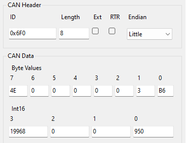

# CAN Communication 

## Recieved Messages

__EXAMPLE:__

| CAN ID:  | ...ID + ... - Frequency ..Hz                   | | |
|----------|------------------------------|-------|-------------|
| `Signal` | Bits                         | Type  | Description |

### BMS Switches Message 

| CAN ID:          | Switches ID* - Frequency should be atleast 1Hz | | |
|------------------|--------|-------|-----------------------------------|
| `BMS Switches`   | 64..56 | Uint8 | The switches which control the BMS during normal operation.   Bits: 0 (0x01)   Flag: Enable the pack                                              |
| `Fault Switches` | 55..48 | Uint8 | The switches which control the BMS when an error has been triggered.   Bits: 7 (0xF0)   Flag: Clear the latched error events                        |
| `Not Used`       | 47..0  | -     | -                                 |

Used to control the BMS and engage the pack when not in STANDALONE mode. The DISCONNECTED event will be triggered if the switches message is not received for a period of more than 5 seconds.

* Default is 0x500

### BMS Config Message 

| ID:                          | Base ID + 0x0F0* - Frequency N/A                        | | |
|------------------------------|--------|-------|--------------------------------------------|
| `Configuration parameter ID` | 64..56 | Uint8 | The ID of the configuration parameter that is being updated. (See the ID column of Configuration parameter table)   If set to 0xFF, this will persist all configuration parameters to non-volatile flash. This is required to “save” the configuration values after being updated. |
| `Command`                    | 55..48 | Uint8 | The operation ID of the command that is being performed on the configuration parameter.   Bits: 0..1..0x98   Flag: WRITE .. READ .. SOC_RESET         |
| `Not Used`                   | 47..16 | -     | -                                          |
| `Value`                      | 15..0  | (See the ID column of Configuration parameter table) | The value of the configuration parameter.                                                                     |

Used to read and update the configuration parameters of the BMS and save them to flash.__
- If a READ command is issued, The BMS will respond with an identical CAN message that contains the currently value that is stored on the BMS
- If a WRITE command is issued, then a 22 BMS Config message (with the configuration parameter ID of 0xff) will need to be sent for the value to be saved permanently in flash.

* default is 0x6F0

### SoC Reset Message

The BMS has the ability to have the SoCpercentage reset manually if required. This may be useful for testing, demonstration purposes or commissioning of new battery systems.

The SoCreset is performed by making use of the SOC_RESET command of the BMS Config Message and setting the value to between 0 and 1000. This value translates to 0% to 100% respectively. 

For example, sending the following CAN message will set the SoCto 95% and clear the SoCINVALID event. 

Figure 12: BMS SoCConfig Example

## Transmitted Messages

All CAN messages transmitted by the BMS are described in a DBC single file, also known as CAN Database file. The DBC file format is an industry standard for documenting CAN messages as a set of messages that each contain one or more signals. A signal is a single value such as a voltage of current. 

The DBC file for the 48V BMS is available upon request. 

There are several software products that support viewing DBC files and parsing CAN data using DBC file. The two main software products are:

-	Profinity – Used for parsing CAN bus data using a DBC file into messages and signals that can be used for monitor and logging of CAN bus systems. 
-	Vector CAN DB++ Editor – Used for editing DBC files. 

