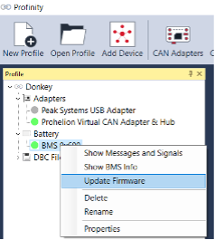

# Generic Battery Assembly Procedure

The following section aims to provide a generic battery assembly procedure that can be used as a guide for developing working instructions that are specific to the system into which the BMS is being installed.

NOTE: This guide does not provide specific advice on wiring types and sizing. Due diligence should be performed by the system integrator to ensure that all wiring adheres to the requirements for the appropriate standards. Different countries have different standards. Therefore, the system integrator needs to check which standards apply to the region in which the battery is sold and installed. For the Australian market, standards such as AS/NZS 3000 and AS/NZS 3008.1.1 may apply. For non-Australian markets, standards such as IEC/EN 60364 may apply. 

__Step 1: Create the cell-sense harness__

__1a.__	Select a suitable wire type and size for running sense wires to the individual cells. Make sure that the selected wiring has the correct specifications to meet the safety standards that apply to the system. This may include insulation requirements and ensuring adequate strain relief when installed. Make sure the wiring can handle the maximum balance current and any short-circuit conditions that could occur. 

__1b.__	Select a suitable socket contact for the JAE Electronics MX34 housings of the Cell Sense connectors. The part numbers for suitable socket contacts and the associated crimp tools can be found in the datasheet for the Cell Sense Connectors. 

__1c.__	Determine a suitable length to cut the cell-sense wires so that they can reach each of the terminals of the cells once the BMS is mounted in place. For a 22S battery, a total of 28 lengths of wires will need to be cut. An additional 16 lengths will need to be cut for the 8 thermistors.  

__1d.__ Crimp the JAE Electronics MX34 socket contacts onto one end of each conductor. An appropriate socket contact will need to be used. Make sure that the crimp has been formed properly and adheres to the appropriate guidelines. 

__1e.__ Starting with Cell Sense Connector A, insert 14 lengths of conductor into a MX34 housing. Make sure that only the pins labelled “BATT” are inserted and all other locations left blank. 

__1f.__ Label the end of each the conductors using stickers or printed heat shrink with the pin label (e.g., “BATT 8+). This is to ensure that each conductor is connected to the right battery cell and that no components of the BMS are damaged due to incorrect wiring. 

__1g.__ Crimp appropriate ring terminals onto the other side of each cell-sense wire. If required, the wire can be trimmed to ensure the final installation is neat and tidy. If a battery pack is available, use it to measure the correct length of each wire. If two wires have the same label (e.g., “BATT 11+” or “BATT 1-”), they can share a ring terminal. 

__1h.__ Follow a similar procedure in the steps 3-6 above to create the wiring for the thermistors.

__1i.__ Solder and heat shrink each leg of a thermistor to a wire. If required, the wire can be trimmed to ensure the final installation is neat and tidy. If a battery pack is available, use it to measure the correct length of each wire. Make sure that no part of the thermistor can cause short-circuit to the battery cells. This can be achieved by insulating the thermistor legs using heat shrink. 

__1j.__	Repeat steps 5-9 for the Cell Sense Connector B. 

__Step 2: Create the front-panel harness__

__2a.__ Using an appropriate 14-way IDC ribbon cable, cut a length that will allow the front panel PCB to connect to the BMS while installed in the enclosure. Add extra length if needed for maintenance or removing of front panel while diagnosing issues. 

__2b.__ Slide a 14-way SKEDD connector on one end of the cable, ensuring that the red conductor of the ribbon cable is aligned with pin 1 of the SKEDD connector. Press the back side of the connector down to ensure the ribbon cable and connector have full engaged. 

__2c.__ Repeat previous step for other end of the ribbon cable. 

__2d.__ Alternatively, pre-crimped options are available. See [here](https://www.we-online.com/en/components/products/WST_IDC_PRE_PRESSED_CONNECTOR)

__Step 3: Create the precharge resistor harness__

__3a.__ Select a suitable wire type and size for running wires to the precharge resistor. Given that the battery voltage is a maximum of 60V and the specified precharge resistor is 33 ohms, the maximum current can be determined. Make sure a factor of safety is included when selecting a wire gauge.

__3b.__ Cut two lengths of the selected wire and crimp one end using the appropriate crimp for the precharge resistor connector housing. 

__3c.__ Solder and heatsink the other end of each wire to the terminals of the precharge resistor. 

__Step 4: Wire up the battery cells__

__4a.__ Place each of the battery cells into their enclosure or mounting structure. 

__4b.__ Carefully add the busbars to connect the cells. Starting from the bottom (i.e., Cell 1) and working towards the middle of the stack (i.e., Cell 11). Then start from top (i.e., Cell 22) and work towards the middle of the stack (i.e., Cell 12). Leave the middle busbar between Cell 11 and Cell 12 out so that the battery is not full assembled and remains at half the maximum voltage. This ensures that an accidental short between the battery positive and negative does not cause. 

__4c.__ Using the cell-sense harnesses, place each of the ring terminals onto the terminals of the respective cell terminal. Make extra sure that a ring terminal is not misplaced onto the wrong battery terminal. 

__4d.__ Using a digital multi-meter, double-check that the voltage at the pins of each cell-sense connector. For example, on Cell Sense Connector A, use Pin 27 (BATT 1-) as the ground reference of the multi-meter. One pin at a time, measure the voltage present at each pin. Starting with BATT 1+ and working toward BATT 11+. Each step should result in a higher voltage measurement. If not, double check the wiring and make sure not ring terminals have been misplaced. __IMPORTANT! IF this is not done correctly, it will cause damage to the BMS.__

__4e.__ Place the temperature sense thermistors in appropriate locations and fix into place using thermal compound or tape.

__4f.__ Only place middle busbar between Cell 11 and Cell 12 after the BMS and front-panel has been installed.

__Step 5: Wire up the BMS to battery__

__5a.__ Select a suitable wire type and size for running high-current power between the Battery, BMS and external loads. At a minimum these cables need to maintain the full current (i.e., 100A) continuously and includes any thermal considerations of the final installation. The cable should be able to sustain the short-circuit current between the battery positive and negative long enough for the battery fuse to blow. Alternatively, laser-cut busbars can be used in place of the cables, but the same constraints will apply. 

__5b.__ Select a suitable cable lug sizes for the selected cable size. The different cable lugs sizes will need to be selected for the Battery cell terminals (2-4 lugs), BMS terminals (4-8 lugs),  and Load terminals (2-4 lugs). The lugs going to the BMS should be compatible with the M5 screw terminals on the BMS. The “load” end could be considered as a set of connectors on the battery enclosure which allows for the system to be installed on-site. 

__5c.__ Cut 4 lengths of the cable, one for battery positive to BMS, one for battery positive to BMS, one for Load positive to BMS, and another for Load negative to BMS. Double-up the number of lengths if the intention is to run two conductors for each connection and reduce the cable size. Make sure they are of appropriate length. Also consider if there are any circuit breakers or switches between the BMS and the load or battery.” 

__5d.__ Crimp and heat shrink cable lugs onto either end of the cable lengths. Make sure that the right combination of lugs has been used on each cable. For example, a cable running between the Battery and BMS will need a lug that is compatible with the cell terminal on one end and a lug that is compatible with the BMS on the other. 

__5e.__ First connect the battery negative to the BMS, then connect the battery positive to the BMS. Load negative and positive connections can be connected later once the battery system has passed an initial power-up test.

__Step 6: Connect the front panel PCB__

__6a.__ Install the front-panel PCB into the battery enclosure.

__6b.__ Ensure that the power switch is in the off position.

__6c.__ Connect one end of the front-panel harness to the front-panel PCB by inserting the SKEDD connector into the socket. Make sure you have the orientation of the connector correct. There is only one way that the connector will fit, do not force the connector in. 

__6d.__ Connect one end of the front-panel harness to the BMS. 

__Step 7: Power up the BMS__

__7a.__ Using a digital multi-meter, measure the voltage between Cell 11 and Cell 12. With the busbar left uninstalled, there should be minimal voltage. If there is a significant voltage, consider if there is a short-circuit somewhere in the battery or BMS installation. Failing to perform this check may result in the battery being short-circuited in the next step.

__7b.__ Carefully install the link between the upper and lower halves of the battery cells. For example, install the busbar link between Cell 11 and Cell 12. 

__7c.__ Using a digital multi-meter, measure the voltage between the  Battery- and Battery+ terminals of the BMS. The full battery voltage should be present (i.e. 48V)

__7d.__ Ensure no loads are connected to the Load- and Load+ of the BMS.

__7e.__ Turn in the BMS using the power switch on the front panel PCB. 

__7f.__ The front panel LEDs should turn on and begin to show status and SoCinformation.

__Step 8: Connect the CAN Bus__

__8a.__ Using a Windows computer, install the following software.
    - [Install the PEAK drivers](https://www.peak-system.com/Drivers.523.0.html?&L=1)
    - [Install Profinity](https://docs.prohelion.com/Profinity/Overview.html)

__8b.__ Follow the same setup procedure as defined in the Firmware Update Procedure.  
    - Connect PEAK CAN-USB adapter to the Front Panel and the Windows Computer

__8c.__ Right click on the Prohelion NextGen BMS device in the Profinity profile viewer window and select __Show BMS Info.__

