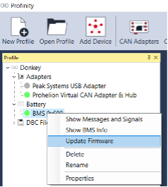

# Firmware Update Procedure

## Setup: 

The following steps detail the process required to correctly setup a BMS to begin the Firmware flashing process:

__1.__	Ensure that the 48V BMS is connected to a working set of battery cells using the sense cables and that the BMS has at least 30V across the Load Negative and Load Positive connections.

__2.__	Plug a 48V BMS cable harness into the Front Panel Connector.

__3.__	Plug a 48V BMS CAN Bus adapter cable into the 48V BMS cable harness.

__4.__	Plug a PEAK-CAN USB Adapter into the 48V BMS CAN Bus adapter cable.

__5.__	Plug the PEAK-CAN USB Adapter into a computer. 

__6.__	Plug the PEAK-CAN USB Adapter into the computer. 

__7.__	__Ensure that there is exactly two 120 Ohm terminating resistors on the CAN bus! DO NOT proceed if you have too many or too little two resistors.__ 

__8.__	Ensure that the compute has the latest version of the Profinity software installed on it.

__9.__	Turn the power switch of the 48V BMS cable harness on. 

## Flashing the Firmware

The firmware flashing procedure is similar that of other Prohelion MSP430-based devices:

__1.__	Start the Profinity application.

__2.__	Create a new profile (if you haven't already created one)

__3.__	Add a PEAK Systems USB adapter device via the CAN Adapters tool.

__4.__	Add a Prohelion Virtual CAN Adapter & Hub device via the Add Device tool.
    - Leave all settings as the default values.

__5.__	Add a Prohelion NextGen BMS device via the Add Device tool.
    - Leave all settings as default. Set the Base CAN ID to right address if the device firmware has been configured to anything other than the default base CAN ID of 0x600.

__6.__	Right click on the Prohelion NextGen BMS device in the profile viewer. Select Update Firmware. 

__7.__	Select the 48V BMS device in the firmware loader menu.  Make sure the Device ID is 0x00350100. 

__8.__	Click Browse and locate the user application firmware file (PHLN-3000-0175-XXXX-XX-XX-XXXX.tsf) on your computer. Make sure the firmware Device ID is also 0x00350100.

__9.__	Click Erase / Program to flash the device. Once completed, there should be a success message in the text box. 

__10.__	If the firmware programming failed, check the CAN bus cabling to ensure that there is exactly two 120 Ohm terminating resistors. If there are not exactly two terminating resistors, it will cause communication issues that can lead to the device becoming no longer functional due to corrupted firmware. Also try unplugging any other devices on the CAN bus that is potentially interfering with the firmware update. If it is still failing, try unplugging the PEAK-USB adapter, restarting the computer and re-opening Profinity.    

## Default Configuration for 22S LTO

| Description                                   | Value  |
|-----------------------------------------------|--------|
| `CAN - Bitrate`                                | 4      |
| `CAN - Base ID`                               | 0x600  | 
| `CAN - Switches ID`                           | 0x700  |
| `BMS - Modes Config`                          | 0x05   |
| `Cell - Under Voltage Threshold (V)`          | 1.8V   |
| `Cell - Critical Under Voltage Threshold (V)` | 1.5V   |                                     
| `Cell - Over Voltage Threshold (V)`           | 2.75V  |
| `Cell - Critical Over Voltage Threshold (v)`  | 2.8V   |                                
| `Cell - Balancing Threshold (V)`              | 2.6V   |
| `Temp - Over Temperature Threshold (°C)`      | 65.0   |
| `Temp - Under Temperature Threshold (°C)`     | -20.0  |                                 
| `Pack - Precharge Voltage Delta (V)`          | 10.000 |
| `Pack - Precharge Timeout (s)`                | 20.0   |
| `Pack - Overcurrent Threshold (A)`            | 100.00 | 
| `Pack - Capacity (Ah)`                        | 90.00  |
| `Node - Count`                                | 2      | 
| `Node - Parallel Count`                       | 1      | 
| `Node0 - Cell Count`                          | 11     |
| `Node0 - Temp Count`                          | 4      | 
| `Node1 - Cell Count`                          | 11     |
| `Node1 - Temp Count`                          | 4      |