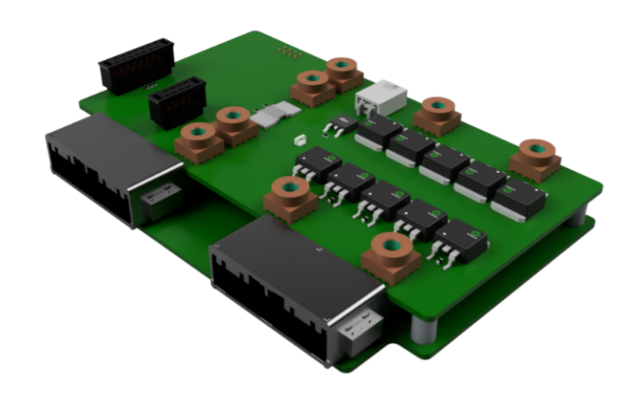
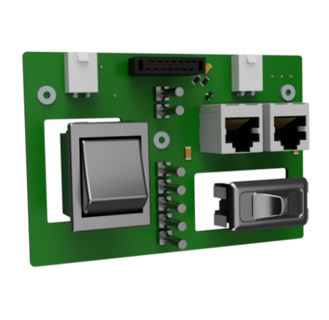
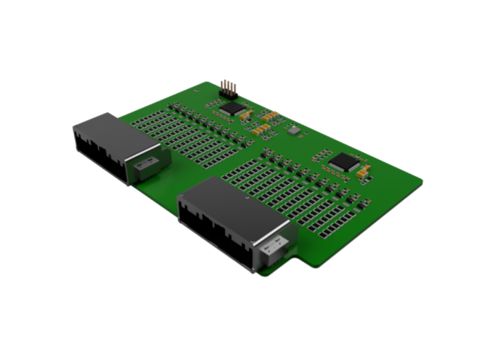
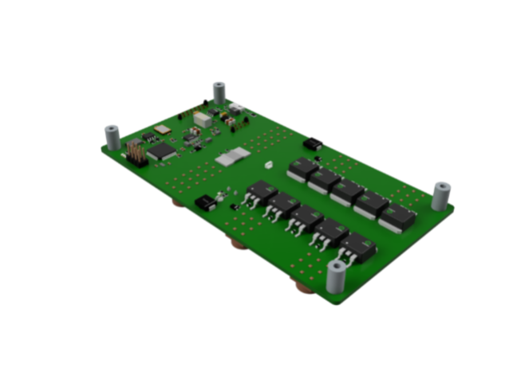
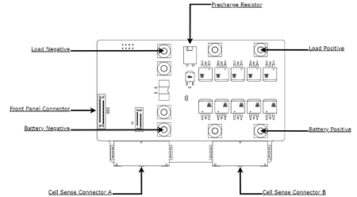
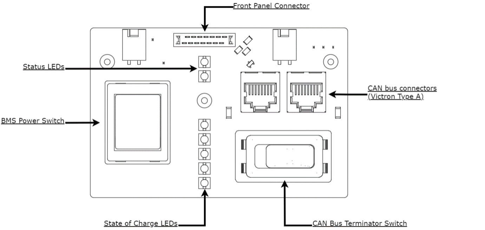

# 48V BMS User Manual 

This document describes the interface, installation, and usage requirements for the Prohelion 48V Battery Management System (PHLN-3000-0175). The PHLN-3000-0175 part was designed and developed by Prohelion Pty Ltd.

The Prohelion 48V BMS provides the ability to easily monitor and control large capacity 48V battery packs up to a 22S cell configuration with up to 8 temperature sensors.  The number of cells and temperatures can be individually controlled to allow ultimate pack configuration flexibility. The BMS provides all necessary error checking and thresholding logic to keep the battery system and the cells within the area of safe operation. This includes Over Current, Over Voltage, Under Voltage, Under Temperature and Over Temperature thresholds.

The 48V BMS individually controls Precharge, Charge and Discharge outputs to ensure that any connected loads do not over-charge or over-discharge the battery pack. The 48V BMS also includes the ability to preemptively balance cells (mid-pack balancing) and provides closed-loop state-of-charge (SoC) estimation to ensure the highest performance can be extracted from the battery pack.

Figure 1: Prohelion 48V BMS Render

## System Diagram

The Prohelion 48V BMS has several electrical interfaces and connections to external systems. The figure below shows locations for each of these connections and interfaces.

Figure 2: Prohelion 48V BMS Diagram

Figure 3: Prohelion Front Panel PCB Diagram

## Acronyms and Abbreviations

| Acronym   | Abbreviation                  |
|-----------|-------------------------------|
| `A`       | Ampere                        |
| `Ah`      | Ampere Hour                   |
| `BMS`     | Battery Management System     |
| `CAN-B`   | Controller Area Network - Bus |
| `DC`      | Direct Current                |
| `ESS`     | Energy Storage System         |
| `HV`      | High Voltage                  |
| `LV`      | Low Voltage                   |
| `SoC`     | State of Charge               |
| `V`       | Voltage                       |     

## Safety 

!!! caution "Caution"
    The following safety precautions must be observed during all phases of operation, service and repair of this equipment. Failure to comply with the safety precautions or warnings in this document violates safety standards of design, manufacture and intended use of this equipment and may impair the built-in protections. Prohelion shall not be liable for user’s failure to comply with these requirements

!!! warning "Danger - DC Voltage"
    This System controls DC voltages (~48VDC) with the potential to deliver high current (>200A), failure to isolate and test for isolation before installation, service or troubleshooting could result in damage to equipment or personal! 

!!! warning "Danger - Live Circuits"
    Operating personnel should not remove the unit covers. No internal adjustment or component replacement is allowed by non Prohelion qualified personnel (excluding fuses). Never replace components with the power cable connected. To avoid injuries, always disconnect power, remove external voltage sources, discharge circuits and test for dangerous voltage potentials before touching components.

