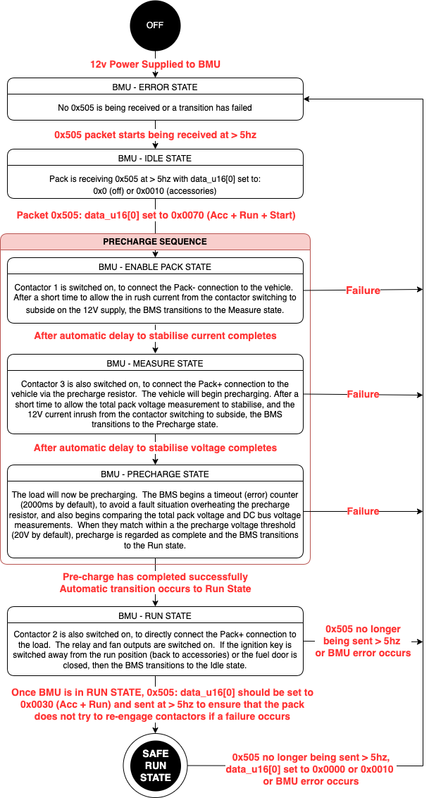

# BMS State Machine

The BMS can be in any one of six states, depending on operating conditions, commands, and errors.  The states are reported on the CAN bus, and shown in the BMS Viewer software.  The states are, in the most commonly seen sequence: 

- Error 
- Idle 
- Enable 
- Measure 
- Precharge 
- Run 

States transition from one to another based on various thresholds and timers, and on user commands via the CAN bus.  Prohelion provides out of the box, battery management control in its software suite [Profinity](../../../Profinity/Prohelion_Batteries.md), hardware support for engaging the pack in the [EV Driver Controls](../../../Driver_Control/index.md) and detailed information on how to engage the pack from custom code in the [BMS Documentation](../Communications_Protocol/Incoming_CAN_Packets.md).

## BMU Engagement State Diagram 

The following diagram shows how the BMU transitions though the various states on the way to either being successfully engaged or not, using the CAN messages outlined above.

<figure markdown>

<figcaption>BMS Engagement State Diagram</figcaption>
</figure>

## Error

The BMS is in the Error state if any of the following conditions are true: 

- The 12V contactor supply is not present or is undervoltage 
- Any cell Over Voltage 
- Any cell Under Voltage 
- Any cell Over Temperature 
- Any CMU communications packet is overdue (CMU timeout) 
- Packets from the EV driver controls are overdue (vehicle timeout)
- Missing CMU or cell 
- Extra CMU or cell 
- Contactor feedback mismatch to the commanded state of the contactor 

In the Error state, all contactors are switched off to isolate the pack.  The relay and fan outputs are also switched off. 

If all errors are removed, then the BMS will transition to the Idle state if the ignition key is switched to the accessories position and the fuel door is closed.  It requires this active user intervention to move to Idle, and will otherwise remain in the Error state. 

## Idle

In the Idle state, the BMS waits for a command from the EV driver controls.  All contactors are switched off.  The relay output and fans are also off. 

If the ignition key is switched from the run position to the start position, or the fuel door is opened, then the BMS transitions to the Enable state and begins a precharge sequence. 

## Enable

Contactor 1 is switched on, to connect the Pack- connection to the vehicle.  After a short time to allow the inrush current from the contactor switching to subside on the 12V supply, the BMS transitions to the Measure state. 

## Measure

Contactor 3 is also switched on, to connect the Pack+ connection to the vehicle via the precharge resistor.  The vehicle will begin precharging.   

After a short time to allow the total pack voltage measurement to stabilise, and the 12V current inrush from the contactor switching to subside, the BMS transitions to the Precharge state. 

## Precharge

The load will now be precharging.  The BMS begins a timeout (error) counter (2000ms by default), to avoid a fault situation overheating the precharge resistor, and also begins comparing the total pack voltage and DC bus voltage measurements.   

When they match within a the precharge voltage threshold (20V by default), precharge is regarded as complete and the BMS transitions to the Run state. 

## Run

Contactor 2 is also switched on, to directly connect the Pack+ connection to the load.  The relay and fan outputs are switched on.   

If the ignition key is switched away from the run position (back to accessories) or the fuel door is closed, then the BMS transitions to the Idle state. 