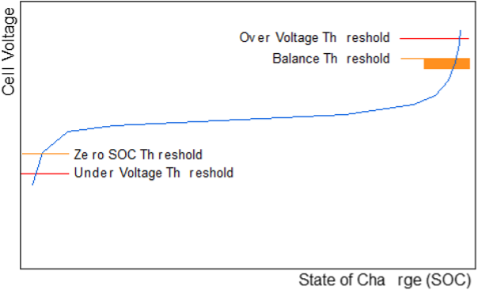

# Operating Thresholds

There are six user-settable thresholds that control the operation of the BMS.  These should be set based on the maximum acceptable limits for the cells used in the battery pack, along with reference to the charge/discharge curves for selecting the balancing points.   

These operating points can be programmed into the BMU over the CAN bus using the BMS Setup software and a Prohelion CAN-Ethernet bridge.  Settings that are required at the CMUs are passed to them from the BMU when the system starts. 

The SoCvs Voltage curve for a typical Lithium chemistry cell is shown below, along with the location of the various thresholds. 

## Over Voltage Threshold 

This voltage should be set to the maximum acceptable voltage for the cell.  If it is ever exceeded, then the BMS will move to the Error state and open the contactors immediately to protect the pack. 

## Balance Threshold

This voltage is the target setpoint for the charging control algorithm, and will be the voltage that the cells are charged to in normal operation.  It should be chosen to be part-way up the 'knee' in the voltage charge curve, so that the cells can be easily seen to be at different SoCand therefore balanced accurately.   

Choosing this number to be higher (closer towards the Over Voltage Threshold) will give a slightly increased useable capacity of the pack, but will make it more likely that sudden regen braking will push a cell above the Over Voltage Threshold and shut down the system without warning.  Pushing the usual charge voltage to the maximum rating of the cell may also reduce cell cycle life – refer to the battery cell datasheet for specific information on this aspect, as it is highly dependant on cell chemistry and manufacturing techniques. 

When any cell exceeds this voltage, the cell balance (shunt) resistor for that cell is switched on, and begins to discharge that cell at approximately 250mA.  The shunt resistor remains switched on until the cell falls below the Balance Threshold by the Balance Threshold Hysteresis value. 

## Balance Threshold Hysteresis

This voltage determines the hysteresis used to control the balance resistors.   

If using CMUs made after January 2013, it should be set to around 5mV, as the firmware in the newer CMUs turns off the shunt resistors while taking voltage measurements to eliminate errors caused by the resistance of the sense wiring.   

If using older CMUs, it should be set to around 50mV for a typical pack, to allow for the voltage drop in the sense wiring, connections, and cell impedance when 250mA of balance current is flowing.  This will be installation dependent. 

Setting it too low will cause oscillations in the balance resistor switching and possibly erroneous voltage measurement reporting. 

Setting it too high will give a wide band of voltage that various cells are balanced to, giving a less than optimally balanced pack and slightly reduced pack capacity. 

## Zero SoCThreshold

This voltage should be set to the point where the cells are considered fully discharged during normal operation.  It will be along the lower 'knee' in the charge curve.  When a cell goes below this threshold, the BMU reports SoCas 0%.  It is also the target minimum voltage used by motor controllers and other devices to not exceed during operation. 

## Under Voltage Threshold

This voltage should be set to the minimum acceptable voltage for the cell.  If any cell voltage falls below this point, then the BMS will move to the Error state and open the contactors immediately to protect the pack. 

## Over Temperature Threshold

This temperature should be set to the maximum acceptable operating temperature for the cell.  If it is ever exceeded, then the BMS will move to the Error state and open the contactors immediately to protect the pack. 