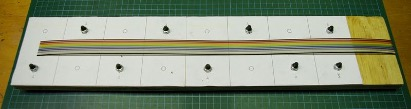
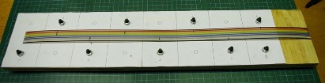
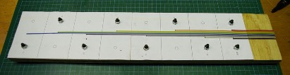
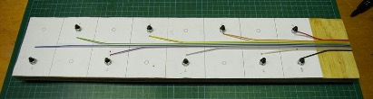
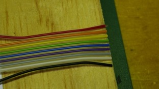
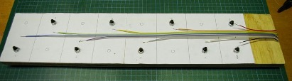
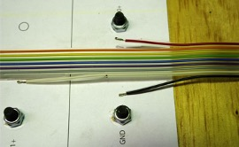
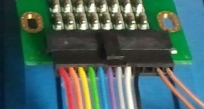

# Assembly Procedure

## Assembly Jig

Making an assembly jig with bolts at the same spacing as the battery terminals is a good idea, saving the danger of working around high power cells.

## Cut to Length

Work out where you want the CMU to be located.  It should be fastened to the wall of the battery box to aid in heatsinking, with the supplied insulation material, as outlined in the [BMS User's Manual](../User_Manual/0_Overview.md)

The appropriate length of cable has been placed on the assembly jig and cut to length in the following photo:

## Mark For Trimming

The reason for choosing the pinout of the voltage sense connector on the CMU is to make the wiring harness simpler and neater.  Each wire branches out from the edge of the ribbon, with the ribbon being trimmed down narrower as it approaches Cell 7.  The following picture shows the cut points for trimming marked onto the cable.  

The Brown wire is not used, and can be removed completely and used for the thermistor wiring.  The Red wire branches out to Cell 0+, and the Black to Cell 0–.  The White wire to Cell 1+, Orange to Cell 2+, and so on.  Each cut will be one wire deeper into the ribbon.

## Trim

Cut in on the marks, and then from the marks to the end of the ribbon.  The cut pieces can then be removed, as shown below:

## Split Branches

Cut back along from each mark by one cell length, and split the resulting stub off in the direction of each cell, as shown below:

## Separate CMU End

Cut the cable back between strands by 10mm or so at the CMU end, to allow fitting the microfit connector.

## Strip Branches

Strip around 10mm from the end of each branch, to allow folding back on itself and therefore obtaining a better crimp (double copper into crimp).

Fold back the stripped length, as shown below:

Use the proper crimp tool to crimp on the ring terminals for the cell connections.

## Fit Microfit Crimps

Strip back the CMU end of the cable by 2 – 2.5mm and use the correct tool to crimp on the molex crimps.  Pay careful attention to which way is 'up' when orienting the crimps and the housing.  The following photo shows the correct relationship. Refer to [Appendix A](30_Appendix_A.md) for component sources and [Appendix B](40_Appendix_B.md) for crimping instructions.

## Add Thermistor Wiring

Use one of the offcuts from the previous steps to make a two-wire cable to the thermistor, and crimp it into the microfit connector in the appropriate location.

## Check Harness

Use a multimeter to check resistance between adjacent pins in the microfit connector.  There should be no connection between any terminals.  

## Fit to Battery Pack

Fit the harness to your battery pack.  The ring terminals should be above the main high-current busbars, so that they do not have traction pack currents flowing through them.  Use spring or belleville washers so that the connections to the cells remain tight, even with vibration and thermal expansion.  Consider using a contact grease or jointing compound, as described in the [Prohelion WaveSculptor200 User Manual](../../../Motor_Controllers/WaveSculptor200/User_Manual/0_Overview.md) high-current wiring appendix.

