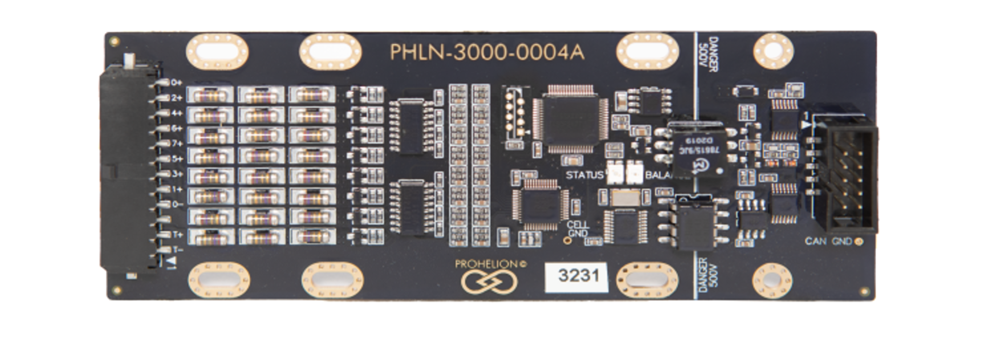
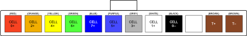
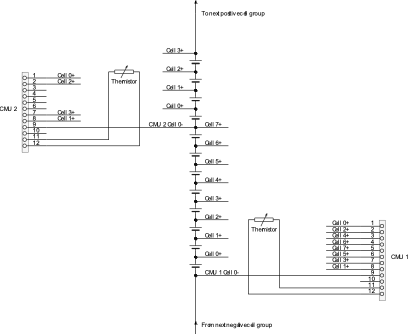

# CMU Cell Sense Wiring Assembly Procedure 

This document describes how to make the cell voltage sense wiring harness for the Prohelion 8-cell Cell Management Unit (CMU).  The examples shown are for 60Ah prismatic type LiFePO4 cells, although the procedure will be similar for other shapes and sizes of cell.  

Please read through the entire assembly procedure, as well as the [BMS User's Manual](http://localhost:4000/Battery_Management_System/User_Manual/0_Overview.md) before commencing work.

    
<strong>Working Around Batteries in Dangerous</strong> Not only are lethal high voltages present, but individual cells can also put out thousands of amps when shorted, for example with a stray wire or dropped tool, throwing out arcs and molten metal.

    
Check the legal requirements in your jurisdiction for using licensed technicians for this type of work.

    
Wear eye protection! Use insulated tools! Take extreme caution!

    
Go slow. think through every step before doing it.

The 8-cell CMU has the connections for the cell voltage and temperature sensing at one end of the circuit board.  The CAN bus ribbon cable connector is at the other end of the board.  

The CMU is shown below:

The cell sense connector is a 12-way 3mm Molex Microfit connector, with locking ramp.  8 pins are used for cell voltage sensing, one pin for cell ground, and two for a temperature sensing thermistor, leaving one pin unused.  

The mating housing is Molex part n sumber <strong>43645-1200</strong>, and the 20-24 AWG crimps part number is <strong>43030-0007</strong>. One housing and 11 crimps are required per CMU.  

The pinout is shown below, as viewed from the wire side – as you would look at it while inserting crimps.  The colours shown match those used in the recommended cable.

The CMU senses anywhere from one to eight cells.  Cell 0 must always be the first cell connected with Cell 0– connected to its negative terminal.  If one cell is being monitored, it should be connected to Cell 0; if two are monitored, they should be connected to Cell 0 and Cell 1, and so on.  

The temperature sensor must be electrically isolated from the cells, and would normally be positioned to monitor the temperature of Cell 0.  Gluing the thermistor to the cell or cell terminal is usually the most convenient option.

Schematically, the connections are shown in the following diagram, which shows one full 8-cell CMU (CMU 1), and one CMU monitoring four cells (CMU 2).  Note the connection order to the CMU, this is done to simplify the wiring layout in later steps.

