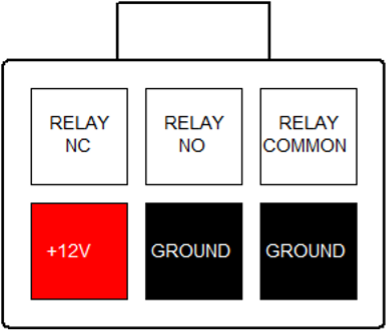

# Relay Output

The BMU provides a voltage-free relay output to use for signalling devices in the vehicle that are not capable of receiving CAN bus data.  This can be used, for example, to control the 'enable' input of a DC/DC converter or drive a relay or HV contactor.   A coil suppression diode must be used if driving this type of load. 

Refer to the [datasheet]()? for current and voltage ratings of the relay. 

The relay is active when the BMS is in Run mode.   

The connector also provides 12V and GND pins, which are sourced from the 12V contactor supply power.  These can be conveniently used in conjunction with the relay to switch 12V out to a load that requires power, for instance to drive another relay, fan or contactor. 

## Relay Output Connector 

The connector used for the Relay output is a 6-way 4.2mm pitch Molex MiniFit Jr connector.  The pinout is shown below, as viewed from the wire side – as you would look at it while inserting crimps.   

The +12V and Ground pins in this connector are wired (on the BMU PCB) to the Contactor 12V supply connector, and can be jumpered across to the relay pins to provide 12V output on relay active or inactive, switch loads to ground, etc, depending on the jumper arrangement. 

The Relay pins in this connector are wired directly to a small relay on the BMU PCB.  Refer to the [datasheet]()? for the ratings on this relay. 