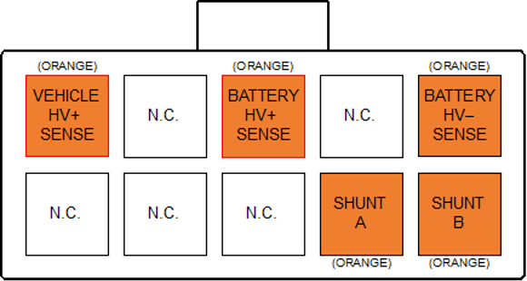

# HV Sense

The HV Sense connector allows the BMU to measure the total pack voltage (pack side of the contactors), total DC bus voltage (vehicle side of the contactors), and total pack current flow.  This information is used to control precharge and pack safety, and to calculate pack Amp-Hours (Ah) usage and SOC. 

The HV Sense connector and associated electronics are isolated from the remainder of the BMU.  Take care when routing wiring around this connector to maintain good isolation between it and the rest of the vehicle system. 

Wire the Vehicle HV+ and Battery HV+ sense wires to their respective sides of Contactor 2 in the positive rail.  Wire the Battery HV– and Shunt sense wires to their respective sides of the current shunt in the negative rail.  Refer to the BMS wiring diagram in the Appendix for more details.   

Please note that this sense wiring must be rated for the full pack voltage, although it is low current so a small gauge wire can be used.  Check the relevant wiring standards regarding wire rating and colours, for example NCOP14 (in Australia) specifies Orange wire for all battery pack and other HV system wiring. 

The Battery HV– and Shunt sense wires should be twisted together to minimise noise pickup between the BMU and the shunt.  It is suggested to have these wires no longer than 300-400mm. 

## HV Sense Connector

The connector used for the HV Sense is a 10-way 4.2mm pitch Molex MiniFit Jr connector.  The pinout is shown below, as viewed from the wire side – as you would look at it while inserting crimps.  The colours shown match those recommended in most EV wiring standards for HV DC wiring. 

| The sense points are as following:                 
|----------------------------------------------------|
| Vehicle HV+ Sense  | Vehicle side of Contractor 2  | 
| Battery HV+ Sense | Battery side of Contractor 2   |
| Battery HV- Sense   | Battery side of 25mV Shunt   |             
| Shunt A   | Vehicle side of 25mV Shunt             |          
| Shunt B | Battery side of 25mV Shunt               |       

# HV Sense Fusing 

All HV Sense connections should be fused with an appropriately rated fuse for the type of wire used for the sense connection.  This fuse should be low current (since the sense wiring uses small wires) and rated for the full DC pack voltage.  The fuse should be located towards the supply end of the sense wiring. See [Fusing](Fusing.md). 

