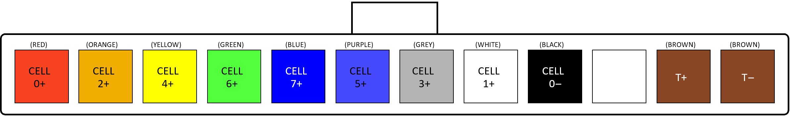

# Cell Voltage & Temperature Sense Connector 

<figure markdown>

<figcaption>Prohelion CMU Connectors</figcaption>
</figure>

The connector used for the Cell Voltage Sense is a 12-way single-row 3mm pitch Molex MicroFit connector.  The pinout is shown below, as viewed from the wire side – as you would look at it while inserting crimps.  The colours shown match those used in the recommended cable. 

<figure markdown>

<figcaption>Prohelion CMU Cell Voltage and Temp Sensor</figcaption>
</figure>

Please refer to the associated [Assembly Procedure document](../../Cell_Management_Unit/Wiring_Harness/Assembly_Procedure.md) for detailed procedures on making the cell sense wiring harness. 

The recommended cell temperature sensor to use is a Murata 10k NTC bead type thermistor (NXFT15XH103FA2B100) with 100mm leads. The thermistor should be attached to a part of the cell that is a good representation of the internal temperature, such as a cell terminal (Care MUST be taken that the sensor is appropriately insulated from the terminal). 