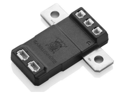

This section provides information on the Prohelion D1000 Gen2 Battery Junction Unit (BJU). 

## Supported Devices

The Prohelion D1000 Gen2 Battery Management Unit (BMU) supports the following devices as the Battery Junction Unit (BJU):

### Option #1 - Isabellenhuette IVT-S - High Precision Current Measurement System

For more information on the Isabellenhuette IVT-S, see the datasheet: [Datasheet-IVT-S-V1.03.pdf](https://www.isabellenhuetteusa.com/wp-content/uploads/2022/07/Datasheet-IVT-S-V1.03.pdf)    

#### Expected Usage

The Prohelion D1000 Gen2 Battery Management Unit (BMU) firmware expects the following IVT-S measurement channel arrangement

| **IVT-S Channel**        | **Battery Measurement**                                |
|--------------------------|--------------------------------------------------------|
| **Current**              | Battery Current                                        |
| **Voltage 1** (U1)       | Battery Voltage (on battery side of pack fuse)         |
| **Voltage 2** (U2)       | Fuse Voltage (on contactor side of pack fuse)          |
| **Voltage 3** (U3)       | Load Voltage (on load side of main+ contactor)         |

!!! tip "Coming Soon!"
    As other similar devices become available, we will begin to integrate them into the standard firmware release.
