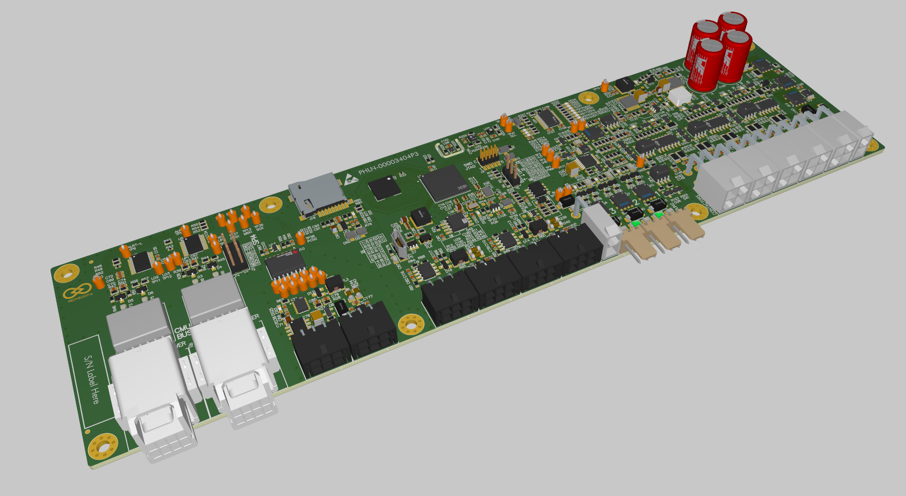
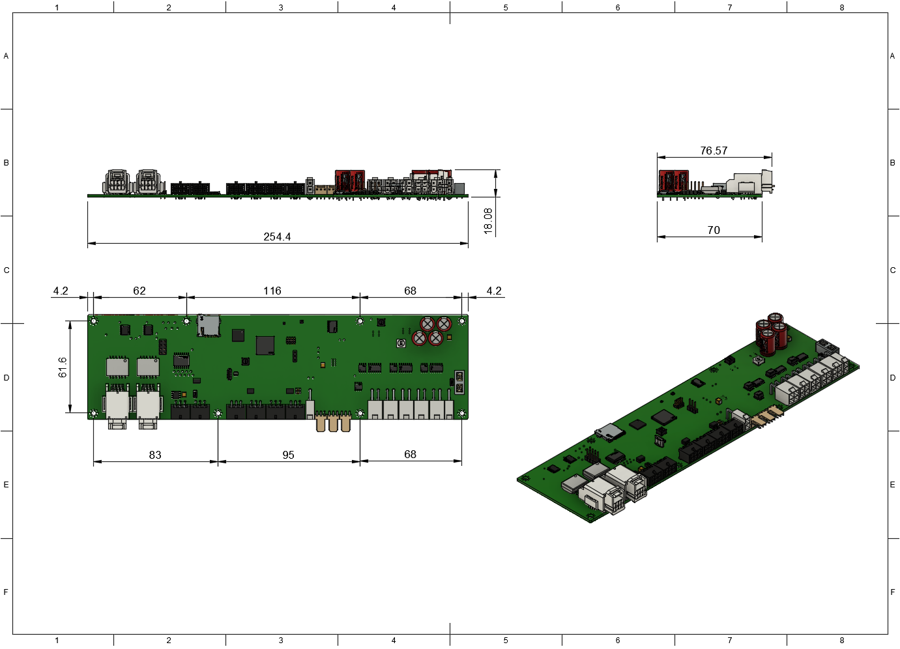
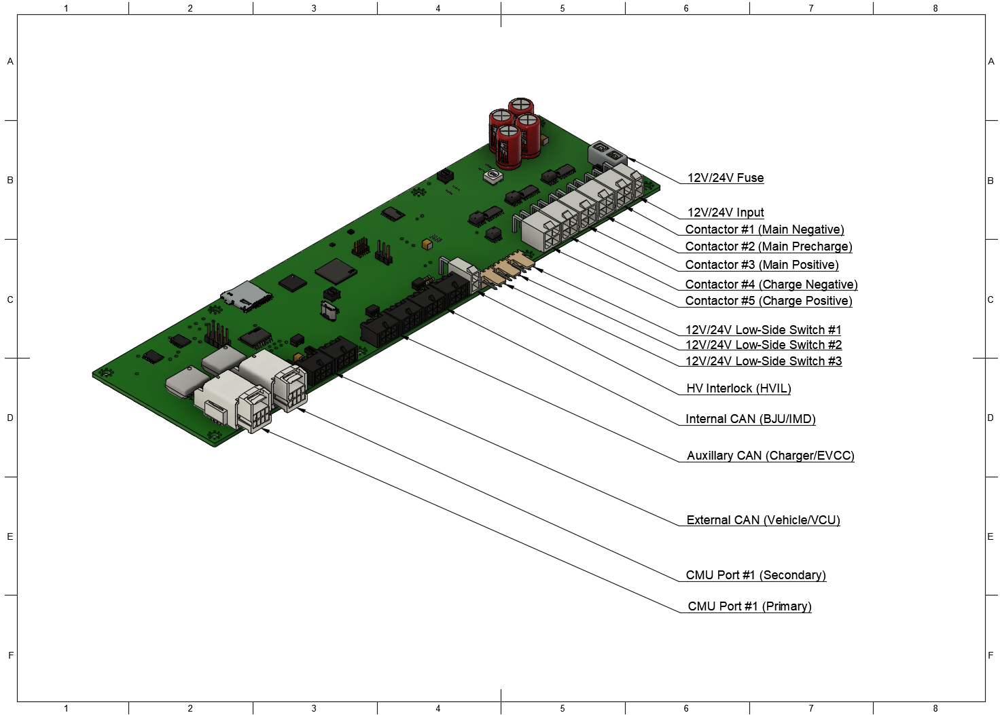

This section provides information on the Prohelion D1000 Gen2 Battery Management Unit (BMU). 

<figure markdown>

<figcaption>Figure 1:  Prohelion BMS D1000 Gen2 BMU</figcaption>
</figure>

## Features

- 5 contactor outputs
- 3 low-side switches
- 2 non-isolated CAN bus networks (Internal and Charger)
- 1 isolated CAN bus network (External)
- Pressure and humidity sensor
- VOC and NOx sensor
- Temperature sensors

## Specifications 

| **Parameter** | **Value**                                                    |
|----------------|-------------------------------------------------------------|
| BMS Supply Voltage               | 12 V / 24 V  (two variants)               |
| BMS Supply Current               | 80 mA (excluding contactors)              |

## Dimensions

<figure markdown>

<figcaption>Figure 2:  Prohelion BMS D1000 Gen2 BMU Drawing 1</figcaption>
</figure>

<figure markdown>

<figcaption>Figure 3:  Prohelion BMS D1000 Gen2 BMU Drawing 2</figcaption>
</figure>

## Connectors and Pinouts

| **Connector Name**        | **Receptacle Part Number**  | **Plug Part Number**          |
|---------------------------|-----------------------------|-------------------------------|
| 12V/24V Input Port        | Wurth WR-MPC4 649002227222  | Wurth WR-MPC4 649002113322    |
| Contactor Ports           | Wurth WR-MPC4 649004227222  | Wurth WR-MPC4 649004113322    |
| Low-Side Switch Ports     | Wurth WR-WTB 61900319521    | Wurth WR-WTB 61900311621      |
| HVIL Port                 | Wurth WR-MPC4 649002227222  | Wurth WR-MPC4 649002113322    |
| CAN Ports                 | Wurth WR-MPC3 66200621022   | Wurth WR-MPC3 662006113322    |
| CMU Communication Ports   | JAE Electronics MX34R08HF4T | JAE Electronics MX34008SF4    |

### 12V/24V Input Port

| **Pin Number** | **Label**                            |
|----------------|--------------------------------------|
| 1              | BMS Input Power+  (12V/24V)          |
| 2              | BMS Ground                           |

### Contactor Port Pinout

| **Pin Number** | **Label**                            |
|----------------|--------------------------------------|
| 1              | Contactor Power+ (12V/24V) (switched)|
| 2              | Auxiliary Power+ (12V/24V)           |
| 3              | Contactor Ground                     |
| 3              | Auxiliary Ground (sense)             |

### Low-Side Switch Port Pinout

| **Pin Number** | **Label**                            |
|----------------|--------------------------------------|
| 1              | Ground (switched)                    |
| 2              | Power+ (12V/24V)                     |
| 3              | Auxiliary Ground (sense)             |

### HVIL Port Pinout

| **Pin Number** | **Label**                            |
|----------------|--------------------------------------|
| 1              | HVIL Out                             |
| 2              | HVIL In                              |

### CAN Communication Port Pinout

| **Pin Number** | **Label**                            |
|----------------|--------------------------------------|
| 1              | CAN Power+ (12V/24)                  |
| 2              | CAN Ground                           |
| 3              | CAN Shield                           |
| 4              | CAN High                             |
| 5              | CAN Low                              |
| 6              | CAN Ground                           |

### CMU Communication Port Pinout

| **Pin Number** | **Label**                            | **Pin Number** | **Label**                             |
|----------------|--------------------------------------|----------------|---------------------------------------|
| 1              | TX Positive                          | 5              | TX Negative                           |
| 2              | Not Connected                        | 6              | Not Connected                         |
| 3              | Not Connected                        | 7              | Not Connected                         |
| 4              | RX Negative                          | 8              | RX Negative                           |
