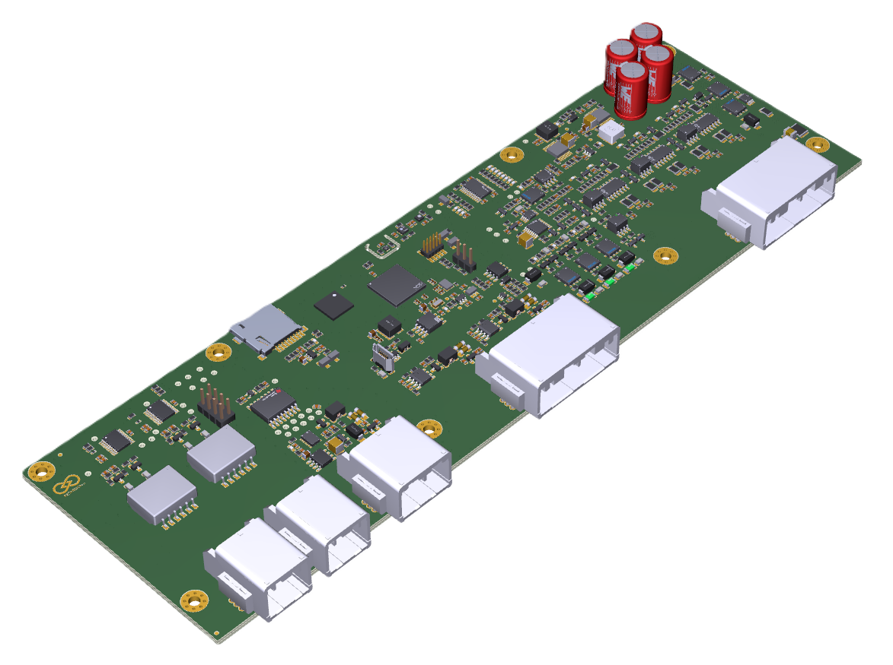
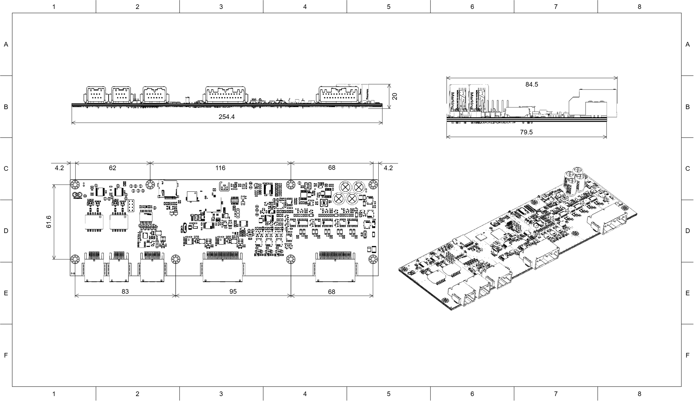
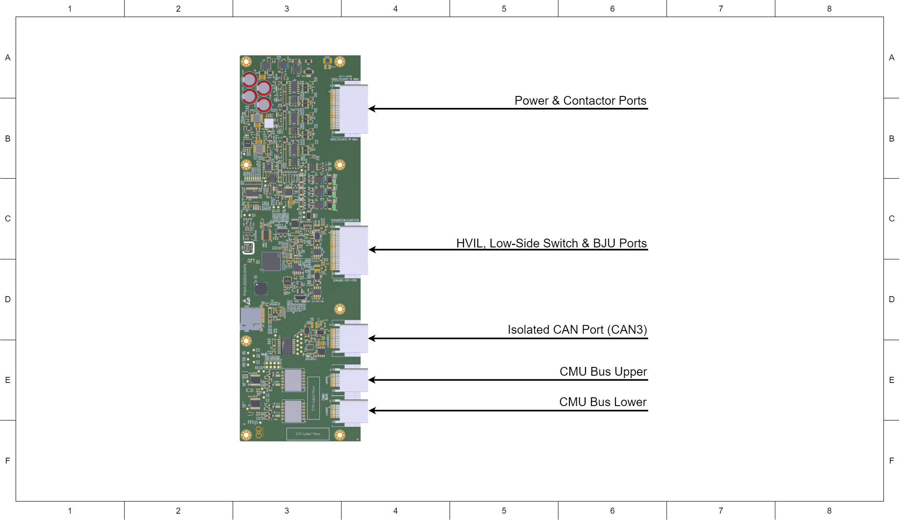

# Prohelion BMS D1000 Gen2 - Hardware Components
This section provides information on the Prohelion D1000 Gen2 Battery Management Unit (BMU). 

<figure markdown>

<figcaption>Figure 1:  Prohelion BMS D1000 Gen2 BMU</figcaption>
</figure>

## Features

- 5 contactor outputs
- 3 low-side switches
- 2 non-isolated CAN bus networks (Internal and Reserved)
- 1 isolated CAN bus network (External)
- Pressure and humidity sensor
- VOC and NOx sensor
- Temperature sensors

## Specifications 

| **Parameter**                    | **Value**                                 |
|----------------------------------|-------------------------------------------|
| BMS Supply Voltage               | 12 V / 24 V  (two variants)               |
| BMS Supply Current               | 80 mA (excluding contactors)              |

## Dimensions

<figure markdown>

<figcaption>Figure 2:  Prohelion BMS D1000 Gen2 BMU Drawing 1</figcaption>
</figure>

<figure markdown>

<figcaption>Figure 3:  Prohelion BMS D1000 Gen2 BMU Drawing 2</figcaption>
</figure>

## Connectors and Pinouts

| **Connector Name**                | **Receptacle Part Number**  | **Plug Part Number**       |
|-----------------------------------|-----------------------------|----------------------------|
| Power & Contactor Ports           | JAE Electronics MX34R24HF4T | JAE Electronics MX34024SF1 |
| HVIL, Low-Side Switch & BJU Ports | JAE Electronics MX34R24HF4T | JAE Electronics MX34024SF1 |
| Isolated CAN Port (CAN3)          | JAE Electronics MX34R12HF4T | JAE Electronics MX34012SF1 |
| CMU Bus Upper                     | JAE Electronics MX34R08HF4T | JAE Electronics MX34008SF4 |
| CMU Bus Lower                     | JAE Electronics MX34R08HF4T | JAE Electronics MX34008SF4 |

### Power & Contactor Ports

| **Pin Number** | **Label**                      | **Pin Number** | **Label**                      |
|----------------|--------------------------------|----------------|--------------------------------|
| 1              | BMS Input Power+  (12V/24V)    | 13             | BMS Input Power+  (12V/24V)    |
| 2              | BMS Input Power-               | 14             | BMS Input Power-               |
| 3              | BMS Ground                     | 15             | Contactor 1 Positive           |
| 4              | Contactor 1 Auxiliary Negative | 16             | Contactor 1 Auxiliary Positive |
| 5              | BMS Ground                     | 17             | Contactor 2 Positive           |
| 6              | Contactor 2 Auxiliary Negative | 18             | Contactor 2 Auxiliary Positive |
| 7              | BMS Ground                     | 19             | Contactor 3 Positive           |
| 8              | Contactor 3 Auxiliary Negative | 20             | Contactor 3 Auxiliary Positive |
| 9              | BMS Ground                     | 21             | Contactor 4 Positive           |
| 10             | Contactor 4 Auxiliary Negative | 22             | Contactor 4 Auxiliary Positive |
| 11             | BMS Ground                     | 23             | Contactor 5 Positive           |
| 12             | Contactor 5 Auxiliary Negative | 24             | Contactor 5 Auxiliary Positive |

### HVIL, Low-Side Switch & BJU Ports

| **Pin Number** | **Label**                    | **Pin Number** | **Label**                    |
|----------------|------------------------------|----------------|------------------------------|
| 1              | HVIL Positive                | 13             | HVIL Input                   |
| 2              | BMS Ground                   | 14             | CAN1 Shield                  |
| 3              | CAN1 Low                     | 15             | CAN1 High                    |
| 4              | Not Connected                | 16             | BJU Power                    |
| 5              | Low-Side Switch 3 Negative   | 17             | Low-Side Switch 3 Positive   |
| 6              | Not Connected                | 18             | Low-Side Switch 3 Sense      |
| 7              | Low-Side Switch 2 Negative   | 19             | Low-Side Switch 2 Positive   |
| 8              | Not Connected                | 20             | Low-Side Switch 2 Sense      |
| 9              | Low-Side Switch 1 Negative   | 21             | Low-Side Switch 1 Positive   |
| 10             | Not Connected                | 22             | Low-Side Switch 1 Sense      |
| 11             | BMS Ground                   | 23             | CAN2 Shield                  |
| 12             | CAN2 Low[^1]                 | 24             | CAN2 High[^1]                |

[^1]: CAN2 is reserved for future use.

### Isolated CAN Port (CAN3)

| **Pin Number** | **Label**     | **Pin Number** | **Label**     |
|----------------|---------------|----------------|---------------|
| 1              | CAN3 Low      | 7              | CAN3 High     |
| 2              | CAN3 Ground   | 8              | CAN3 Power    |
| 3              | Not Connected | 9              | CAN3 Shield   |
| 4              | CAN3 Low      | 10             | CAN3 High     |
| 5              | CAN3 Ground   | 11             | CAN3 Power    |
| 6              | Not Connected | 12             | CAN3 Shield   |

### CMU Bus Port Upper

| **Pin Number** | **Label**                            | **Pin Number** | **Label**                             |
|----------------|--------------------------------------|----------------|---------------------------------------|
| 1              | TX Positive                          | 5              | TX Negative                           |
| 2              | Not Connected                        | 6              | Not Connected                         |
| 3              | Not Connected                        | 7              | Not Connected                         |
| 4              | RX Negative                          | 8              | RX Negative                           |

### CMU Bus Port Lower

| **Pin Number** | **Label**                            | **Pin Number** | **Label**                             |
|----------------|--------------------------------------|----------------|---------------------------------------|
| 1              | TX Positive                          | 5              | TX Negative                           |
| 2              | Not Connected                        | 6              | Not Connected                         |
| 3              | Not Connected                        | 7              | Not Connected                         |
| 4              | RX Negative                          | 8              | RX Negative                           |