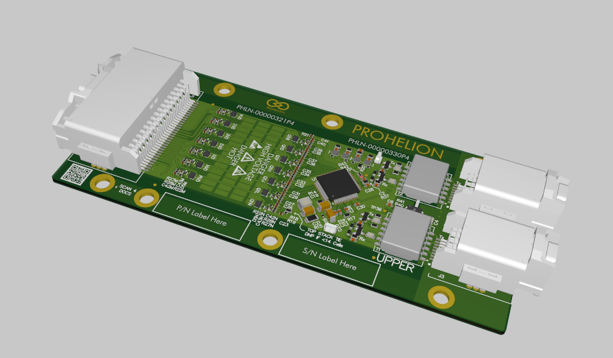
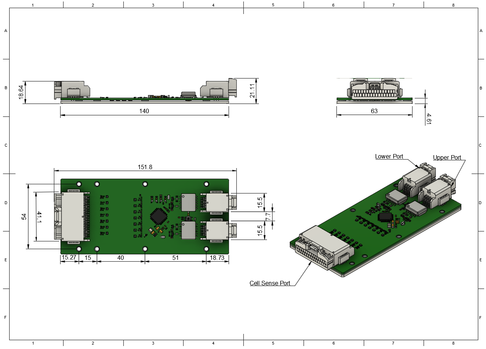
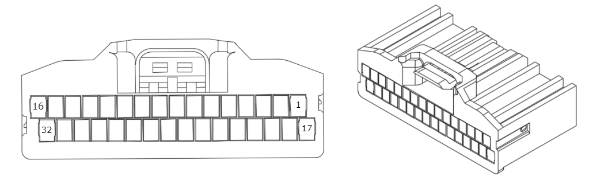

This section provides information on the Prohelion D1000 Gen2 Cell Management Unit (CMU). 

<figure markdown>

<figcaption>Figure 1:  Prohelion BMS D1000 Gen2 CMU Cell Sense Connector</figcaption>
</figure>

## Features

- Up to 14 Cell Voltage Measurements at 1mV Accuracy
- Up to 4 Temperature Measurements
- Up to 650 mA Balancing Current per Cell
- Support ASIL D Requirements for Cell Voltage,
Temperature, Communication
- AECQ-100 Grade 1 Temperature Range
- Isolated Battery Management Daisy-Chain Protocol

## Specifications

| **Parameter** | **Value**                                                    |
|----------------|-------------------------------------------------------------|
| Operating Voltage Range               | 9 V to 65 V                          |
| Operating Temperature Range           | -40°C to +125°C                      |
| Ultra-Low-Power Operation             | Shutdown Mode: 2µA                   |
| Number of Cell Voltage Measurements   | 4-14 (configurable)                  |
| Number of Temperature Measurements    | 0-4 (configurable)                   |
| Measurement Accuracy                  | 1mV Accuracy (3.6V, +25°C), 2mV Accuracy (+5°C to +40°C), 4.5mV Accuracy (-40°C to +125°C) |
| Balancing Current                     | 650 mA @ 100% duty-cycle             |

## Dimensions

<figure markdown>

<figcaption>Figure 1:  Prohelion BMS D1000 Gen2 CMU</figcaption>
</figure>

## Connectors and Pinouts

| **Connector Name**        | **Receptacle Part Number**  | **Plug Part Number**          |
|---------------------------|-----------------------------|-------------------------------|
| Cell Sense Connector      | JAE Electronics MX34R32HF4T | JAE Electronics MX34032SF1    |
| Upper Communication Port  | JAE Electronics MX34R08HF4T | JAE Electronics MX34008SF4    |
| Lower Communication Port  | JAE Electronics MX34R08HF4T | JAE Electronics MX34008SF4    |

### Cell Sense Connector Pinout

<figure markdown>

<figcaption>Figure 1:  Prohelion BMS D1000 Gen2 CMU Cell Sense Connector</figcaption>
</figure>

| **Pin Number** | **Label**                            | **Pin Number** | **Label**                             |
|----------------|--------------------------------------|----------------|---------------------------------------|
| 1              | Not Connected                        | 17             | Not Connected                         |
| 2              | Not Connected                        | 18             | Not Connected                         |
| 3              | Top of Stack (see note [^1])         | 19             | Cell 14+                              |
| 4              | Cell 13+                             | 20             | Cell 12+                              |
| 5              | Cell 11+                             | 21             | Cell 10+                              |
| 6              | Cell 9+                              | 22             | Cell 8+                               |
| 7              | Cell 7+                              | 23             | Cell 6+                               |
| 8              | Cell 5+                              | 24             | Cell 4+                               |
| 9              | Cell 3+                              | 25             | Cell 2+                               |
| 10             | Cell 1+                              | 26             | Cell 1- (GND) (see note [^2])         |
| 11             | Not Connected                        | 27             | Cell 1- (GND) (see note [^2])         |
| 12             | Not Connected                        | 28             | Not Connected                         |
| 13             | Temp 4 - GND (see note [^3])         | 29             | Temp A4                               |
| 14             | Temp 3 - GND (see note [^3])         | 30             | Temp A3                               |
| 15             | Temp 2 - GND (see note [^3])         | 31             | Temp A2                               |
| 16             | Temp 1 - GND (see note [^3])         | 32             | Temp A1                               |

[^1]: Note 1: Top of stack is to be connected to the highest potential cell of the CMU. E.g. If the CMU is only measuring 10 cells, Top of Stack is considered to be the 10th cell (Cell 10+). 

[^2]: Note 2: Pins labelled as "Cell 1-" are the ground reference for the CMU. They are not the same as battery ground or any other ground. 

[^3]: Note 3: The pins labelled as "Temp X - GND" on the temp sense connector is not to be used for anything other than providing a ground reference for the respective thermistor on the same connector. They are not the same as battery ground or any other ground.  A short-circuit between battery ground and the thermistor ground could result in damage.

### Upper Communication Port Pinout

| **Pin Number** | **Label**                            | **Pin Number** | **Label**                             |
|----------------|--------------------------------------|----------------|---------------------------------------|
| 1              | TX Upper Positive                    | 5              | TX Upper Negative                     |
| 2              | Not Connected                        | 6              | Not Connected                         |
| 3              | Not Connected                        | 7              | Not Connected                         |
| 4              | RX Upper Negative                    | 8              | RX Upper Negative                     |

### Lower Communication Port Pinout

| **Pin Number** | **Label**                            | **Pin Number** | **Label**                             |
|----------------|--------------------------------------|----------------|---------------------------------------|
| 1              | TX Lower Positive                    | 5              | TX Lower Negative                     |
| 2              | Not Connected                        | 6              | Not Connected                         |
| 3              | Not Connected                        | 7              | Not Connected                         |
| 4              | RX Lower Negative                    | 8              | RX Lower Negative                     |