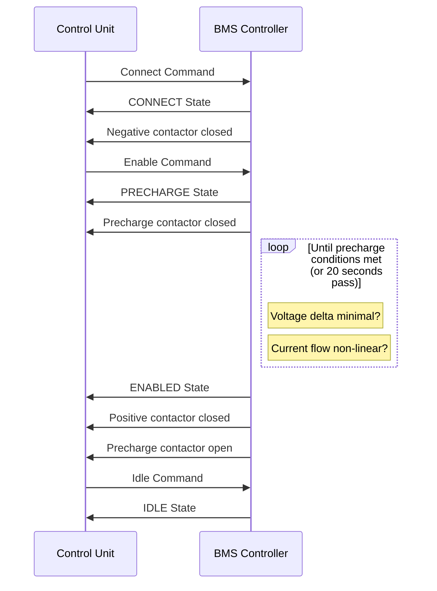
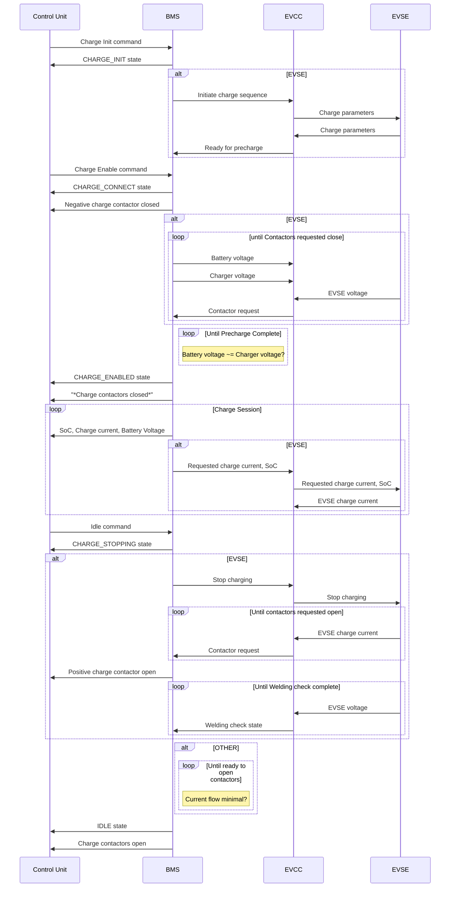

# BMS D1000 Gen2 State Sequence Diagram

## Enable Operation Flow

```mermaid
sequenceDiagram
    participant ECU as Control Unit
    participant BMS as BMS Controller

    ECU->>BMS: Connect Command
    BMS->>ECU: CONNECT State
    
    BMS->>ECU: Negative contactor closed
    ECU->>BMS: Enable Command
    BMS->>ECU: PRECHARGE State
    BMS->>ECU: Precharge contactor closed
    
    loop Until precharge conditions met (or 20 seconds pass)
        Note right of BMS: Voltage delta minimal?
        Note right of BMS: Current flow non-linear?
    end

    BMS->>ECU: ENABLED State
    BMS->>ECU: Positive contactor closed
    BMS->>ECU: Precharge contactor open
    
    ECU->>BMS: Idle Command
    BMS->>ECU: IDLE State
```

## Charge Operation Flow

```mermaid
sequenceDiagram
    participant ECU as Control Unit
    participant BMS as BMS
    participant EVCC as EVCC
    participant EVSE as EVSE

    ECU->>BMS: Charge Init command
    BMS->>ECU: CHARGE_INIT state
    alt EVSE
        BMS->>EVCC: Initiate charge sequence
        EVCC->>EVSE: Charge parameters
        EVSE->>EVCC: Charge parameters
        EVCC->>BMS: Ready for precharge
    end

    ECU->>BMS: Charge Enable command
    BMS->>ECU: CHARGE_CONNECT state
    BMS->>ECU: Negative charge contactor closed


    alt EVSE
        loop until Contactors requested close
            BMS->>EVCC: Battery voltage
            BMS->>EVCC: Charger voltage
            EVSE->>EVCC: EVSE voltage
            EVCC->>BMS: Contactor request
        end
    end

    loop Until Precharge Complete
        Note right of BMS: Battery voltage ~= Charger voltage?
    end

    BMS->>ECU: CHARGE_ENABLED state
    BMS->>ECU: "*Charge contactors closed*"

    loop Charge Session
        BMS->>ECU: SoC, Charge current, Battery Voltage
        alt EVSE
            BMS->>EVCC: Requested charge current, SoC
            EVCC->>EVSE: Requested charge current, SoC
            EVSE->>EVCC: EVSE charge current
        end
    end
    
    ECU->>BMS: Idle command
    BMS->>ECU: CHARGE_STOPPING state
    
    alt EVSE
        BMS->>EVCC: Stop charging
        EVCC->>EVSE: Stop charging
        loop Until contactors requested open
            EVSE->>EVCC: EVSE charge current
            EVCC->>BMS: Contactor request
        end
        BMS->>ECU: Positive charge contactor open
        loop Until Welding check complete
            EVSE->>EVCC: EVSE voltage
            EVCC->>BMS: Welding check state
        end
    end
    alt OTHER
        loop Until ready to open contactors
            Note right of BMS: Current flow minimal?
        end
    end

    BMS->>ECU: IDLE state
    BMS->>ECU: Charge contactors open
```