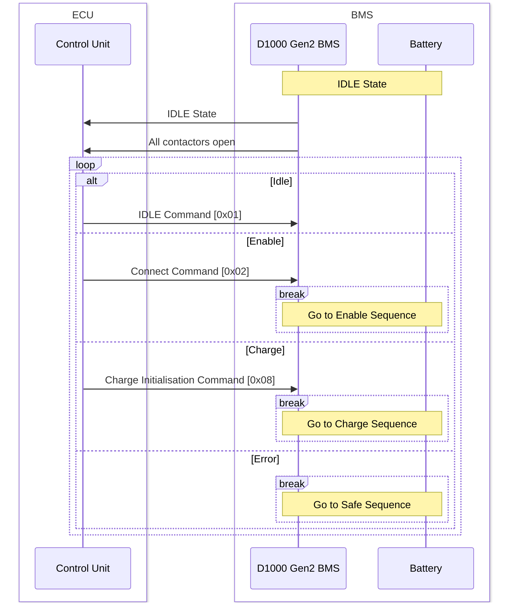
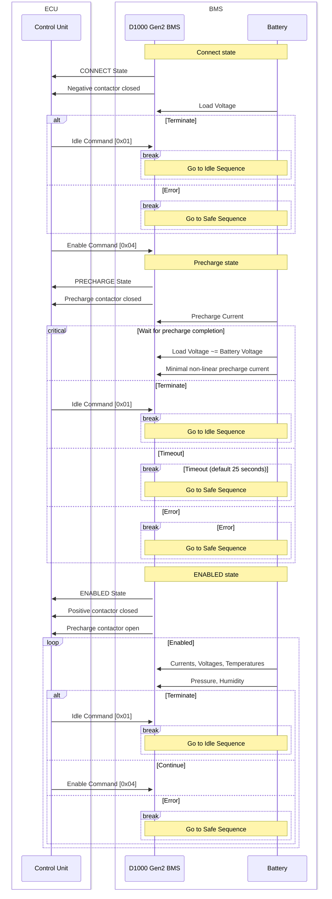
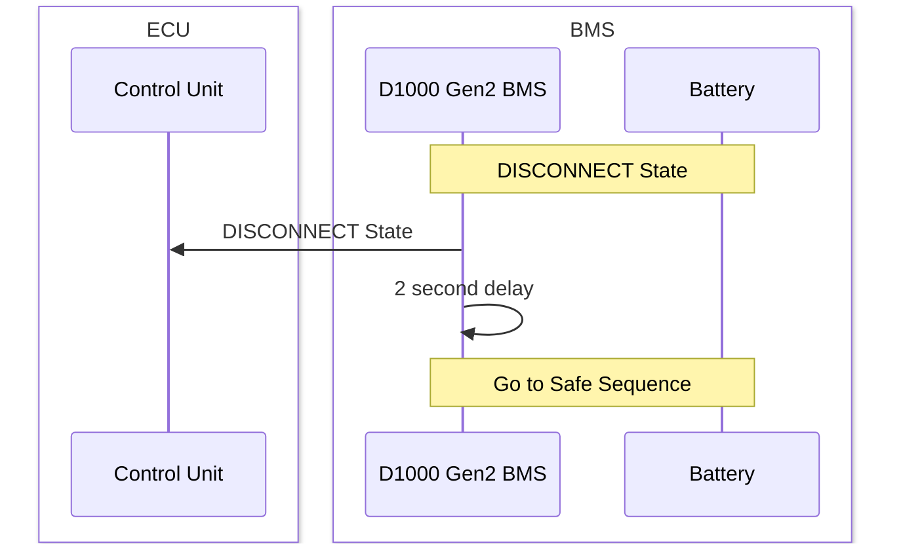
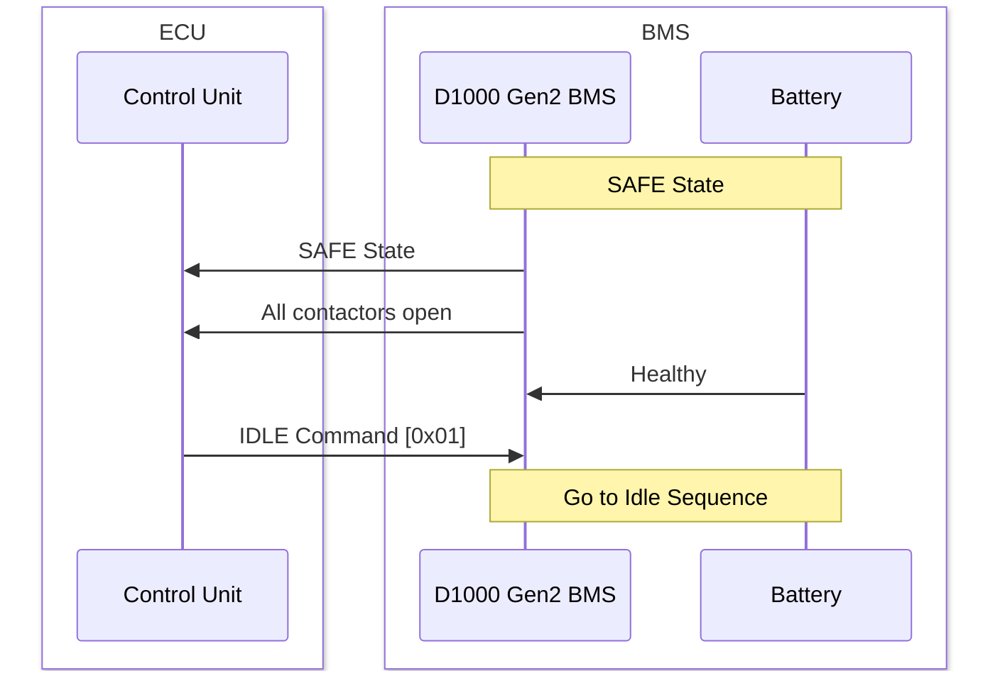

# BMS D1000 Gen2 State Sequence Diagram

## Idle Sequence

```mermaid
sequenceDiagram
    box rgba(255, 255, 255, 1) ECU
        participant ECU as Control Unit
    end
    box rgba(255, 255, 255, 1) BMS
        participant BMS as D1000 Gen2 BMS
        participant BATT as Battery
    end
    Note over BMS,BATT: IDLE State
    BMS->>ECU: IDLE State
    BMS->>ECU: All contactors open
    loop
        alt Idle
            ECU->>BMS: IDLE Command [0x01]
        else Enable
            ECU->>BMS: Connect Command [0x02]
            break
                Note over BMS,BATT: Go to Enable Sequence
            end
        else Charge
            ECU->>BMS: Charge Initialisation Command [0x08]
            break
                Note over BMS,BATT: Go to Charge Sequence
            end
        else Error
            break
                Note over BMS, BATT: Go to Safe Sequence
            end
        end
    end
```

## Enable Sequence

```mermaid
sequenceDiagram
    box rgba(255, 255, 255, 1) ECU
        participant ECU as Control Unit
    end
    box rgba(255, 255, 255, 1) BMS
        participant BMS as D1000 Gen2 BMS
        participant BATT as Battery
    end

    Note over BMS, BATT: Connect state
    BMS->>ECU: CONNECT State
    BMS->>ECU: Negative contactor closed
    BATT->>+BMS: Load Voltage

    alt Terminate
        ECU->>BMS: Idle Command [0x01]
        break
            Note over BMS, BATT: Go to Idle Sequence
        end
    else Error
        break
            Note over BMS, BATT: Go to Safe Sequence
        end
    end

    ECU->>BMS: Enable Command [0x04]
    Note over BMS, BATT: Precharge state
    BMS->>ECU: PRECHARGE State
    BMS->>ECU: Precharge contactor closed
    BATT->>BMS: Precharge Current

    critical Wait for precharge completion
        BATT->>BMS: Load Voltage ~= Battery Voltage
        BATT->>BMS: Minimal non-linear precharge current
    option Terminate
        ECU->>BMS: Idle Command [0x01]
        break
            Note over BMS, BATT: Go to Idle Sequence
        end
    option Timeout
        break Timeout (default 25 seconds)
            Note over BMS, BATT: Go to Safe Sequence
        end
    option Error
        break Error
            Note over BMS, BATT: Go to Safe Sequence
        end
    end
    Note over BMS, BATT: ENABLED state
    BMS->>ECU: ENABLED State
    BMS->>ECU: Positive contactor closed
    BMS->>ECU: Precharge contactor open
    loop Enabled
        BATT->>BMS: Currents, Voltages, Temperatures
        BATT->>BMS: Pressure, Humidity
        alt Terminate
            ECU->>BMS: Idle Command [0x01]
            break
                Note over BMS, BATT: Go to Idle Sequence
            end
        else Continue
            ECU->>BMS: Enable Command [0x04]
        else Error
            break
                Note over BMS, BATT: Go to Safe Sequence
            end
        end

    end
```

## Charge Sequence

```mermaid
sequenceDiagram
    box rgba(255, 255, 255, 1) ECU
        participant ECU as Control Unit
    end
    box rgba(255, 255, 255, 1) BMS
        participant BMS as D1000 Gen2 BMS
        participant BATT as Battery
    end
    participant EVCC as EVCC
    participant EVSE as EVSE

    Note over BMS, BATT: Charge Initialisation state
    BMS->>ECU: CHARGE_INIT State

    alt Terminate
        ECU->>BMS: Idle Command [0x01]
        break
            Note over BMS, BATT: Go to Idle Sequence
        end
    else Error
        break
            Note over BMS, BATT: Go to Safe Sequence
        end
    end

    alt Configuration Charge Method: None
        Note over BMS, BATT: Go to Safe Sequence
    else Configuration Charge Method: EVSE
        BMS->>EVCC: Initiate charge sequence
        EVCC->>EVSE: Charge parameters
        EVSE->>EVCC: Charge parameters
        EVCC->>BMS: Ready for precharge
    end

    ECU->>BMS: Charge Enable command [0x10]
    Note over BMS, BATT: Charge Connect state
    BMS->>ECU: CHARGE_CONNECT state
    BMS->>ECU: Negative charge contactor closed


    loop Precharge
        BATT->>BMS: Charger Voltage, Battery Voltage

        critical Wait for precharge completion
            ECU->>BMS: Charge Enable Command [0x10]
            alt Configuration Charge Method: EVSE
                BMS->>EVCC: Battery voltage
                BMS->>EVCC: Charger voltage
                EVSE->>EVCC: EVSE voltage
                EVCC->>BMS: Close contactor request [Precharge complete]
            else Configuration Charge Method: Other
                BATT->>BMS: Charger Voltage ~= Battery Voltage [Precharge complete]
            end
        option Terminate
            ECU->>BMS: Idle Command [0x01]
            break
                alt Configuration Charge Method: EVSE
                    BMS->>EVCC: Terminate session
                    EVCC->>EVSE: Terminate session
                end

                Note over BMS, BATT: Go to Idle Sequence
            end
        option
            break Timeout (default 50 seconds)
                Note over BMS, BATT: Go to Disconnect Sequence
            end
        option
            break Error
                Note over BMS, BATT: Go to Disconnect Sequence
            end
        end
    end

    Note over BMS, BATT: Charge Enabled state
    BMS->>ECU: CHARGE_ENABLED state
    BMS->>ECU: Positive charge contactor closed
    loop Charge Enabled
        BATT->>BMS: Currents, Voltages, Temperatures
        BATT->>BMS: Pressure, Humidity
        BMS->>BATT: Balancing control
        alt Terminate
            alt Requested
                ECU->>BMS: Idle Command [0x01]
            else Battery Full
                BATT->>BMS: SoC 100%
            end
            Note over BMS, BATT: Go to Charge Stopping state

        else Continue
            ECU->>BMS: Charge Enable Command [0x10]
            BATT->>BMS: Currents, Voltages, Temperatures
            BATT->>BMS: Pressure, Humidity
            alt Configuration Charge Method: EVSE
                BMS->>EVCC: Requested charge current, SoC
                EVCC->>EVSE: Requested charge current, SoC
                EVSE->>EVCC: EVSE charge current
            end

        else Error
            break
                Note over BMS, BATT: Go to Disconnect Sequence
            end
        end
    end
    
    Note over BMS, BATT: Charge Stopping state
    BMS->>ECU: CHARGE_STOPPING state
    
    alt Configuration Charge Method: EVSE
        BMS->>+EVCC: Stop charging
        EVCC->>EVSE: Stop charging
        EVSE->>EVCC: EVSE charge current
        critical Contactors open
            EVCC->>-BMS: Open contactor request
        option Timeout (20 seconds)
            break
                Note over BMS, BATT: Go to Disconnect Sequence
            end
        end

        BMS->>ECU: Positive charge contactor open

        BMS->>+EVCC: Positive charge contactor open
        BATT->>BMS: Charger Voltage
        BMS->>EVCC: Charger Voltage
        EVSE->>EVCC: EVSE voltage
        EVCC->>-BMS: Welding check complete
        critical Welding check complete
            alt No welding detected
                break
                    Note over BMS, BATT: Go to Idle Sequence
                end
            else Welding detected
                break
                    Note over BMS, BATT: Go to Disconnect Sequence
                end
            end
        option Timeout (20 Seconds)
            break
                Note over BMS, BATT: Go to Disconnect Sequence
            end
        end
    else Configuration Charge Method: Other
        alt
            BATT->>BMS: Current < 5A
        else Timeout (20 Seconds)
            break
                Note over BMS, BATT: Go to Disconnect Sequence
            end
        end
        break
            Note over BMS, BATT: Go to Idle Sequence
        end
    end
```
## Disconnect Sequence

```mermaid
sequenceDiagram
    box rgba(255, 255, 255, 1) ECU
        participant ECU as Control Unit
    end
    box rgba(255, 255, 255, 1) BMS
        participant BMS as D1000 Gen2 BMS
        participant BATT as Battery
    end
    Note over BMS,BATT: DISCONNECT State
    BMS->>ECU: DISCONNECT State
    BMS->>BMS: 2 second delay
    Note over BMS,BATT: Go to Safe Sequence
```
## Safe Sequence

```mermaid
sequenceDiagram
    box rgba(255, 255, 255, 1) ECU
        participant ECU as Control Unit
    end
    box rgba(255, 255, 255, 1) BMS
        participant BMS as D1000 Gen2 BMS
        participant BATT as Battery
    end
    Note over BMS,BATT: SAFE State
    BMS->>ECU: SAFE State
    BMS->>ECU: All contactors open
    BATT->>BMS: Healthy
    ECU->>BMS: IDLE Command [0x01]
    Note over BMS,BATT: Go to Idle Sequence
```