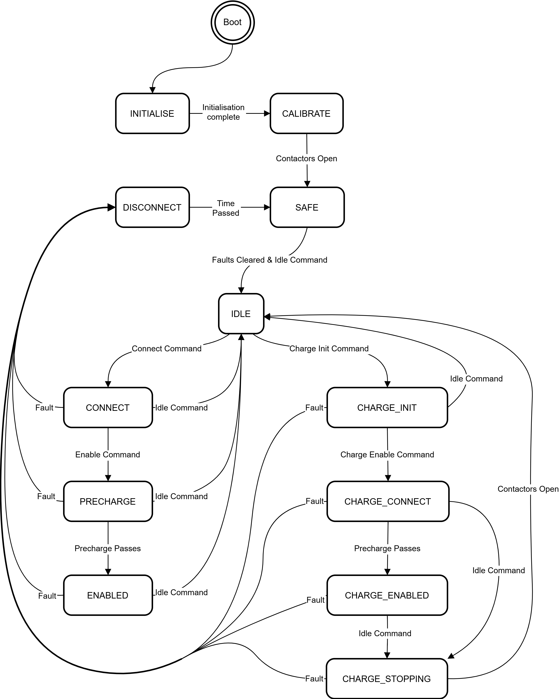

# State Machine

This section provides information on the BMS State Machine. The BMS State Machine is responsible for engaging and disengaging the battery contactors (main and charge outputs). The BMS State Machine continuously monitors the status all of sensors and external devices to ensure the battery stays within it's safe area of operation.  

## System Wide State Diagram

<figure markdown>

<figcaption>Figure 1:  High-Level state machine</figcaption>
</figure>

## State Descriptions

### Non-Charging States

<table style="undefined;table-layout: fixed">
    <colgroup>
        <col style="width: 90px">
        <col style="width: 330px">
        <col style="width: 250px">
        <col style="width: 330px">
    </colgroup>
    <thead>
        <tr>
            <th>State</th>
            <th>Description</th>
            <th>Transitions</th>
            <th>Requirements</th>
        </tr>
    </thead>
    <tbody>
        <tr>
            <td>INITIALISE</td>
            <td>Immediately enters this state on startup</td>
            <td>INIT &rarr; CALIBRATE</td>
            <td>Cell count correct, thermistor count correct, external CAN enabled, BJU present &amp; internal self-testing passed</td>
        </tr>
        <tr>
            <td>CALIBRATE</td>
            <td>Performs self-calibration and starts self-tests</td>
            <td>CALIBRATE &rarr; SAFE</td>
            <td>On completion of calibration steps</td>
        </tr>
        <tr>
            <td rowspan="3">IDLE</td>
            <td rowspan="3">System is healthy and is ready to be enabled. Continuously monitoring the system and battery health.</td>
            <td>IDLE &rarr; DISCONNECT</td>
            <td>On any fault</td>
        </tr>
        <tr>
            <td>IDLE &rarr; CONNECT</td>
            <td>BMS command is CONNECT</td>
        </tr>
        <tr>
            <td>IDLE &rarr; CHARGE_INIT</td>
            <td>BMS command is CHARGE_CONNECT</td>
        </tr>
        <tr>
            <td rowspan="3">CONNECT</td>
            <td rowspan="3">A request has been made to connect the load to the battery. The negative contactor to the load has been closed to enable load voltage checks and connection parameters are established</td>
            <td>CONNECT &rarr; DISCONNECT</td>
            <td>On any fault</td>
        </tr>
        <tr>
            <td>CONNECT &rarr; PRECHARGE</td>
            <td>BMS command is ENABLE and precharge context is established</td>
        </tr>
        <tr>
            <td>CONNECT &rarr; IDLE</td>
            <td>BMS command is not CONNECT or ENABLE</td>
        </tr>
        <tr>
            <td rowspan="3">PRECHARGE</td>
            <td rowspan="3">Engages the precharge contactor and waits for the load voltage to reach the battery voltage, monitors for precharge faults</td>
            <td>PRECHARGE &rarr; DISCONNECT</td>
            <td>On any fault</td>
        </tr>
        <tr>
            <td>PRECHARGE &rarr; ENABLED</td>
            <td>BMS command is ENABLE and precharge conditions are met</td>
        </tr>
        <tr>
            <td>PRECHARGE &rarr; IDLE</td>
            <td>BMS command is not ENABLE</td>
        </tr>
        <tr>
            <td rowspan="2">ENABLED</td>
            <td rowspan="2">Enabled state. Contactors to the load are now closed following a successful PRECHARGE state. This state will persist until commanded otherwise, or a safety fault occurs</td>
            <td>ENABLED &rarr; DISCONNECT</td>
            <td>On any fault</td>
        </tr>
        <tr>
            <td>ENABLED &rarr; IDLE</td>
            <td>BMS command is not ENABLE</td>
        </tr>
        <tr>
            <td>DISCONNECT</td>
            <td>Disconnect allows for the load or charging device to safely reduce current flow prior to opening the contactors.</td>
            <td>DISCONNECT &rarr; SAFE</td>
            <td>Disconnection has completed or timed out (2s)</td>
        </tr>
        <tr>
            <td>SAFE</td>
            <td>Ensures the system is in a safe state. It will enter this state if an error has occurred or we have progressed from the CALIBRATE state. Requires a command and no persistent errors to move to IDLE state</td>
            <td>SAFE &rarr; IDLE</td>
            <td>BMS command is IDLE and non-latching faults have cleared</td>
        </tr>
    </tbody>
</table>

<table style="undefined;table-layout: fixed">
    <colgroup>
        <col style="width: 100px">
        <col style="width: 100px">
        <col style="width: 100px">
    </colgroup>
    <thead>
        <tr>
            <th>State</th>
            <th>Contactors Engaged</th>
            <th>Balancing Enabled</th>
        </tr>
    </thead>
    <tbody>
        <tr>
            <td>INITIALISE</td>
            <td>None</td>
            <td>No</td>
        </tr>
        <tr>
            <td>CALIBRATE</td>
            <td>None</td>
            <td>No</td>
        </tr>
        <tr>
            <td>IDLE</td>
            <td>None</td>
            <td>No</td>
        </tr>
        <tr>
            <td>CONNECT</td>
            <td>1</td>
            <td>No</td>
        </tr>
        <tr>
            <td>PRECHARGE</td>
            <td>1 &amp; 2</td>
            <td>No</td>
        </tr>
        <tr>
            <td>ENABLED</td>
            <td>1 &amp; 3</td>
            <td>Yes</td>
        </tr>
        <tr>
            <td>DISCONNECT</td>
            <td>Unchanged</td>
            <td>No</td>
        </tr>
        </tr>
        <tr>
            <td>SAFE</td>
            <td>None</td>
            <td>No</td>
        </tr>
    </tbody>
</table>
### Charging States

<table style="undefined;table-layout: fixed">
    <colgroup>
        <col style="width: 100px">
        <col style="width: 100px">
        <col style="width: 200px">
        <col style="width: 310px">
        <col style="width: 200px">
    </colgroup>
    <thead>
        <tr>
            <th>Charge method configuration</th>
            <th>State</th>
            <th>Description</th>
            <th>Transitions</th>
            <th>Requirements</th>
        </tr>
    </thead>
    <tbody>
        <tr>
            <td rowspan="10">EVSE [0x1]</td>
            <td rowspan="3">CHARGE_INIT</td>
            <td rowspan="3">Initiates the charge session and waits for the ERS to signal it is ready to perform precharge sequences with the EVSE</td>
            <td>CHARGE_INIT &rarr; IDLE</td>
            <td>BMS command is not CHARGE_INIT or CHARGE_ENABLE; ERS system has encountered an error; Timed out waiting for ERS (50s)</td>
        </tr>
        <tr>
            <td>CHARGE_INIT &rarr; CHARGE_CONNECT</td>
            <td>ERS is ready for precharge; BMS command is CHARGE_ENABLE</td>
        </tr>
        <tr>
            <td>CHARGE_INIT &rarr; DISCONNECT</td>
            <td>On any BMS fault</td>
        </tr>
        <tr>
            <td rowspan="3">CHARGE_CONNECT</td>
            <td rowspan="3">ERS precharge sequence in progress, with negative contactor enabled. Progression to CHARGE_ENABLED and closing of contactors follows success</td>
            <td>CHARGE_CONNECT &rarr; IDLE</td>
            <td>BMS command is not CHARGE_INIT; Invalid ERS state</td>
        </tr>
        <tr>
            <td>CHARGE_CONNECT &rarr; CHARGE_ENABLED</td>
            <td>ERS has completed precharge; BMS command is CHARGE_ENABLE</td>
        </tr>
        <tr>
            <td>CHARGE_CONNECT &rarr; DISCONNECT</td>
            <td>On any BMS fault or ERS emergency stop</td>
        </tr>
        <tr>
            <td rowspan="2">CHARGE_ENABLED</td>
            <td rowspan="2">ERS charge session persists until the ERS indicates it is stopping or BMS is commanded to stop.</td>
            <td>CHARGE_ENABLED &rarr; CHARGE_STOPPING</td>
            <td>ERS state is requesting open contactors; BMS command is not CHARGE_ENABLE</td>
        </tr>
        <tr>
            <td>CHARGE_ENABLED &rarr; DISCONNECT</td>
            <td>On any BMS fault or ERS emergency stop</td>
        </tr>
        <tr>
            <td rowspan="2">CHARGE_STOPPING</td>
            <td rowspan="2">Opens contactor 5 (HV+). Waits for ERS to progress to FINISHED before progressing to IDLE</td>
            <td>CHARGE_STOPPING &rarr; IDLE</td>
            <td>ERS completes welding detection without error and is finished</td>
        </tr>
        <tr>
            <td>CHARGE_STOPPING &rarr; DISCONNECT</td>
            <td>On any BMS fault; Timeout (20s)</td>
        </tr>
        <tr>
            <td rowspan="10">OTHER [0x1]</td>
            <td rowspan="3">CHARGE_INIT</td>
            <td rowspan="3">Transitional state that moves immediately to charge connect when the BMS command CHARGE_ENABLE is provided.</td>
            <td>CHARGE_INIT &rarr; IDLE</td>
            <td>BMS command is not CHARGE_INIT or ENABLE; Timed out waiting for ERS (50s)***</td>
        </tr>
        <tr>
            <td>CHARGE_INIT &rarr; CHARGE_CONNECT</td>
            <td>BMS command is CHARGE_ENABLE</td>
        </tr>
        <tr>
            <td>CHARGE_INIT &rarr; DISCONNECT</td>
            <td>On any BMS fault</td>
        </tr>
        <tr>
            <td rowspan="3">CHARGE_CONNECT</td>
            <td rowspan="3">Performs the precharge sequence prior to closing contactors and moving to CHARGE_ENABLED</td>
            <td>CHARGE_CONNECT &rarr; IDLE</td>
            <td>BMS command is not CHARGE_INIT; precharge sequence timed out (N seconds)***</td>
        </tr>
        <tr>
            <td>CHARGE_CONNECT &rarr; CHARGE_ENABLED</td>
            <td>Precharge requirements met; BMS command is CHARGE_ENABLE</td>
        </tr>
        <tr>
            <td>CHARGE_CONNECT &rarr; DISCONNECT</td>
            <td>On any BMS fault</td>
        </tr>
        <tr>
            <td rowspan="2">CHARGE_ENABLED</td>
            <td rowspan="2">Charge session in progress. Waits for the BMS command to change before finishing the session.</td>
            <td>CHARGE_ENABLED &rarr; CHARGE_STOPPING</td>
            <td>BMS command is not CHARGE_ENABLE***</td>
        </tr>
        <tr>
            <td>CHARGE_ENABLED &rarr; DISCONNECT</td>
            <td>On any BMS fault</td>
        </tr>
        <tr>
            <td rowspan="2">CHARGE_STOPPING</td>
            <td rowspan="2">Charge session is stopping. Waits for current flow to minimise before opening contactors.</td>
            <td>CHARGE_STOPPING &rarr; IDLE</td>
            <td>Current flow is less than threshold (5A)</td>
        </tr>
        <tr>
            <td>CHARGE_STOPPING &rarr; DISCONNECT</td>
            <td>On any BMS fault; Timeout (20s)</td>
        </tr>
    </tbody>
</table>
<table style="undefined;table-layout: fixed">
    <colgroup>
        <col style="width: 100px">
        <col style="width: 100px">
        <col style="width: 100px">
        <col style="width: 100px">
    </colgroup>
    <thead>
        <tr>
            <th>Charge method configuration</th>
            <th>State</th>
            <th>Contactors Engaged</th>
            <th>Balancing Enabled</th>
        </tr>
    </thead>
    <tbody>
        <tr>
            <td rowspan="4">EVSE [0x1]</td>
            <td>CHARGE_INIT</td>
            <td>None</td>
            <td>No</td>
        </tr>
        <tr>
            <td>CHARGE_CONNECT</td>
            <td>4</td>
            <td>No</td>
        </tr>
        <tr>
            <td>CHARGE_ENABLED</td>
            <td>4 &amp; 5</td>
            <td>No</td>
        </tr>
        <tr>
            <td>CHARGE_STOPPING</td>
            <td>4</td>
            <td>No</td>
        </tr>
        <tr>
            <td rowspan="4">OTHER [0x1]</td>
            <td>CHARGE_INIT</td>
            <td>None</td>
            <td>No</td>
        </tr>
        <tr>
            <td>CHARGE_CONNECT</td>
            <td>4</td>
            <td>No</td>
        </tr>
        <tr>
            <td>CHARGE_ENABLED</td>
            <td>4 &amp; 5</td>
            <td>No</td>
        </tr>
        <tr>
            <td>CHARGE_STOPPING</td>
            <td>4 &amp; 5</td>
            <td>No</td>
        </tr>
    </tbody>
</table>