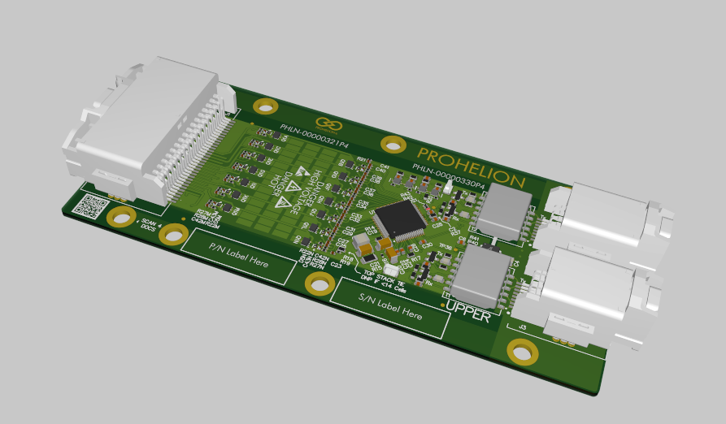
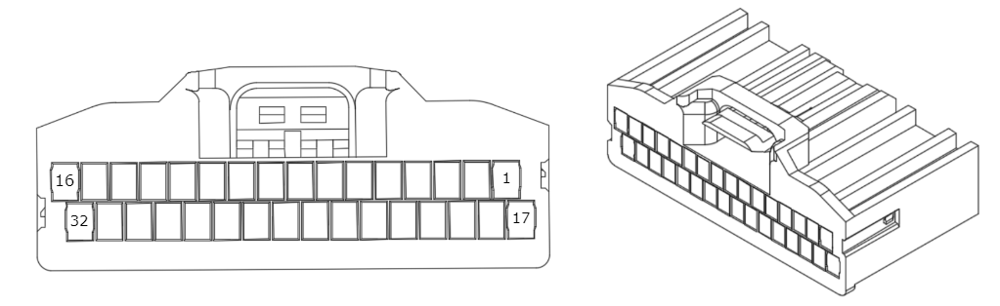

This section provides detailed information on the Prohelion D1000 Gen2 Cell Management Unit (CMU). 

<figure markdown>

<figcaption>Figure 1:  Prohelion BMS D1000 Gen2 CMU</figcaption>
</figure>

# Cell Sense Connector 

<figure markdown>

<figcaption>Figure 1:  Prohelion BMS D1000 Gen2 CMU Cell Sense Connector</figcaption>
</figure>

| **Pin Number** | **Label**                            | **Pin Number** | **Label**                             |
|----------------|--------------------------------------|----------------|---------------------------------------|
| 1              | Not Connected                        | 17             | Not Connected                         |
| 2              | Not Connected                        | 18             | Not Connected                         |
| 3              | Top of Stack (see note [^1])         | 19             | Cell 14+                              |
| 4              | Cell 13+                             | 20             | Cell 12+                              |
| 5              | Cell 11+                             | 21             | Cell 10+                              |
| 6              | Cell 9+                              | 22             | Cell 8+                               |
| 7              | Cell 7+                              | 23             | Cell 6+                               |
| 8              | Cell 5+                              | 24             | Cell 4+                               |
| 9              | Cell 3+                              | 25             | Cell 2+                               |
| 10             | Cell 1+                              | 26             | Cell 1- (GND) (see note [^2])         |
| 11             | Not Connected                        | 27             | Cell 1- (GND) (see note [^2])         |
| 12             | Not Connected                        | 28             | Not Connected                         |
| 13             | Temp 4 - GND (see note [^3])         | 29             | Temp A4                               |
| 14             | Temp 3 - GND (see note [^3])         | 30             | Temp A3                               |
| 15             | Temp 2 - GND (see note [^3])         | 31             | Temp A2                               |
| 16             | Temp 1 - GND (see note [^3])         | 32             | Temp A1                               |

[^1]: Note 1: Top of stack is to be connected to the highest potential cell of the CMU. E.g. If the CMU is only measuring 10 cells, Top of Stack is considered to be the 10th cell (Cell 10+). 

[^2]: Note 2: Pins lablled as "Cell 1-" are the ground reference for the CMU. They are not the same as battery ground or any other ground. 

[^3]: Note 3: The pins labelled as "Temp X - GND" on the temp sense connector is not to be used for anything other than providing a ground reference for the respective thermistor on the same connector. They are not the same as battery ground or any other ground.  A short-circuit between battery ground and the thermistor ground could result in damage.

# Upper Communciation Port Pinout

| **Pin Number** | **Label**                            | **Pin Number** | **Label**                             |
|----------------|--------------------------------------|----------------|---------------------------------------|
| 1              | TX Upper Positive                    | 5              | TX Upper Negative                     |
| 2              | Not Connected                        | 6              | Not Connected                         |
| 3              | Not Connected                        | 7              | Not Connected                         |
| 4              | RX Upper Negative                    | 8              | RX Upper Negative                     |

# Lower Communciation Port Pinout

| **Pin Number** | **Label**                            | **Pin Number** | **Label**                             |
|----------------|--------------------------------------|----------------|---------------------------------------|
| 1              | TX Lower Positive                    | 5              | TX Lower Negative                     |
| 2              | Not Connected                        | 6              | Not Connected                         |
| 3              | Not Connected                        | 7              | Not Connected                         |
| 4              | RX Lower Negative                    | 8              | RX Lower Negative                     |