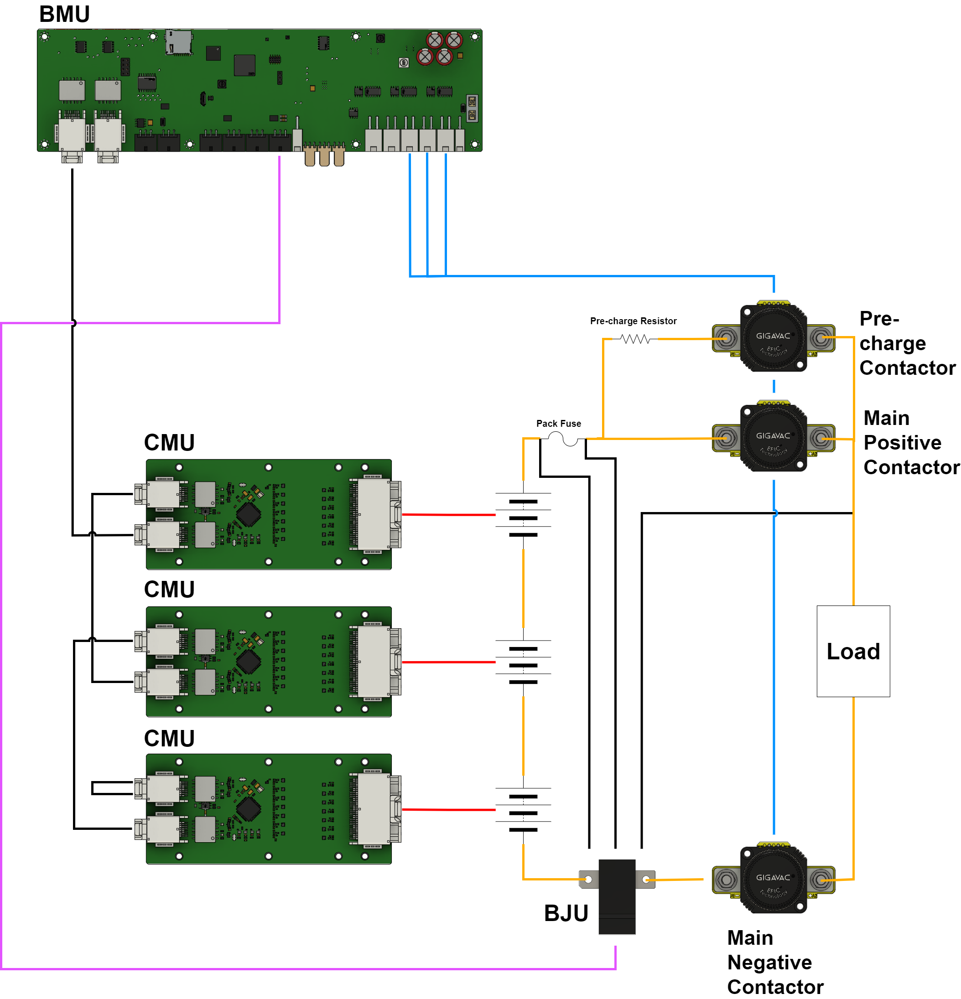

# Prohelion BMS D1000 Gen2

The Prohelion BMS D1000 Gen2 is a cutting-edge, distributed Battery Management System designed for high-voltage applications. It provides comprehensive monitoring and protection for battery packs up to 1000V, accommodating up to 448 individual cells with precise voltage management through its advanced architecture. The system leverages a Battery Management Unit (BMU), a Battery Junction Unit (BJU) and multiple Cell Monitoring Units (CMUs), to ensure optimal performance, safety, and longevity of your energy storage solutions. Whether for industrial, automotive, or energy applications, the Prohelion BMS D1000 Gen2 solution offers unparalleled reliability and scalability.

## Specifications

| **Parameter** | **Value**                                                    |
|----------------|-------------------------------------------------------------|
| BMS Supply Voltage               | 12 V / 24 V  (two variants)               |
| BMS Supply Current               | 80 mA (excluding contactors)              |
| Maximum Battery Voltage          | 1000 V                                    |
| Maximum Battery Current          | 1000 A                                    |
| Number of Contactor Outputs           | 5                                    |
| Number of Low-Side Switch Outputs     | 3                                    |
| Number of Cell Management Units       | 1-32  (configurable)                 |
| Number of Cell Voltage Measurements   | 4-448 (configurable)                 |
| Number of Temperature Measurements    | 0-128 (configurable)                 |
| Measurement Accuracy                  | 1mV Accuracy (3.6V, +25°C)           |
| Balancing Current                     | 650 mA @ 100% duty-cycle             |
| Environmental Sensors                 | Temperature, Humidity, VoC, NOx      |

## Distributed Architecture

<figure markdown>

<figcaption>Figure 1:  Prohelion BMS D1000 Gen2</figcaption>
</figure>

The Prohelion BMS D1000 Gen2 is built around a distributed approach, where:
- The Prohelion D1000 Gen2 Battery Management Unit (BMU) acts as the central hub, overseeing communication and coordination across the entire system. The BMU interfaces with the CMUs, collecting data on cell voltages, temperatures, and overall pack health, while also controlling contractors and other safety mechanisms to protect against overvoltage, undervoltage, and thermal issues.
- The Prohelion D1000 Gen2 Cell Monitoring Units (CMUs) monitor up to 14 individual cell voltages and 4 temperature sensors each. The system can accommodate up to 32 CMUs, enabling the monitoring of up to 448 individual cells and 128 temperature sensors. 
- The Battery Junction Unit (BJU) is tasked with monitoring the overall pack current and voltages.

This modular setup allows for scalability, enabling the system to manage up to 448 cells across a battery pack. The distributed nature of the system reduces wiring complexity and enhances fault tolerance, making it highly reliable for high-voltage applications.

## Features

### Cell Voltage Monitoring
Continuous monitoring of individual cell voltages to ensure all cells are within safe operating limits, preventing over-voltage and under-voltage conditions.

### Temperature Monitoring
Monitoring of cell and pack temperatures to prevent overheating. This feature helps in detecting thermal issues and managing thermal runaway.

### Current Monitoring
Monitoring of charge and discharge currents to protect the battery from overcurrent conditions, which can lead to excessive heat and potential damage.

### Cell Balancing
Ensures uniform charge levels across all cells, improving the overall lifespan and performance of the battery pack by preventing imbalance during charging and discharging.

### Over-charge and Over-Discharge Protection
Automatically disconnects the battery from the charger or load to prevent over-charging or over-discharging, which can damage the battery.

### State Estimations
- **State of Charge (SOC)** - Estimation of the remaining charge in the battery.
- **State of Health (SOH)** - Estimation of the battery’s capacity to hold a charge relative to its original capacity.
- **State of Power (SOP)** - Estimation of the available power for charging or discharging at any given time.

### Environmental Sensors
The BMS is equipped with a suite of environmental sensors to monitor the operating conditions and ensure optimal performance and safety.

- **Pressure Sensor** - Monitors the internal pressure of the battery pack to detect potential issues such as gas build-up or leaks. The system triggers alerts if pressure readings fall outside the safe range.
- **Humidity Sensor** - Tracks the humidity levels within the battery enclosure. High humidity can indicate potential ingress of moisture, which could lead to corrosion or electrical short circuits. Alerts are generated if humidity levels exceed or drop below predefined thresholds.
- **VOC Sensor** - Detects Volatile Organic Compounds (VOCs) that could indicate the presence of harmful or flammable gases within the battery pack. The BMS raises alarms if VOC levels reach dangerous levels, ensuring timely intervention.
- **NOx Sensor** - Measures nitrogen oxide levels, which could be indicative of overheating or other chemical reactions occurring within the battery. The system provides alerts if NOx levels exceed safe limits.
- **Onboard Temperature Sensors** - Continuously monitors the temperature at key locations within the BMS. These sensors help prevent thermal runaway by ensuring that temperatures remain within safe operating limits. Alerts are triggered if temperatures rise too high or fall too low.

### Contactor Control

- **Precharge Circuit Management** - Controls the contactors to safely connect the battery to the load or charger by gradually increasing the voltage to prevent inrush currents. This feature protects both the battery and the connected systems from potential damage caused by sudden power surges.
- **Main Contactor Control** - Manages the connection and disconnection of the battery pack to the system, ensuring safe operation. The BMS continuously monitors system conditions and can automatically disconnect the main contactor in case of faults, preventing potential hazards.
- **Charge Contactor Control** - Manages the connection of the battery pack to the charger during the charging process. It ensures that the contactor only closes when safe conditions are met, such as correct voltage alignment and no faults detected. Additionally, it controls the timing of the contactor closure to optimize charging efficiency and protect the battery from overcharging or excessive heat buildup.

### Low-Side Switches

The BMS is equipped with three 12V/24V low-side switches designed to control external devices or subsystems, providing flexibility and enhanced control within the battery management system.

- **Control Logic Integration** - The switches can be directly controlled by the BMS's logic, enabling automated responses to various conditions, such as temperature thresholds, state of charge, or fault conditions. This integration enhances the overall system's responsiveness and reliability.
- **Diagnostic Feedback** - The BMS provides diagnostic feedback for each low-side switch, allowing for real-time monitoring of their status. This feature helps in detecting any potential issues, such as open or short circuits, and ensures that corrective actions can be taken promptly.

### Fault Detection and Diagnostics

- **Fault Detection** - Real-time detection of issues such as short circuits, insulation faults, sensor failures, and communication errors.
- **Diagnostics** - Detailed reporting and logging of faults to aid in troubleshooting and maintenance.

### High-Voltage Interlock (HVIL)
A safety mechanism that ensures the high-voltage system is disconnected or rendered safe in case of tampering, servicing, or emergencies.

### Isolation Monitoring (Optional)
Continuous monitoring of the isolation resistance between the high-voltage system and the vehicle chassis, ensuring no leakage paths that could pose safety risks. Isolation Monitoring is an optional feature that is enabled by including an Isolation Monitoring Device that is additional to the BMS.  

### Communication Interface
- **CAN Bus** - For real-time data exchange with the vehicle's central control system or other external devices.
- **USB Diagnostics and Configuration Interface** - Allows for system diagnostics, firmware updates, and configuration changes.

### Built-in Firmware Self-Test
Built-in self-test feature (as defined by to IEC 60730-1), which is crucial for ensuring the safe operation of electronic control systems, particularly in environments where safety is paramount.

- **Firmware Integrity Check** - Periodically verifies the integrity of the firmware by performing checksums and other verification methods. This ensures that the firmware has not been corrupted or tampered with, maintaining reliable operation.
- **Memory Testing** - Conducts continuous testing of both volatile and non-volatile memory to detect and correct errors, ensuring that data critical to BMS operation is stored and retrieved accurately.
- **CPU Monitoring** - Monitors the performance and operation of the CPU, ensuring it is functioning correctly and detecting any abnormal behavior that could indicate potential issues.
- **Peripheral Diagnostics** - Regularly checks the status and functionality of essential peripherals, such as ADCs, communication interfaces, and contactor drivers, ensuring that they operate within specified parameters.
- **Watchdog Timer** - Implements a watchdog timer that resets the system in the event of a firmware hang or malfunction, providing an additional layer of protection against software-related failures.

### Firmware Update Capability

Remote or local capability to update BMS firmware, allowing for improvements, bug fixes, and new feature deployment.

### Security Features

- **Secure Bootloader** - Ensures that only authenticated and encrypted firmware binaries are loaded onto the BMS, preventing unauthorized or malicious firmware updates.
- **Firmware Integrity Checks** - Continuously verifies the integrity of the firmware during operation to detect and respond to any corruption or tampering.
- **Access Control** - Implements user authentication and role-based access to the BMS configuration and diagnostics interfaces, ensuring that only authorized personnel can make changes or access critical information.

