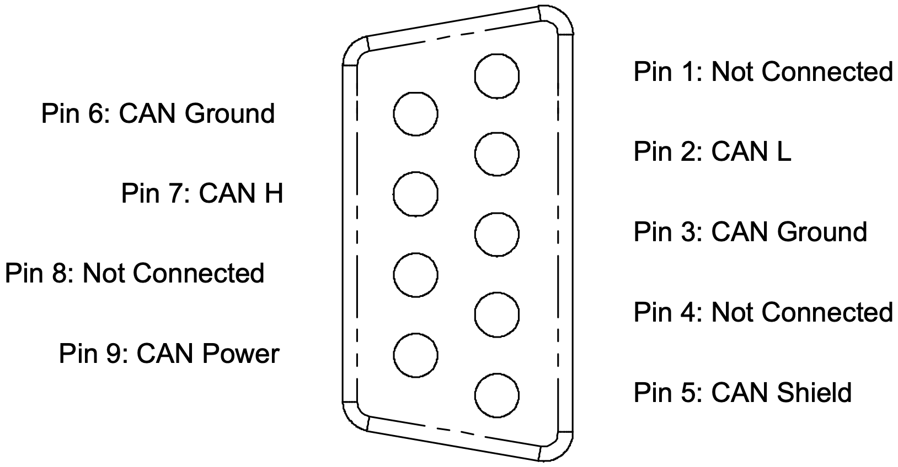

# DB9 Connector

The CAN bus and operating power for the bridge are connected through the male DB9 connector at one end of the bridge.  The pinout for this connector is shown below, as viewed when looking at the bridge, or when inserting crimps into the mating connector.

The pinout for this connector follows the standard commonly used in industrial CAN Bus applications such as DeviceNET and CANOpen.

The bridge does not contain any termination between the CAN H and CAN L lines.
  
Pin 6 and Pin 3 (CAN Ground) are connected together internally to the bridge.

The bridge must be supplied with DC power through the DB9 connector on Pin 9 (CAN Power), relative to CAN Ground.  

| Supply                               | Value | Units    | Notes: |
|--------------------------------------|-------|----------|--------|
| `DC Supply Voltage Minimum:`         | 9     | V        | Note 1 |
| `DC Supply Voltage Maximum:`         | 30    | V        |        |
| `DC Supply Voltage Nominal:`         | 13.8  | V        |        |
| `Supply Current at Nominal Voltage:` | 26    | mA       | Note 2 |
| `Supply Power Maximum:`              | 0.5   | W        | Note 3 |
| `Default CAN bit rate:`              | 500   | kbit/sec |        |

__NOTES:__

__1.__  The CAN–Ethernet bridge will operate successfully between these voltage limits.  Operation outside these voltages may damage the device.

__2.__  Since the CAN–Ethernet bridge uses an internal DC/DC converter, power draw at the input remains approximately constant even as the supply voltage is changed, ie supply current will decrease with increasing supply voltage.

__3.__ Tested with CAN traffic at 20% bus utilisation running at 500kbps.  Higher data rates and utilisation will increase power consumption above this figure.

