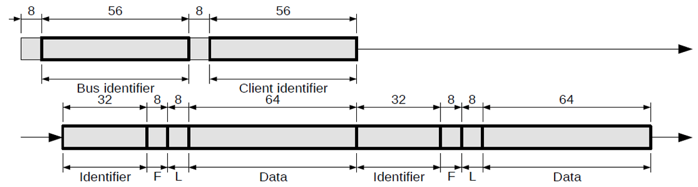
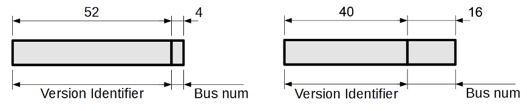

# CAN-UDP Bridging

By default, CAN packets that are received by the bridge will be broadcast on the UDP group address/port, and data contained in UDP datagrams received by the bridge from this group address/port will be broadcast on the CAN network.

The UDP group address is __239.255.60.60__, and the port is __4876__.  This port is assigned by the IANA and is not configurable.

The UDP packet structure is shown in figure 1.  Unless otherwise noted, all values are transmitted in big-endian format.

<figure markdown>

<figcaption>Figure 1: UDP Packet Structure</figcaption>
</figure>

The bus identifier is a 56-bit value as shown in figure 2.  There are presently two protocol versions designated by the bus identifier. Version 1 identifiers allow 4 bits for the bus number (range 0-15), while Version 2 allows 16 bit bus numbers (range 0-65535).

In protocol version 1, the first 52 bits encode the protocol version, and should read __0x5472697469756__ in all packets.  The least significant 4 bits represent the bus number that the packet was transmitted on.

In protocol version 2, the first 40 bits encode the protocol version and should read __0x547269FDD6__ in all packets, with the least significant 16 bits representing the bus number. The bus number can be used to create separate virtual networks on the same Ethernet network, see [Version Querying](50_Version_Querying.md).

<figure markdown>

<figcaption>Figure 2: Bus Identifier Structure - Version 1 (left) and Version 2 (right)</figcaption>
</figure>

The client identifier is a 56-bit value that uniquely identifies the sender of the datagram.  Each device on the virtual CAN network should have a different client identifier; the CAN-Ethernet bridges use the MAC address of their Ethernet interface as their client id.  This is also the recommended setting for other devices to ensure uniqueness.

The identifier represents the identifier of the packet on the physical CAN network.  The identifier is contained in the low 11 bits (29 in extended mode).

The flags byte contains the bitfield shown in figure 3.

<figure markdown>

<figcaption>Figure 3: Flags Bitfield</figcaption>
</figure>

- __H – Heartbeat / query response packet__  Indicates that this datagram contains a message from the bridge itself, rather than a bridged CAN packet.  This will either be a bridge heartbeat packet, or a packet containing a response to a query request.

- __S – Settings packet__ Indicates that this datagram contains a setting for the bridge itself, and should not be bridged on to the physical CAN network.

- __R – RTR packet__ Indicates that the data contained in this datagram should be sent as an RTR packet on the physical CAN network.

- __E – Extended id packet__  Indicates that this packet should be sent with an extended CAN identifier.

The length byte indicates the length of the packet data, in bytes.  This length should not exceed eight bytes.

The data section contains the data contained in the physical CAN packet.  If the length byte indicates less than 8 bytes of data, the remaining bytes of the data section should be zero.

Multiple CAN packets are able to be bundled into a single UDP datagram as shown in figure 1, this circumvents the need to repeatedly send the same bus and client identifier along with each CAN packet. It is important to note that unlike CAN-TCP bridging of multiple CAN packets outlined in section 4, each new UDP datagram must start with the bus and client identifier.