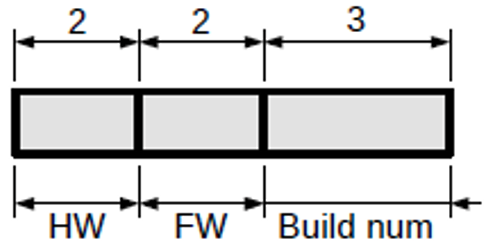

# Version Querying

The hardware and firmware version of a given bridge can be queried via the Ethernet interface.  To query a given bridge, open a TCP connection and transmit a single packet with:

- the __S__ bit set in the flags bitfield,
- the length field set to 8,
- the upper two bits of the data field set to __00b__,
- the remaining bits of the upper data byte set to __0x16__, and
- the remaining data bytes set to zero.

Upon receipt of this packet, the bridge will respond with a UDP packet with:

- the __H__ bit set in the flags bitfield,
- the length field set to 8,
- the upper two bits of the data field set to __01b__,
- the remaining bits of the upper data byte set to __0x16__, and
- the remaining data bytes containing version information as shown in figure 6, with the HW field containing the hardware version, the FW field the firmware version multiplied by ten, and the build number field the firmware build number.  All fields are little-ending unsigned integers.

Figure 6: Version information

