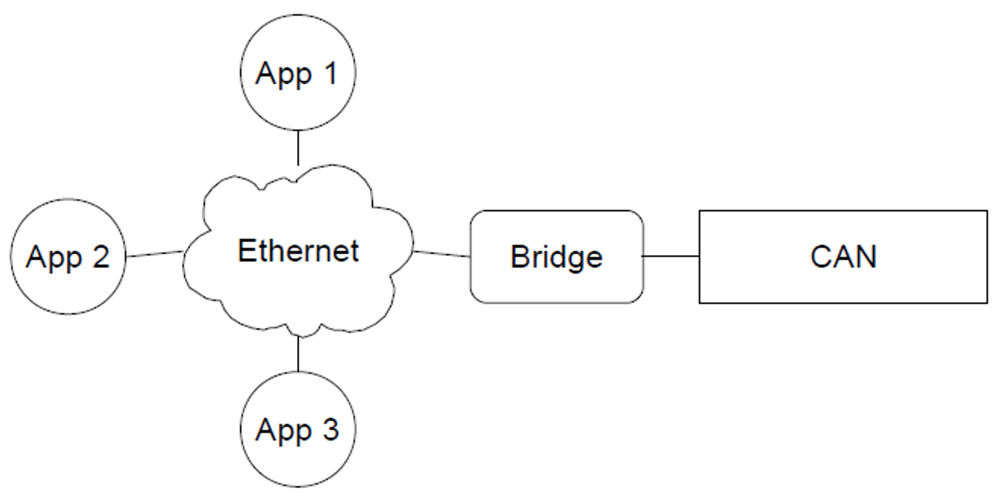
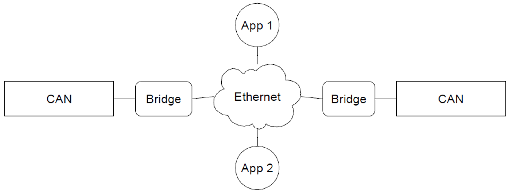
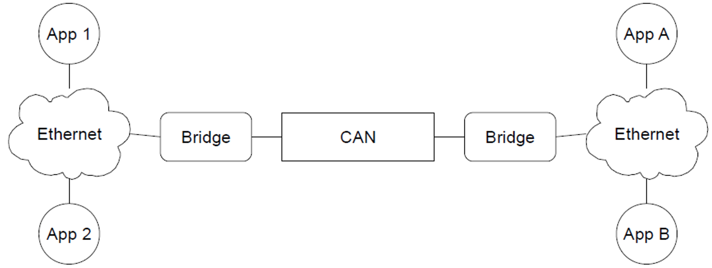
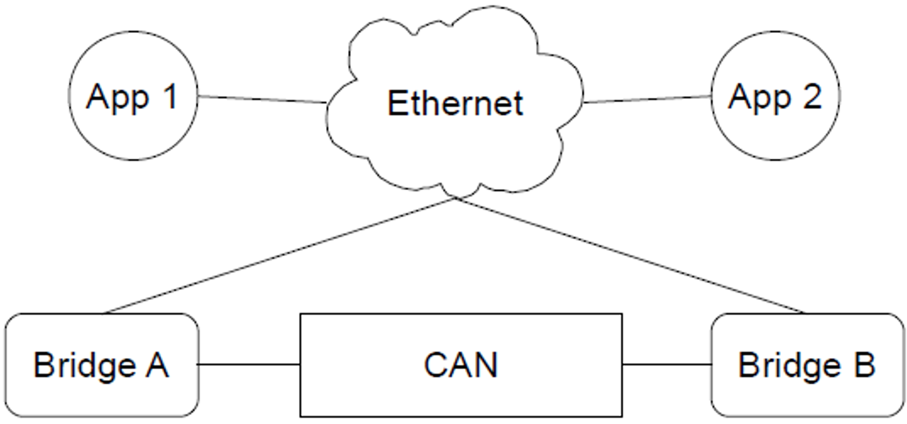

# Network Topologies

The most basic network is a single hardware bridge on the CAN bus with multiple applications connected to the UDP part of the bus, as shown in Figure 1.

<figure markdown>

<figcaption>Figure 1: Setup With Hardware Bridge</figcaption>
</figure>

When making more advanced networks, the easiest setup is using multiple CAN buses on the same network, as shown in Figure 2. In this case, messages sent on one CAN bus, will also be received by the devices listening on the other bus. In order to create this setup, both bridges should be configured with the same virtual bus, which is the default configuration. When a different virtual bus is given to the two bridges of Figure 2, the CAN buses will have no interaction, so two simple networks as shown in Figure 1 are created.

<figure markdown>

<figcaption>Figure 2: Setup With Multiple CAN Buses</figcaption>
</figure>

Another advanced configuration is using multiple bridges on one CAN bus, as shown in Figure 3. This network looks simple and can be quite useful when multiple persons are collecting information from the CAN bus, but it is very easy to create a cyclic network, which is not desired. This often happens because the two Ethernet parts shown in Figure 3 are actually connected, resulting in only one Ethernet part as shown in Figure 4. Having a cyclic network will cause problems, as explained below.

<figure markdown>

<figcaption>Figure 3: Setup With Multiple Bridges on one CAN Bus</figcaption>
</figure>

The problem with a cyclic network as shown in Figure 4 is that any message bridged by bridge A via UDP will be bridged back to the CAN bus by bridge B, to be bridged by A again. Therefore, any message will be resent infinitely and soon the CAN bus will be so loaded that most messages get lost. 

!!! warning "Watch out for Cyclic CAN Bus Networks"
    Creating a cycle in your network causes that network to become unusable and should be avoided.

<figure markdown>

<figcaption>Figure 4: Cyclic Setup With Multiple Bridges on one CAN Bus</figcaption>
</figure>