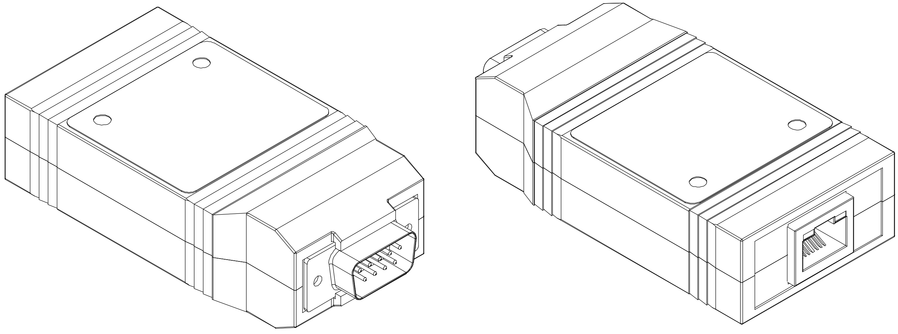

# CAN-Ethernet Bridge User Manual

This document describes the usage of the Prohelion CAN–Ethernet bridge, including the accompanying configuration software.

The Prohelion CAN–Ethernet bridge allows easy access to a CAN bus from a PC. No installation is required, so the device can be used with any PC with an Ethernet interface. Furthermore, an already present Ethernet network can be used to route CAN messages: with a bridge connected to a router on the network, all PCs attached to that router will become part of the virtual CAN bus. It is also possible to combine multiple physically separate CAN buses into one virtual bus, or use them as separate virtual buses on the same network.

