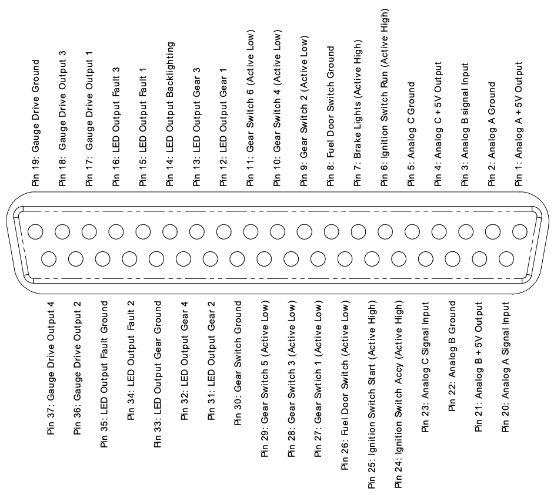

# Inputs and Outputs 

## 12V Input: Power Supply

The Driver Controls requires a 12V power connection to the spade terminals on the front panel.  This connection should be capable of supplying enough current to run all devices on the CAN bus, plus the expected current draw of the brake and reversing lights (if connected).  It should be fused externally to the driver controls. 

This power can be from an 'always on' connection, however the driver controls draws around 30mA continuously, so will drain your accessory battery if your DC/DC converter from the high voltage traction pack does not operate continuously.   This current draw will be lower in the future, however sleep mode functions are not implemented in the default software at this point.

Supplying the driver controls from a relay activated by the 'Run' position of the ignition key is a good compromise.

Supplying the driver controls from the 'Accessories' position of the ignition key is not recommended as this power is usually cut when the key is moved to the start position.  

## 12V Output: Bulb Drive Outputs 

The driver controls has two 12V 3A outputs, and the default software is suitable for connecting these two outputs to your brake lights and your reversing lights.  

This is so that the brake lights can activate if regenerative braking is used, and the reversing lights can be activated if you are using a fixed ratio gearbox and are performing vehicle reversing by changing the motor rotation direction.

If you are not using regen braking then you can leave the brake output from the driver controls disconnected, and leave the vehicle wiring untouched.

If you are using a conventional gearbox to perform reversing, then you can leave the reversing output from the driver controls disconnected, and leave the vehicle wiring untouched.

## Vehicle Control Connector

The vehicle control connector is a female DB37 socket.  The following illustration shows the pinout as viewed when looking into the driver controls, the same view you have when soldering or inserting crimps into the rear of a mating connector housing.

All ground pins on the connector are identical, and connected together internally to the driver controls.  They are provided separately on the connector to simplify wiring, as a ground can be run out from the driver controls along with the bundle of other wires going to each input or output device.

## Vehicle Control Connections: Analog Inputs

The driver controls provide three analog inputs.  These are suitable for connecting to a potentiometer (1k to 10k linear recommended), with the driver controls supplying a stable 5V supply, capable of up to 75mA shared between all three outputs.

They are also suitable for connection to a voltage output device such as a hall-effect 'drive by wire' pedal assembly, as long as it is capable of operating from 5V and has outputs that do not go below ground or above 5V.  Most pedals meet these requirements.

The default software uses the Analog A channel as the motor current input, suitable for connection to your accelerator (gas) pedal.  It has a small dead-band at either end of the pedal travel, but basically maps 0 to 100% throttle to the full range of potentiometer movement.  

Analog B and Analog C are planned to be used for the 2nd cross-check output from a hall pedal, and the regenerative braking strength slider control, respectively.  However neither is currently implemented in the default software.

## Vehicle Control Connections: Digital Inputs

Multiple digital switch or voltage inputs are provided.  Each input accepts a voltage between ground and the 12V supplied to the driver controls.  Inputs have a wide hysteresis band to provide noise immunity, and a 10k pull-up resistor to avoid floating inputs.  

Inputs can be connected to a signal that will either be 12V or ground, such as the ignition switch position outputs. 

Inputs can also be connected to a toggle or pushbutton switch to ground, with the internal pull-up resistor providing the alternative logic level.

Inputs are configured in four groups, but they are all identical in hardware and can be re-mapped as desired by modifying the device software.

The default firmware is configured with the input polarity suitable for the following inputs:

- Ignition Accessories, Run, and Start positions (voltages: 12V = active)
- Brake Status (voltage: 12V = brakes on)
- Fuel Door switch (switch to ground: closed to drive, open to charge)
- Gear selection (switches to ground: closed to select specific mode)

The default software provides power to the CAN bus if the ignition switch Accessories or Run inputs are active.

The default software will only issue commands to the motor controller if the ignition switch Run input is active, and the fuel door is closed.

The default software will send 0% torque commands to the motor controller if the brake switch is active.

The default software will drive in the forwards direction if Gear Switch 1 or 2 is selected, will switch to Neutral if Gear Switch 3 is selected, and will drive in reverse if Gear Switch 4 is selected.  Do not select multiple gears simultaneously.

## Vehicle Control Connections: Analog Outputs

Four analog outputs are provided to drive dashboard gauges or other devices in the vehicle.  All hardware is functionally identical, and capable of providing either a 0-12V pulse train output, or a 'variable resistance' to ground.  This allows driving either a tachometer type gauge, or a fuel type gauge.

The default software drives Gauge outputs 1 and 2 as pulse outputs, with Gauge 1 showing engine RPM, and Gauge 2 showing system power.  

The default software drives Gauge outputs 3 and 4 as resistance outputs, with Gauge 3 showing battery voltage, and Gauge 4 showing motor controller temperature.

## Vehicle Control Connections: Digital Outputs

Eight digital outputs are provided, each capable of driving to either Ground or 12V, and capable of up to 100mA per output.  These outputs are not protected against overcurrent, and are designed to drive current-limited LED loads or small relays.  Take care to avoid overloading these outputs, and make sure to use a diode clamp across the coil if driving a relay.

If used, each output should be connected through a LED and a current-limiting resistor to Ground.  Select the resistor value to set the LED current to the brightness required in your situation.  For a typical LED, a 560 Ohm resistor will give approximately 20mA LED current, giving high brightness from a standard 3mm or 5mm LED.

The default software shows the currently selected gear mode by illuminating one of the Gear LED 1-4 outputs.  The Gear LED backlight is illuminated if either the ignition Accessories or Run positions are active.

The Fault LED outputs are unused by the default software.