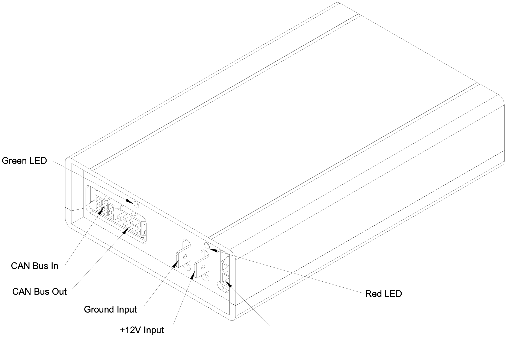

# EV Driver Controls User Manual

This document describes the interface, installation, and usage requirements for the Prohelion EV Driver Controls product.  It also provides information on programming the device to implement custom functionality.

The EV Driver Controls provide an easy way to control a Prohelion WaveSculptor motor controller.  The driver controls come programmed from the factory configured with sensible default values that will work in a plug-and-play manner with a motor controller.

The EV Driver Controls provide analog and digital inputs, used to generate commands to the motor controller.  It also provides both analog and digital outputs to drive dashboard gauges and error and status LEDs.

The microcontroller firmware for the device (written in 'C') is available on the Prohelion website under an open-source BSD license, as are the hardware schematics and component overlays.

## Layout

The following illustration shows the connections and indicators on the front panel of the EV Driver Controls.  A CAN bus connection, 12V in and out, and two status LEDs are present.

The rear panel contains a single DB37 connector, connecting all the analog and digital I/O connections required to drive a vehicle.
