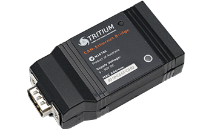

## Tritium Bridge Fundamentals

Here is a few fundamental concepts that are worth knowing when working with the Tritium CAN-Ethernet bridges.

<figure markdown>

<figcaption>Prohelion CAN to Ethernet Bridge</figcaption>
</figure>

### Reset Button

There is a reset button that you can see in the image above, just to the right of the Tritium logo.  Pressing and holding this button will reset the setup of the bridge back to default.

### UDP mode vs TCP mode

The Tritium CAN-Ethernet Bridges have the ability to send and receive packets in UDP mode or in TCP mode, they can even send and receive packets in a blended mode where both protocols are being used at once.

UDP and TCP are fundamentally different and have different pros and cons, the [CAN & Ethernet](30_CAN_Ethernet_Fundamentals.md) section of this FAQ has much more detail on that.  

### Bus Id

The Bus Id is used to uniquely identify a Bus on a network and is particularly important when using UDP. If you have two CAN-Ethernet Bridges on a network with the same Bus Id and you are using UDP then there is a significant risk that the traffic from those bridges will get mixed up and sending messages to one bridge will result in both bridges getting the message.

This is obviously not ideal so it is important that if you have multiple Bus Ids on one network, they use be unique. Bus Ids are set on the firmware of the CAN-Ethernet Bridge, you can set this either via Profinity or the Tritium Can Bridge Config tool. We would recommend Profinity where possible.

### V1 vs V2 CAN-Ethernet Bridges

There are two major releases of the CAN-Ethernet Bridge firmware, we call them V1 and V2 bridges. 

V1 bridges can be updated to V2 bridges by refreshing their firmware. The main difference between V1 and V2 bridges is the number of Bus Ids (see below) that they can support. V1 bridges can support up to 16 Bus Ids, V2 bridges up to 32,767 different bus IDs.

When configuring Profinity you need to make sure that your bridge version is correct as the protocol used by V1 bridges is different to V2. AutoDiscovery can identify the bridge version correctly and will set it up correctly, so wherever possible use AutoDiscovery.

If you are using the Tritium tools there are V1 Tritium tools and V2 Tritium tools. V1 tools will not be able to work with V2 bridges, V2 tools should be able to manage both bridge, but regardless to limit issues we would recommend using the tools for your bridge version. **Profinity works fine with both V1 and V2 bridges as long as you have it set correctly in your bridge settings in the Profile.**

### Client Id

Each CAN Bus Bridge as well as Profinity or the Tritium Can Bus tools have a unique Id that identifies the end point and is generally the same as the Mac Address of the machine that the connection is running from. 

From the position of using the tools this is largely a behind the scenes capability, but if you are looking at the CAN Bus traffic in a tool like Wireshark you will see the Client Id in each packet transmitted and it is a useful way to determine which bridge sent what message.

### Single Messages vs Bulk Messages

In TCP Mode, the bridge has the ability to transmit CAN Bus packets in bulk. The advantage of this mode is that if you are doing a firmware change or flash (both of which can occur in CAN Bus) then the order of the packets can be more guaranteed and the reliability can also be better.