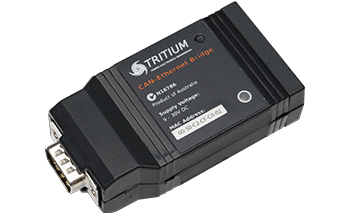

  
## Tritium CAN-Ethernet Bridge FAQ

The Tritium and Prohelion CAN Bus bridges are a widely used technology for Tritium and Prohelion customers. They bridge from CAN Bus to Ethernet, providing a reliable and scalable mechanism to easily connect a PC or Ethernet based device to a CAN Bus based device. 

**They are also a common source of challenges, particularly for new users.**

This guide is designed to explain some of the fundamental concepts behind the bridges and how to get the most out of this very capable piece of hardware.

Before diving in to the bridge itself it is work being familiar with some of the networking concepts involved. Even if you are very familiar with [UDP](https://en.wikipedia.org/wiki/User_Datagram_Protocol), [TCP](https://en.wikipedia.org/wiki/Transmission_Control_Protocol), [DCHP](https://en.wikipedia.org/wiki/Dynamic_Host_Configuration_Protocol) etc, it is worth skim reading the next section as some of the concepts  impact the most common issues encountered with the bridges in everyday use.

Also it is important to note that while this guide covers both the Tritium and [Profinity](../../..//Profinity/Overview.md) tools, we would recommend that if you are using the current Tritium tools have a look at [Profinity](../../../Profinity/Overview.md) and use [Profinity](../../../Profinity/Overview.md)  wherever possible, it gets regular updates and has a lot of features designed to make your life easier and this whole experience of using the bridges a lot more reliable. The Tritium CAN Bus tools while not End of Life are functionally stabilised and unlikely to see further updates.

Prohelion is developing these tools in collaboration with Tritium so you’ll get access to the best of both worlds.

If you are still having issues with your CAN-Ethernet Bridges after reading this guide then please feel free [to get in Contact with us](https://www.prohelion.com/contact-us/)