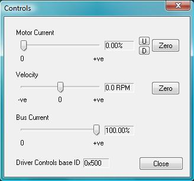

# Control

The purpose of the control dialog box is to provide a basic driver controls interface, allowing the system to be tested. It is not meant to be used to actually drive a vehicle on the road. Figure 2 shows a screen shot of the interface.

Figure 2: Control Interface

In order to control the motor, three setpoint sliders are provided with text boxes to the right of the sliders displaying the selected setpoint. Fine movement of these sliders can be achieved using the keyboard as shown in Table 3.

The __Motor Current__ slider of Figure 2 controls the motor current setpoint, and ranges from 0 to 100% of the maximum current setpoint in the configuration file. Fine control of the motor current setpoint is available using the __U__, __D__ and __Zero__ buttons to the far right.

The __Velocity__ slider of Figure 2 controls the vehicle velocity setpoint. The setpoint is in RPM and is displayed in the text box to right of the slider. If this slider is pulled below the actual vehicle speed the controller will regenerate in an attempt to slow the vehicle. If the slider is pulled above the actual vehicle speed the controller will drive with more current in an attempt to increase vehicle speed. The rate at which the vehicle will slow or speed up will be limited by the motor current or other setpoints. __DO NOT REGEN__, if you are using a power supply to feed the WaveSculptor bus, this may damage the supply.  Avoid regen by always setting the motor current to zero before changing the velocity.

The __Bus Current__ slider of Figure 2 controls the DC bus current setpoint, and ranges from 0 to 100% of the maximum current setpoint in the configuration file.

The keyboard can also be used to move the sliders, with the key mapping in the table below:

| Key           | Functional Description                                                   |
| ------------- | ------------------------------------------------------------------------ |
| `Up Arrow`    | Increases motor current setpoint by 0.1%                                 |
| `Down Arrow`  | Decreases motor current setpoint by 0.1%                                 |
| `Space Bar`   | Zeros motor current setpoint                                             |
| `Right Arrow` | Increase vehicle velocity setpoint by 0.1%                               |
| `Left Arrow`  | Decrease vehicle velocity setpoint by 0.1%                               |
| `Enter`       | Zeros the vehicle velocity setpoint (will regen at the current setpoint) |
| `a`           | Increase bus current setpoint by 0.1%                                    |
| `z`           | Decrease bus current setpoint by 0.1%                                    |

Table 3: Controls screen keyboard interface