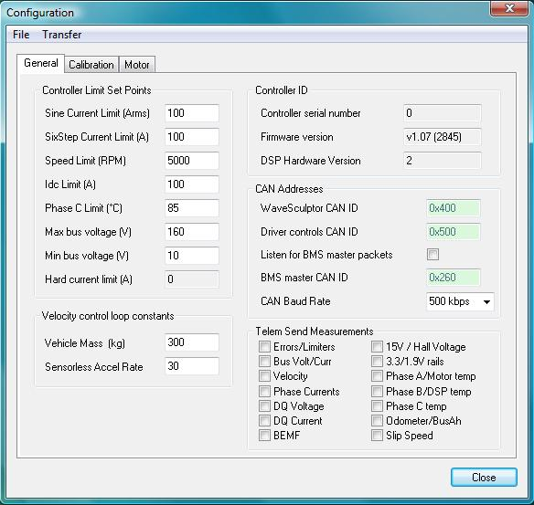
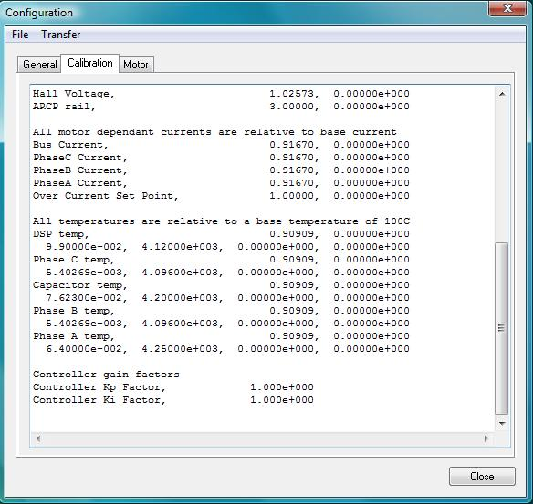
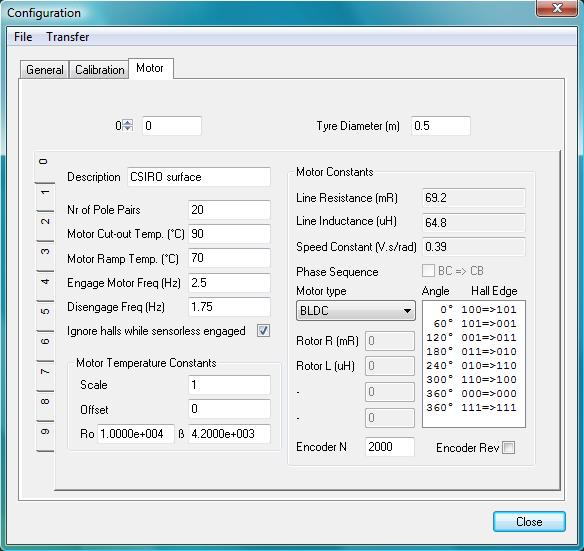

# Configuration

The configuration screen shown in Figure 3 provides four main functions: Load and save to PC or WaveSculptor. The load and save functions are under the File menu, provide a means of storing the configuration file on the PC for backup purposes. You should backup your configuration files just as you would any other file. If the configuration file on the WaveSculptor is somehow corrupted you will be able to restore to a known good version with a backup. If using the latest release of the software and firmware, configuration files are  interchangeable between WaveSculptors, __BUT the existing configuration must be first downloaded in order to integrate the configuration constants with the file.__

The transfer functions move the information from all configuration tabs to and from the WaveSculptor. The upload and download progress is reflected in a separate popup-window as mentioned in the [Observation](10_Observation.md) section.

The configuration screen consists of three tabs. The first contains general controller information that the user is free to adjust, the second contains calibration data set in the factory and the third tab contains motor information, also adjustable by the user.

## General Configuration

Figure 3 shows the general controller information tab. 

Figure 3: WaveSculptor General Configuration Tab

Table 4 gives a description of the different configuration values and the impact they have on the WaveSculptor operation.

| Value                                 | Description                                                                  |
|---------------------------------------|------------------------------------------------------------------------------|
| `Sine Current Limit (Arms)`           | Represents the 100% motor current setpoint. In sine mode all three phases are switching and the current target on every phase will be a percentage of this current.                                  |
| `SixStep Current Limit (A)`           | Represents the 100% motor current setpoint while in six step mode. In sixstep mode only a pair of phases is switching at any one time and the current target through these two phases will be a percentage of this current.                                                                                            |
| `Speed Limit (RPM)`                   | The maximum motor speed setpoint                                             |
| `Idc Limit (A)`                       | Represents the 100% bus current setpoint.                                    |
| `Phase C Limit (Heatsink Limit) (°C)` | The motor current will be reduced if the heatsink temperature nears this setpoint.                                                                                                              |
| `Max bus voltage (V)`                 | The controller will attempt to limit regeneration current if this setpoint is exceeded.  Below this voltage, full current will be available.                                                         |
| `Min bus voltage (V)`                 | The controller will attempt to limit drive current if the bus voltage falls below this setpoint.  Above this voltage, full current will be available.                                              |
| `Hard current limit (A)`              | The setpoint for the hardware based current comparators. This is not adjustable and may not read correctly for a second or two after reset.                                                 |
| `Serial Number`                       | Uniquely identifies the controller. Set during manufacture. Should match the serial number on the case.                                                                                             |
| `Firmware Version`                    | Version of firmware running on the DSP in the controller. The number is parenthesis is the firmware build number.                                                                              |
| `Hardware Version`                    | Version of control board in the WaveSculptor.                                |
| `Base Address`                        | The CAN identifier that the WaveSculptor will send all its CAN packets relative to. The edit box will force the address to a multiple of 32.                                                  |
| `Driver Controls Base Address`        | The CAN identifier that the WaveSculptor will expect to receive driver controls CAN packet relative to. The edit box will force the address to a multiple of 32.                              |
| `Listen for BMS master packets`       | Tick to listen to maximum and minimum cell voltages from a Prohelion BMS master. Not available at present.                                                                                      |
| `BMS master address`                  | The CAN identifier that the WaveSculptor will expect to receive BMS CAN packet relative to. The edit box will force the address to a multiple of 32.                                           |
| `CAN baud rate`                       | The CAN baud rate the WaveSculptor will use.                                 |
| `Vehicle Mass`                        | The total mass of the vehicle. Directly affects the velocity control loop. Vehicle mass is used to calculate the P and I terms in the velocity loop. Drop this mass to 30 – 50kg for testing a motor by itself on the bench.                                                                                          |
| `Send Measurement Flags`              | Enables/Disables the periodic broadcast of the associated measurements. Each flag will affect two measurements, as each measurement CAN packet contains two measurements.                           |

Table 4: Description of values of the general configuration screen 

## Calibration Configuration 

This dialog tab is read-only in the release version of the software. It contains all the scale, offset and thermistor data for all the WaveSculptor sensors. There should be no need for the end user to access variables in this dialog box. 

Figure 4: WaveSculptor Calibration Configuration Tab

## Motor Configuration

Configuration values for up to 10 different motors can be configured on this tab, shown in Figure 4. This allows complete testing and setup for all motors that you expect to use in the vehicle, while still in the workshop.

Figure 5: WaveSculptor Motor Configuration Tab

A description of each motor configuration value along with its effect on the system, is given in Table 4:

| Value                    | Description                                                                              | 
|--------------------------|------------------------------------------------------------------------------------------|
| `Active Motor`           | The index to the motor config tab that the WaveSculptor will use by default (in the absence of a valid ActiveMotor CAN packet being received). THE SELECTED MOTOR CONFIG TAB HAS NO BEARING ON THE ACTIVE MOTOR IN THE WaveSculptor.                                                                                            |
| `Tyre Diameter (m)`      | Outside diameter of the drive tyre. Used for speed calculation. If motor is geared, scale this value by the gear ratio.                                                                                         |
| `Description`            | Free text description of the motor.                                                      |
| `Nr of PolePairs`        | The number of magnet north-south pairs on the rotor of the motor                         |
| `Motor Cut-out Temperature (°C)` `Motor Ramp Temperature (°C)` | The controller will linearly reduce its current limit from the configured limit at 'Motor Ramp Temperature' to 0A at 'Motor Cut-out Temperature'.                     |
| `Engage Motor Freq (Hz)` | The motor must reach this frequency (in revolutions per second) before the feedback from the sensorless position  algorithm is used instead of the hall position feedback.                                     |
| `Disengage Freq (Hz)`    | Below this motor frequency (in revolutions per second) the feedback from the sensorless position algorithm is ignored and the position feedback from the hall sensors is used.                                |
| `Ignore halls which sensorless engaged`                 | If this box is ticked, the controller will ignore any error between the position feedback of the sensorless algorithm and the motor hall effect sensors. If not ticked the controller will revert to using feedback from the hall effect sensors in the case of a large discrepancy between the two position feedback systems.  In most situations, ticking this box will be advantageous, as the position estimation routines used by the motor controller are more accurate than the output of most motor hall position sensors.                                                                                                              |
| `Motor temperature scale` `Motor temperature offset` | Applied directly to the raw ADC reading: tempVolt = scale*(rawTempVolt + offset)                                                                                          |
| `R``0` `β` | Required if using a thermistor type motor temperature sensor. The thermistor datasheet should specify R0 and β. Where R0 is the thermistor resistance at T0=250C |
| `Line Resistance (mR)`   | Motor line to neutral resistance as calculated by ParamExtract.                          |
| `Line Inductance (uH)`   | Motor line to neutral inductance as calculated by ParamExtract.                          |
| `Speed Constant`         | The RMS voltage induced across the motor phase winding at 1 radian per second. Measured phase relative to neutral.                                                                                            |
| `Phase Sequence`         | Ticked if phase C leads phase B while the motor is rolling forward. Used in the control system. Set by PhasorSense and is read-only in the release version of the interface software.                         |
| `Hall Transition Table`  | The first six entries represent actual transitions, the last two entries are the unused hall combinations. The transition angle is in degrees and the hall transition is in [last hall] => [new hall] format. Set by PhasorSense.                                                                                                   |
| `Motor Type`             | Three different types of motor are selectable: BLDC, Induction or IPM. The settings below this drop down box have different meaning for different motor types.                                                  |

| BLDC Motor Type (PM motor with no overspeed [constant power regain] capability) |          |
|---------------------------------------------------------------------------------|----------|
| `Rotor R (mR)`                                                                  | Not used |
| `Rotor L (uH)`                                                                  | Not used |

| Induction motor type |                                          |
|----------------------|------------------------------------------|
| `Rotor R (mR)`       | Rotor resistance calculated by ImExtract |
| `Rotor L (uH)`       | Rotor resistance calculated by ImExtract |
| `Min Id (Apk)`       | -                                        | 

| Value          | Description |
|----------------|-------------| 
| `Max Id (Apk)` | The control system will keep the flux producing current (Id) between Min Id and Max Id at all times. Max Id is a motor parameter and should be set as high as possible without saturating the iron in the motor. Min Id controls the amount of over speed, the smaller the Min Id the more over speed. Typical defaults will be around 20A and 5A.                            | 

| IPM (Interior Permanent Magnet) motor type |          |
|--------------------------------------------|----------|
| `Rotor R (mR)`                             | Not used |
| `Rotor L (uH)`                             | Lq inductance of the IPM motor, whereas the Line inductance is the Ld inductance of the IPM motor.                            |
| `IdO (A)`                                  | TBD      |
| `Id m (A/Atot)`                            | TBD      |

Table 5: Description of values on the motor configuration screen