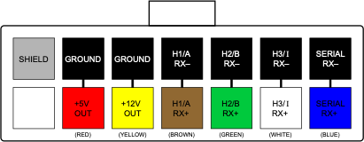

# WaveSculptor Motor Interface Type 2: Encoder and Thermistor

This document describes the function, interface and properties of the WaveSculptor motor interface circuit, type 2.

# Position Sensor

## Type

The type 2 interface reads three channels of position information from a __quadrature encoder position sensor__ with __differential outputs.__  Each channel is passed through to the differential receiver in the WaveSculptor, terminated with approximately 150 ohms between each + and – pair.

## Power

5V DC is provided to run the encoder.

## Connector

The connector used for the motor sense signals is a 10-way 3mm pitch Molex MicroFit connector.  The pinout is shown below, as viewed from the wire side – as you would look at it while inserting crimps.  

<figure markdown>

<figcaption>Position Sense Connector</figcaption>
</figure>

# Temperature Sensor

## Type

The type 6 interface reads a single channel from an __NTC thermistor.__  Linearisation is provided in hardware on the motor interface circuit, with further scaling, offset and B curve correction being provided by the WaveSculptor, with inputs from the calibration software and the user.

## Input

By default, the linearisation is provided for a 100k @ 25°C sensor, but this can also be chosen as a factory option for different values, such as the relatively common 10k @ 25°C parts.

## Connector

The connector used for motor temperature sense signals is a 2-way 3mm pitch Molex MicroFit connector.  The pinout is shown below, as viewed from the wire side – as you would look at it while inserting crimps

<figure markdown>

<figcaption>Temp Sense Connector</figcaption>
</figure>

# Motor Controller Interface

The interface to the WaveSculptor motor controller is provided using differential signal pairs transmitted by the motor interface, with three being received by timer channels in the WaveSculptor, and one being received by a serial UART peripheral.  Regulated 5V and 12V power is provided by the WaveSculptor for use by the motor interface circuitry and sensors.

## Connector

The connector used for motor sense signals is a 14-way 3mm pitch Molex MicroFit connector.  The pinout is shown below, as viewed from the wire side – as you would look at it while inserting crimps.  

<figure markdown>

<figcaption>Motor Controller Connector</figcaption>
</figure>

## Wiring

The wiring for this connector must be implemented with twisted pairs, as the signal inputs are differential.  Prohelion strongly recommends using Belden 9506 type cable (shielded 6 pair) for this connection, with suggested cable colours shown above.  

# Installation

## Position

To minimise the length that low-powered signals from the position and temperature sensors have to travel, install the interface board as close to the motor as possible, usually inside the motor terminal box.  Insulate it with heatshrink or similar if necessary.

## Wiring

Wire a straight-through cable from the WaveSculptor to the motor interface board 14-pin connectors, using the twisted-pair cable recommended in the previous section.

Wire the position sensor to the 10-way connector.

Wire the temperature sensor to the 2-way connector.

# Mechanical

The motor interface is supplied as an unenclosed PCB of dimensions 37x25mm.  Approximate height including connectors is 12mm.