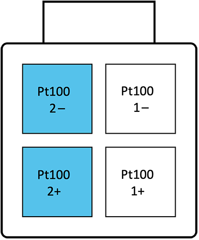

# Temperature Sensor

## Type

The type 3 interface reads two channels of temperature information from __Pt100 platinum elements. __ Scaling and offset corrections are provided by the WaveSculptor, with inputs from the calibration software and the user.

## Input

By default, the sense circuitry is configured for 100 ohm platinum sensors (Pt100), but this can also be chosen as a factory option for different values, such as the relatively common 1000 ohm (Pt1000) types.

The motor interface board only sends a single temperature reading to the motor controller, and chooses the highest temperature reading from channel 1 or channel 2 to send.  If not using one of the temperature channels, please fit a dummy resistor of around 100ohms to simulate a low temperature reading for that channel.  

## Connector 

The connector used for motor temperature sense signals is a 4-way 3mm pitch Molex MicroFit connector.  The pinout is shown below, as viewed from the wire side – as you would look at it while inserting crimps.  

