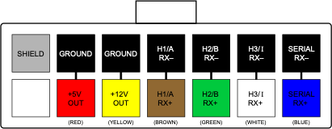

# WaveSculptor Motor Interface Type 3: Resolver and pt100

This document describes the function, interface and properties of the WaveSculptor motor interface circuit, type 3.

# Position Sensor

## Type

The type 3 interface reads position information from a __sin/cos resolver position sensor with analog outputs__.

## Drive

The interface board drives the resolver with a sinusoidal excitation signal of approximately 7V pk-pk at a frequency of 10kHz.  This amplitude and frequency is factory settable to other options so can support other types of resolver if necessary.  

These drive signals are commonly shown in resolver datasheets as:

*   R1(Exc+)
*   R2(Exc–)

## Sense

Two channels of differential analog input are used, for the sin and cos sense windings.  

These signals are commonly shown in resolver datasheets as:

*   S1 (Sin+)
*   S3 (Sin–)
*   S4(Cos+)
*   S2(Cos–)

## SHIELD

Resolver signals can be quite sensitive to noise and therefore attention should be paid to shielding. 

The motor interface board provides two possible shield signals:

1. ground, and 
2. a shield generated from the average voltage of the Sin and Cos waveforms.  If using a single-shielded cable, terminate the shield to the SHIELD pin, although terminating to GND will usually work equally well.

If using a dual shielded cable, terminate the inner shield to SHIELD, and the outer shield to GND.

## Resolver Mount

To help prevent noise pickup from capacitive coupling, the resolver should be mounted such that its body is isolated from the motor frame.  Do NOT tie the SHIELD or GND pins to the motor frame.

## Connector 

The connector used for the motor sense signals is a 8-way 3mm pitch Molex MicroFit connector.  The pinout is shown below, as viewed from the wire side – as you would look at it while inserting crimps

<figure markdown>

<figcaption>Position Sense Connector</figcaption>
</figure>

# Temperature Sensor

## Type

The type 3 interface reads two channels of temperature information from __Pt100 platinum elements. __ Scaling and offset corrections are provided by the WaveSculptor, with inputs from the calibration software and the user.

## Input

By default, the sense circuitry is configured for 100 ohm platinum sensors (Pt100), but this can also be chosen as a factory option for different values, such as the relatively common 1000 ohm (Pt1000) types.

The motor interface board only sends a single temperature reading to the motor controller, and chooses the highest temperature reading from channel 1 or channel 2 to send.  If not using one of the temperature channels, please fit a dummy resistor of around 100ohms to simulate a low temperature reading for that channel.  

## Connector 

The connector used for motor temperature sense signals is a 4-way 3mm pitch Molex MicroFit connector.  The pinout is shown below, as viewed from the wire side – as you would look at it while inserting crimps.  

<figure markdown>

<figcaption>Temp Sense Connector</figcaption>
</figure>

# Motor Controller Interface

The interface to the WaveSculptor motor controller is provided using differential signal pairs transmitted by the motor interface, with three being received by timer channels in the WaveSculptor, and one being received by a serial UART peripheral.  Regulated 5V and 12V power is provided by the WaveSculptor for use by the motor interface circuitry and sensors.

## Connector

The connector used for motor sense signals is a 14-way 3mm pitch Molex MicroFit connector.  The pinout is shown below, as viewed from the wire side – as you would look at it while inserting crimps.  

<figure markdown>

<figcaption>Motor Controller Connector</figcaption>
</figure>

## Wiring

The wiring for this connector must be implemented with twisted pairs, as the signal inputs are differential.  Prohelion strongly recommends using Belden 9506 type cable (shielded 6 pair) for this connection, with suggested cable colours shown above.  

# Installation

## Position

To minimise the length that low-powered signals from the position and temperature sensors have to travel, install the interface board as close to the motor as possible, usually inside the motor terminal box.  Insulate it with heatshrink or similar if necessary.

## Wiring

Wire a straight-through cable from the WaveSculptor to the motor interface board 14-pin connectors, using the twisted-pair cable recommended in the previous section.

Wire the position sensor to the 8-way connector.

Wire the temperature sensors to the 4-way connector.

# Mechanical

The motor interface is supplied as an unenclosed PCB of dimensions 60x25mm.  Approximate height including connectors is 12mm.