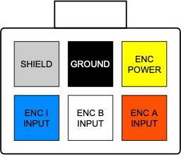
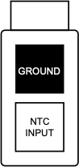
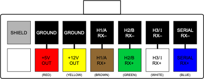

# WaveSculptor Motor Interface Type 6: Encoder and Thermistor 

This document describes the function, interface and properties of the WaveSculptor motor interface circuit, type 6.

# Position Sensor

## Type

The type 6 interface reads three channels of position information from a __quadrature encoder position sensor__ with __single-ended outputs.__ It provides each channel with a 10k pull-up resistor for use with open-collector sensors.

## Power 

Power is provided to the sensors, and this voltage is also used as the pull-up voltage for the three input resistors.  By default, the voltage provided is 12V DC, but this can also be chosen as a factory option to be 5V DC.  

## Inputs

Each input is sensed by a schmitt-trigger logic input with hysteresis.  Rising and falling input thresholds are at 2/3 and 1/3 of the power supply voltage.

## Connector

The connector used for the motor sense signals is a 6-way 3mm pitch Molex MicroFit connector.  The pinout is shown below, as viewed from the wire side – as you would look at it while inserting crimps.  

<figure markdown>

<figcaption>Position Sense Connector</figcaption>
</figure>

# Temperature Sensor

## Type 

The type 6 interface reads a single channel from an __NTC thermistor. __ Linearisation is provided in hardware on the motor interface circuit, with further scaling, offset and B curve correction being provided by the WaveSculptor, with inputs from the calibration software and the user.

## Input

By default, the linearisation is provided for a 100k @ 25°C sensor, but this can also be chosen as a factory option for different values, such as the relatively common 10k @ 25°C parts.

## Connector

The connector used for motor temperature sense signals is a 2-way 3mm pitch Molex MicroFit connector.  The pinout is shown below, as viewed from the wire side – as you would look at it while inserting crimps.  

<figure markdown>

<figcaption>Temp Sense Connector</figcaption>
</figure>

# Motor Controller Interface

The interface to the WaveSculptor motor controller is provided using differential signal pairs transmitted by the motor interface, with three being received by timer channels in the WaveSculptor, and one being received by a serial UART peripheral.  Regulated 5V and 12V power is provided by the WaveSculptor for use by the motor interface circuitry and sensors.

## Connector

The connector used for motor sense signals is a 14-way 3mm pitch Molex MicroFit connector.  The pinout is shown below, as viewed from the wire side – as you would look at it while inserting crimps.  

<figure markdown>

<figcaption>Motor Controller Connector</figcaption>
</figure>

The wiring for this connector should be implemented with twisted pairs, as the signal inputs are differential.  Prohelion recommends using Belden 9506 type cable (shielded 6 pair) for this connection, with suggested cable colours shown above.