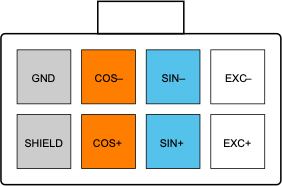

# Position Sensor

## Type

The type 7 interface reads position information from a __sin/cos resolver position sensor with analog outputs.__

## Drive

The interface board drives the resolver with a sinusoidal excitation signal of approximately 7V pk-pk at a frequency of 10kHz.  This amplitude and frequency is factory settable to other options so can support other types of resolver if necessary. 

These drive signals are commonly shown in [resolver datasheets]()? as:

*   R1(Exc+)
*   R2(Exc–)

## Sense 

Two channels of differential analog input are used, for the sin and cos sense windings.  

These signals are commonly shown in [resolver datasheets]()? as:

*   S1 (Sin+)
*   S3 (Sin–)
*   S4(Cos+)
*   S2(Cos–)

## SHIELD

Resolver signals can be quite sensitive to noise and therefore attention should be paid to shielding. 

The motor interface board provides two possible shield signals:

1. ground, and 
2. a shield generated from the average voltage of the Sin and Cos waveforms.  If using a single-shielded cable, terminate the shield to the SHIELD pin, although terminating to GND will usually work equally well.

If using a dual shielded cable, terminate the inner shield to SHIELD, and the outer shield to GND.

## Resolver Mount

To help prevent noise pickup from capacitive coupling, the resolver should be mounted such that its body is isolated from the motor frame.  Do NOT tie the SHIELD or GND pins to the motor frame.

## Connector 

The connector used for the motor sense signals is a 8-way 3mm pitch Molex MicroFit connector.  The pinout is shown below, as viewed from the wire side – as you would look at it while inserting crimps

