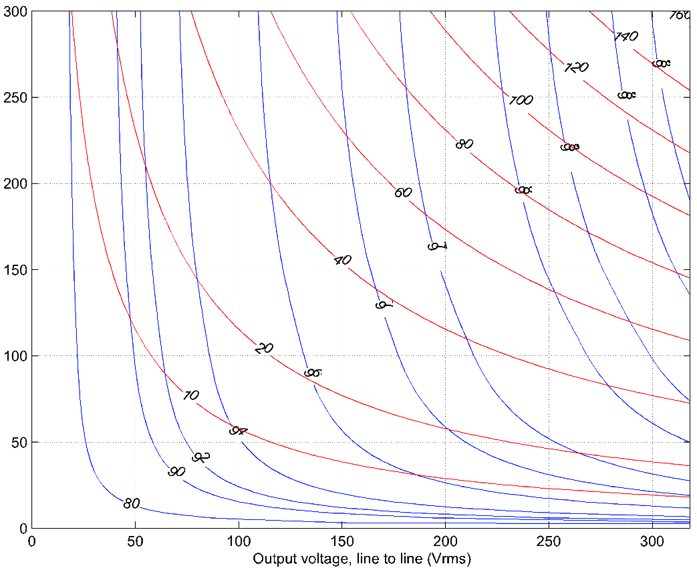

# Efficiency

To estimate an operating point efficiency of the WaveSculptor, refer to the efficiency maps below.  These plots are generated for DC bus voltages of 450V and 200V respectively.

The efficiency (in percent) is shown using the blue lines, and the power being processed by the WaveSculptor (in kW) using the red lines.  

As an example, a vehicle with a 450V DC bus may operating at 250 Vrms output voltage and 150 Arms output current.  The graph shows that at this point, the WaveSculptor will be processing 65 kW of power at just over 98% efficiency.

Figure 1: Predicted Efficiency map of the WaveSculptor controller with a 450V DC Bus

Figure 2: Predicted efficiency map of the WaveSculptor controller with a 200V DC Bus

These efficiency maps were generated using an accurate mathematical model of the WaveSculptor’s power stage, with individual loss components confirmed using laboratory testing.