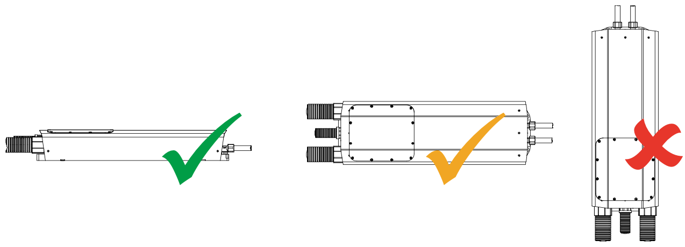

# Environmental

The WaveSculptor controller is environmentally sealed against water and dust ingress, when mounted according to the [User Manual](http://localhost:4000/WaveSculptor_Motor_Controllers/User_Manual/index.md)  

To reach the specified IP rating, please note that the conduit fittings on the front of the WaveSculptor must be permanently glued to the conduit, using a PVC cement.  

| Environmental rating (conduit glued): | IP65 | Note 27 | 
| Environmental rating (conduit push-fit only): | IP54 ||

#### Notes:

27) The acceptable mounting positions as detailed in the [User Manual](http://localhost:4000/WaveSculptor_Motor_Controllers/User_Manual/index.md) are shown below:

