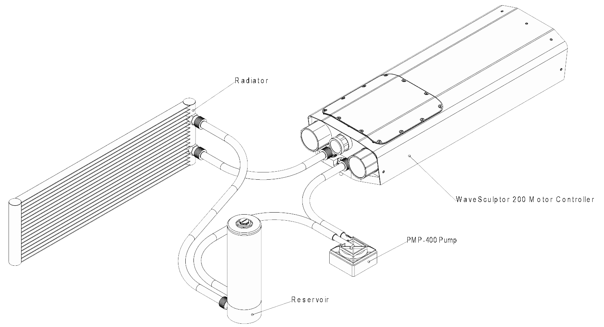

# Cooling

## Liquid Cooling Overview

The liquid cooling system consists of four main components. They are:

- WaveSculptor 200 waterblock
- Pump
- Radiator
- Reservoir

They should be connected as shown below. Tracing the liquid flow path around the circuit, the pump should be directly after the reservoir, to minimise dry running the pump when installing the system.  The radiator should be directly after the WaveSculptor, to cool the liquid as soon as possible and minimise the temperature that the pump is exposed to.

Additional components can be added to the system. Recommended items are:

- Flow sensor somewhere in the loop
- Level sensor in the reservoir

Having both of these extra items wired to an alarm/fault signal will guarantee that the motor controller is not operated without coolant flowing.

It is important to make sure that all items exposed to the coolant loop are either plastic or aluminium.  Using dis-similar metals (especially copper) in different parts of the cooling loop will result in corrosion and pitting of various items in the loop, with quite rapid failure likely.

The coolant system should be operated non-pressurised. A breather hole or an air space of at least 25mm (1”) should be left at the top of the reservoir to allow coolant expansion and contraction without pressure buildup.

## WaveSculptor Waterblock

The coolant flow path inside the WaveSculptor is a 'U' shape along one side from the inlet to the far end of the controller, across at the end, and back along the other side to the outlet.  

When mounted horizontally, it does not matter which way coolant flows in the waterblock, so connect the inlet and outlet in the way that simplifies the tube routing in your vehicle.

When mounted vertically (the middle picture in the [Choosing a Location](20_Mounting.md) section) then the inlet should be below the outlet.  Doing this will simplify bleeding air from the system.

## Radiator

Prohelion recommends an aluminium radiator of at least 120 x 360mm dimensions, such as Koolance part number __HX-1020__ and a pair of nozzles __NZL-V10P__ or __NZL-L10P__, for vertical or right-angle hose attachment.  This will need to be used with three 120mm fans, which should be rated for use in wet environments, as they will be exposed to road grime and spray.

The radiator should be mounted in the airflow path through the front of the car, to help with cooling.  If thermostatically controlled fans are used, a carefully chosen mounting location will minimise the time the fans are required to operate, therefore saving power.

## Pump

Prohelion recommends using a Koolance part number __PMP-400__ pump.  The specifications on this pump are 8.7 litres/min and 7m head (0.68 Bar, 68 kPa), and a 50,000 hour rated lifetime.  This pump is a good match for the pressure drop through the WaveSculptor water block, radiator, and several metres of 10mm ID tubing. 

A quality installation will use some form of monitoring on the pump speed feedback signal, to flag a fault in the event of slow or stalled operation.

It is important to never run the pump without coolant in the system, as dry operation for even a few seconds will dramatically reduce the lifespan of the pump.  This constraint means that the pump should be located below the level of fluid in the reservoir.

The PMP-400 pump does not require additional nozzles, having moulded push-fit barbs as part of the pump.  Make sure to secure the tubing to the barbs using cable ties or hose clamps.  Do not over-tighten if using hose clamps, as the pump barbs are plastic.

## Reservoir

A reservoir is necessary to allow for coolant contraction and expansion as the system heats and cools.  It also allows for time to notice and correct any leaks in the system before running the pump dry.  

The reservoir should be the highest component in the system, so that any air bubbles from other components will collect in the reservoir, not inside the waterblock or radiator.  

Prohelion recommends building a reservoir using Koolance parts __COV-TKBTM__ (base), __BDY-TK200__ (body), __COV-TKTOP__ (top lid), and a pair of nozzles either __NZL-L10P__ or __NZL-V10P__.  This reservoir holds more liquid than strictly necessary, but this allows for easier filling and air bleeding when installing the system.  Using a reservoir with a large top opening allows you to add coolant quickly as the pump sucks it from the reservoir when filling the system for the first time, without having to stop and start the pump.

A second option is a combined reservoir and pump, saving some space, fittings and tubing.  This can be constructed using Koolance parts __COV-RP400__, __PMP-400__, __BDY-TK200__, __COV-TKTOP__ & either __NZL-V10P__ or __NZL-L10P__.

## Tubing

Prohelion recommends using high quality 10mm ID / 13mm OD tubing, such as Koolance part number __HOS-10CL__.  This is also available in a range of colours.  High quality tubing will be far less likely to kink than standard cheap PVC tube, and also has less problems with softening at higher temperatures.  If a tight bend radius is required, consider using a spring wrap such as Koolance part __SPR-10BK__, which helps stop the tube kinking.

## Coolant

The coolant used in the system is critical for it's longevity.  A quality coolant designed for this application is required, to help with corrosion, foaming, heat transfer, and biological growth.  Automotive coolant fulfils the first three requirements, but not the last, as it gets hot enough in a vehicle engine to kill any bacteria, so a biocide is not required. If using automotive coolant in your system, an additional biocide will have to be added manually.

Prohelion recommends using Koolance liquid __LIQ-702BU-B__, which meets all requirements for the system.  This is also available in a range of colours

## Bleeding 

It is important to bleed all air from the system.  The pump and radiator are mostly self-bleeding, but the waterblock on the WaveSculptor requires some intervention by the user.

The coolant flow path inside the WaveSculptor is a 'U' shape along one side from the inlet to the far end of the controller, across at the end, and back along the other side to the outlet.

With the coolant filled and the reservoir close to full, start the pump.  Tilt the WaveSculptor by around 30° to allow air bubbles near the inlet to move to the far end of the controller.  Next, tilt it to the side, so that the air trapped at the far end moves to the outlet side of the waterblock.  Now, tilt the controller so the far end is down, and the air moves along the outlet side of the controller and exits through the outlet tubing.  Repeat this circular tilting motion until air stops exiting the controller.  You may need to top up the reservoir during this process, depending on how much air is purged from the waterblock.  

You may also need to perform a similar process with the radiator, depending on it's mounting location and position relative to the other components in the system.
