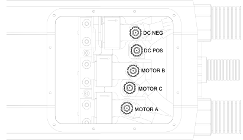

# High Power Connections

It is important to correctly terminate the high power wiring for successful long-term operation of the controller.  DC battery and AC motor phase connections should be crimped to bolt lug crimp terminals.  The copper studs in the busbars of the WaveSculptor have a metric M8 thread, so use a lug designed for this size bolt, with an 8.5mm hole.  

High power connections should not be soldered for vehicle applications, as the solder wicks up inside the copper strands and creates a stress point, which can fatigue and break due to the vibration present in a vehicle.  
For a guide to good quality crimping of the high power connections, please read [Appendix B](80_Appendix_B.md) of this document.

Copper oxidation is a threat to the long-term reliability of both the crimp and the bolted joint to the controller.  Use a thin smear of anti-oxidation electrical jointing compound between the busbar and the crimp lug when bolting the cable to the controller, as shown in the diagram below.  A small amount has already been applied in the factory to minimise corrosion in the time between manufacture and first assembly of the unit in your vehicle.

The copper pressfit studs are permanently attached to the busbars.  

To assemble the bolted joint follow these steps:

*   Apply a thin smear of electrical jointing compound to the busbar
*   Route the cable in through the conduit fitting and locate the crimp lug down over the stud
*   Place a plain (flat) washer and a spring washer on top of the lug
*   Thread a nut over the stud
*   Use a torque wrench to tighten the nut to 10Nm (7.5 ft.lbs)

## Cable 

The cable used to connect to the high power terminals must be rated for the full DC battery voltage as a minimum.  600/1000V cable is suitable.

The current rating of the cable will depend on your expected load and duty cycle for your driving habits in your vehicle.  The WaveSculptor bolt terminal area is designed to accept up to 35mm2 cable with an outside diameter of up to 13.5mm.  Prohelion suggests the use of at least 110°C rated PVC cable (note that standard PVC is 90°C rated) to allow a longer duration of peak power output without exceeding the cable temperature rating.  

The cable should have orange coloured insulation.  This is required by the NCOP14 standard for EV conversions in Australia, but is a good idea in any case.  This is what is used in the Prius and other hybrid vehicles, and emergency response personnel are trained to not cut through orange cables.  Use a short piece of red or black insulation at the ends of the orange cable to indicate polarity.

Use of flexible cable with a high number of fine strands is advised, to help with cable routing and reduce strain and fatigue on the terminations.  Prohelion recommends using “ZDFX” double-insulated 0.6/1kV 110°C rated cable from Tycab Australia, which is made with 1120x 0.2mm strands, resulting in a flexible cable.  It is available in orange insulation.  Similar cable will be available from alternative suppliers in other countries.

## Motor Inductance

The WaveSculptor requires a minimum of 50µH inductance (phase – neutral) per phase to operate correctly. Please ensure that sufficient external inductance has been added if your motor does not have at least this amount of inductance already.  External inductors will most likely only be required on ultra-high efficiency ironless BLDC type motors.

These external inductors must be rated to the full motor current and have windings insulated to the full DC bus voltage.

## High Power Connections

The positions of the busbars for the various connections are shown in the diagram below.  The recommended cable assembly order, to make cable routing inside the controller as easy as possible, is MOTOR C, MOTOR B, MOTOR A, DC POS, DC NEG.

## Testing

At this point, do not connect the other end of the high power DC NEG and DC POS cables to your precharge circuit or batteries.  You will need to connect them to a low-voltage supply of power for initial testing, which is detailed in the [Motor Setup & Testing](60_Motor_Setup_And_Testing.md) section of this document.

## Precharge

The WaveSculptor has 800µF of extremely low-impedance capacitance across the DC bus input connections. An external precharge circuit is <strong>mandatory</strong>.

When not driving a motor, the WaveSculptor draws minimal power from the DC bus, with only a high-value discharge resistor to bleed charge. Therefore, careful attention should be given when working on the controller to ensure that the capacitors have been discharged first.  Note that these capacitors hold over 80 Joules of energy and take up to 10 minutes to discharge to safe levels.

Prohelion can provide a circuit to implement the precharge function, as part of our Pack-Master BMS system.  Please refer to the product webpage for more information.  There are a variety of other ways to implement precharge, but many do not automatically check for faults and may overheat themselves in the event of a problem.

## Fusing

At least one appropriately rated fuse must be installed in the high voltage DC circuit.  This fuse must be rated to the highest expected DC voltage.  AC rated fuses are not appropriate unless they have a DC rating as well.  

Choosing the current rating of the fuse depends on your expected load, the maximum fault current in the battery system, duration of loads, cable sizes, and several other factors.  It is beyond the scope of this document to detail fuse selection for your vehicle.

Note that the WaveSculptor can be programmed to limit the current it draws from the DC bus connection, which may simplify fuse, contactor and wiring selection. However, this will also have the effect of limiting total system power throughput, so be aware that when setting it to less than 100% that you may compromise your vehicle performance.

## HV Isolation

The WaveSculptor has an isolation barrier rated to 1kV continuously between the CAN bus, the DC bus, and the Motor position connection. This helps minimise damage in the event of a fault, and also allows safe connection of the high voltage battery pack.

Prohelion recommends that the CAN bus be operated at the system ground potential, with CAN Ground connected to the vehicle chassis at some point in your system.

The battery ground, high-voltage DC connections, and motor phases should be isolated from the vehicle chassis. This is so that a single fault anywhere in the high voltage system will not result in a high voltage potential being present between any wiring and the chassis of the vehicle.

Please refer to any relevant regulations governing this type of connection, such as (in Australia) the NCOP14 standard for EV conversions.

