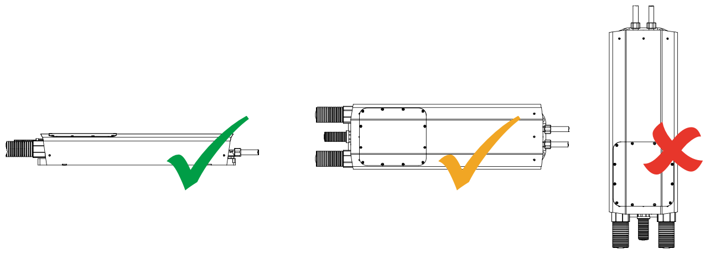
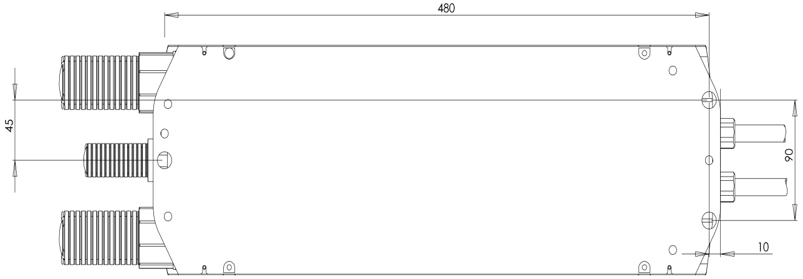

# Mounting

## Choosing a Location

Careful attention should be paid to positioning the WaveSculptor correctly, to ensure optimum performance.
The main criteria for choosing a good mounting location are vibration, water spray, cooling layout, and cable positioning.

Although the Prohelion WaveSculptor is rated for use in water spray environments, it is preferable to locate the controller in an area that won't be directly impacted with water jets coming in through the grille of your car at highway speeds.  Locating the WaveSculptor in the engine bay area is fine, but try to keep it out of the most exposed areas.

The Wavesculptor should ideally be mounted in a horizontal position, but vertical mount is also acceptable if the long axis of the controller is horizontal.  Do not mount the controller with the long axis vertical (ie, conduit exiting top or bottom) as water may pool in the end areas of the controller and eventually seep into the interior.  This position will also trap air in the cooling system.

The [Cooling section](Cooling.md) of this document has further details, but as an overview the controller should not be the highest point in the liquid cooling system, or bleeding the cooling system of air bubbles will be difficult.  Keep this in mind when choosing a location.

The WaveSculptor has been designed with all cables and connections to the device at one end, to allow simplified positioning in your vehicle.  The 40mm orange conduit that contains the motor and battery cabling can be quite stiff, and has a minimum bend radius of around 250mm.  Make sure your chosen position allows room at the connection end of the controller for conduit and cooling connections.

### Environmental

The WaveSculptor is rated to withstand water spray from any angle.  Meeting this rating requires permanently gluing the motor, battery and CAN bus conduit into their fittings in the end panel of the motor controller using standard plumbing PVC pipe cement.  

If the conduit is not glued, then a reduced environmental rating applies, where the controller is immune to low velocity splashing water only.  This may be acceptable if a mounting location is chosen carefully.

### Dimensions and Tolerances

Before final mounting of the controller in the vehicle, connect and fill the liquid cooling system as shown in the next section of this document.  The controller needs to be tilted to fully bleed air bubbles from the system.

The Wavesculptor is mounted with a three-point mount using rubber standoffs to help isolate vehicle vibration from the controller electronics.  Refer to the drawing below for mounting hole locations, which should be fitted with an M6 insert or nut.  

Three M6 thread shoulder screws and washers are provided with the controller for mounting purposes, and the shoulder design means that when fully tightened, the rubber grommet compression is correct – the shoulder on the screw prevents over-compressing the grommet.  Tighten these screws to 10Nm, using Loctite 243 or similar retaining compound to prevent them working loose.

