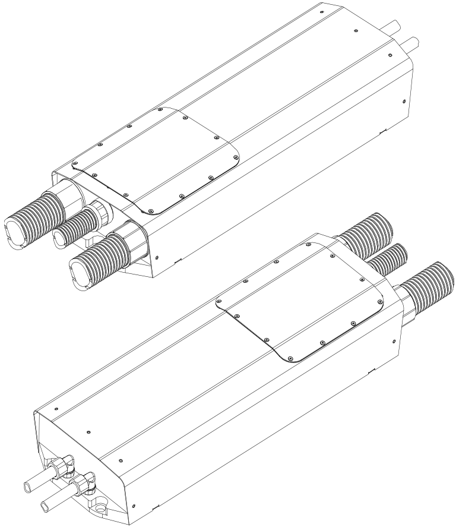

# WaveSculptor200 User Manual

This document describes the operation, connections, mounting, communications, cooling and how to get started with and use the Prohelion WaveSculptor 200 Motor Controller.

!!! danger "Danger" 
    This product processes and uses potentially lethal voltages and currents.  Do not provide power or operate with the cover removed. To be opened and connected to by authorised personnel only

