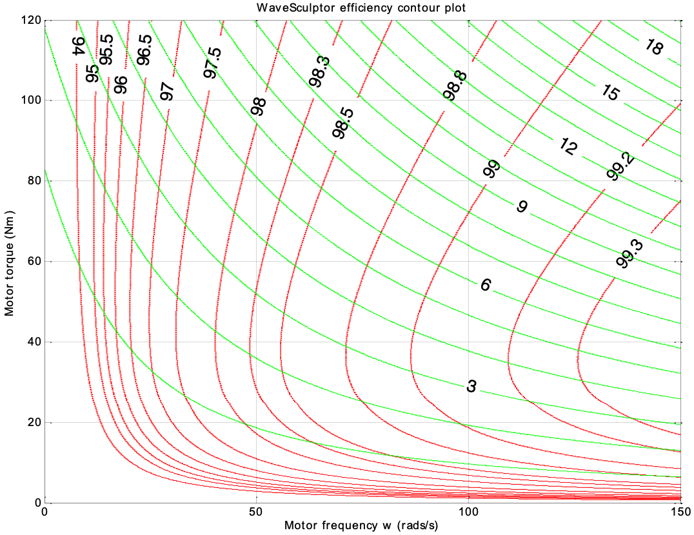

# Efficiency

To estimate an operating point efficiency of the WaveSculptor, refer to the efficiency map below.  This plot is generated for a DC bus voltage of 160V, assuming a CSIRO 'surface' type wheel motor.  Motor efficiencies are not included in the plot.

The efficiency (in percent) is shown using the red lines, and the power being processed by the WaveSculptor (in kW) using the green lines. 

In a typical solar car with a mass of 275kg and a wheel radius of 250mm, the maximum plot values of 150rad/s and 120Nm correspond to a maximum speed of 135km/h and an acceleration of 0.16g respectively.

As an example, for a typical highway cruise setting of 20Nm and 100rad/s, the power being processed by the Wavesculptor is just over 2kW, at an efficiency of just over 99%.

These efficiency maps were generated using an accurate mathematical model of the WaveSculptor’s power stage, with individual loss components confirmed using laboratory testing.
