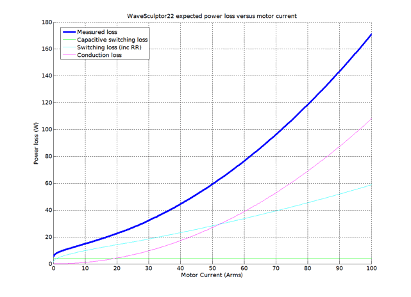

# Cooling

The WaveSculptor will usually require some form of external heatsinking.  The extent of this will depend on the ambient operating temperature, the motor current and duty cycle, and operating voltage.  Once these are known, the heat that is required to be removed from the controller can be calculated from its efficiency.

There will be a wide variety of possible cooling solutions, which is why the WaveSculptor has been designed for technically qualified users to choose their own optimal solution for their exact vehicle and use scenario.

The aim of the cooling solution provided by the end user is to keep the WaveSculptor cold plate temperature below the limit specified in the datasheet.  Above this point, the motor controller will automatically reduce the motor output current to protect itself, resulting in reduced performance for your vehicle.

## Efficiency

The power electronic switching devices in the WaveSculptor are MOSFETs, and the majority of loss in the motor controller comes from these devices.

All of these losses have a very strong relationship to input voltage and output current, and only a weak relationship (via ripple current) to output voltage.  This is an extremely useful observation for those wanting to produce a simple model of the losses in a MOSFET based motor controller.

### Test Methodology

To produce the efficiency curves in the [datasheet](http://localhost:4000/WaveSculptor_Motor_Controllers/Datasheet/0_Overview.md), and the modelling information in this document, the switching losses in the WaveSculptor were measured directly, by analysing the current and voltage switching waveforms.  

Conduction losses were simply derived from the measured phase to phase resistance of the WaveSculptor.

A high bandwidth system was used to acquire the switching waveforms, and data showing switching loss versus load current was then extracted.  Semiconductor parameters were then calculated from this data, producing best fit curves and hence functions that can be used to create an efficiency map over the entire operating area of the controller.  

### Power Loss

The power loss of the WaveScuptor operating with 160V DC bus voltage is shown in the diagram below:

### Predicting Loss

To allow solar racing teams to predict the WaveSculptor power loss, both for heatsink calculations and for race strategy algorithms, the following estimate of controller losses can be used:

Ploss = ReqIo2 + (αIo + β)Vbus + C𝑓eqVbus2

where:

*   Io: is the output current of the controller in Arms
*   Vbus: is the bus voltage (battery voltage) of the controller
*   Req: is the equivalent resistance of the entire controller
*   α: is the linear component of the switching loss (per unit of bus voltage)
*   β: is the constant component of the switching loss (per unit of bus voltage)
*   C𝑓eq: is the equivalent capacitance*frequency product of the entire controller

The table below gives the constants for WaveSculptor22:

| Constant | WaveSculptor22 MOSFETs:
|-------|-------|
| Req | 1.0800E-2|
| 𝛼 | 3.3450E-3 |
| β | 1.8153E-2|
| C𝑓eq | 1.5625E-4|

## Heatsink Requirements

Once the total motor controller loss can be calculated, an expected motor current and duty cycle is required to be able to calculate the heatsinking requirements of the controller.  This will depend on such things as the mass of the vehicle, rolling and aero resistance, and expected speeds and accelerations.  The more accurately this information is known, the more optimal the heatsink can be.

Two scenarios are outlined below: the continuous use case; and the short term peak power use case.

### Continuous Use

Say your vehicle uses a 160V DC bus, and requires 30A motor current continuously to maintain cruising speed on the highway.  The ambient temperature is high, at 40°C, and the maximum cold plate temperature specified in the datasheet is 70°C – please check the [datasheet](../Datasheet/0_Overview.md) for the correct value.

The graph above shows that at this voltage and current, the motor controller will be producing around 35W of loss.

To maintain the cold plate of the motor controller at or below the specified temperature, a cooling solution with a total thermal resistance to ambient of at least (70° – 40°) / 35W = 0.85°C/W is required.   

Assuming 0.05°C/W for thermal grease between the cold plate and heatsink, this means that a heatsink with a thermal resistance of at least 0.80°C/W is required.

This could be provided using an off-the-shelf comb section extruded aluminium heatsink with base dimensions approximately the same as the cold plate, and a 40mm fin depth, weighing around 1.5kg, using convection airflow only.

However, significant weight savings are possible by using a smaller fin depth, and force cooling with a fan.  Careful placement of the motor controller in the vehicle so that there is ambient airflow could mean that the fan is not required to run continuously, therefore saving considerable power.

Further improved alternatives are also available, requiring more integration with the vehicle.  An example would be an aluminium plate laminated into the skin of the vehicle, such that the outside is flush with the rest of the skin (to avoid turbulence), and having the motor controller fastened to the inside surface.  A plate of at least 2mm thick means that standard hex drive countersunk M4 screws can be used to fasten to the WaveSculptor, and remain flush with the outside surface.  The size of this plate can be chosen to give the required thermal resistance, with heat rejected directly to ambient air outside, flowing past at vehicle speed.  A solution like this can provide a very low mass cooling method.

Note that the above calculations are the minimum requirement.  Allowance should be made for higher than expected ambient temperatures, higher than expected power use, and an amount of thermal headroom before the motor controller's thermal protection activates.

### Short Term Peak Power Use

As a further example, say that your vehicle uses a 160V DC bus, and requires 80A motor current for two minutes to do a fast qualifying time.  The graph above shows that the motor controller will be producing around 120W of loss at this power level.  Ambient temperature is high, at 40°C, and the maximum cold plate temperature specified in the datasheet is 70°C – please check the [datasheet](../Datasheet/0_Overview.md) for the correct value.  Assume that the vehicle begins the qualifying lap with a heatsink at ambient temperature.

Heat from the controller in this type of scenario could possibly be stored, rather than immediately rejected to ambient.  In the situation above, the total energy required to be adsorbed by the heatsink is 120W * 120 seconds = 14.4kJ.  Using an aluminium block (specific heat = 0.897J/g°C) and a 30°C temperature rise would require a mass of m = Q/∆T.c =14.4kJ/30°C*0.897 = 535g.  Using a thin aluminium case containing water (specific heat = 4.186J/g°C, almost 5x better than aluminium) would reduce this mass to 115g.

Combining this type of heat storage device with the continuous use heatsink to ambient air will result in a cooling solution suitable both for constant lower power operation, and with the heat capacity to absorb peaks of high current operation.  

A combined system could be made with an all aluminium system, with a ~535g block mounted into the skin of the vehicle.  This provides a low-risk option.

Alternatively, other types of system such as one using a small volume of circulating water are possible, with the water providing both heat transport from the motor controller to an ambient cooling plate in the skin of the car, and also thermal mass to absorb short term high power use.  

## Mechanical Interface 

The WaveSculptor provides a large flat surface to attach to your cooling solution.  Refer to the [mechanical drawing](http://localhost:4000/assets/pdfs/WaveSculptor_Motor_Controllers/PHLN-3000-0036%20enclosure%20subassembly.pdf) for dimensions and details.
Use a thin layer of thermal grease or conformable thermal gap filler pad to fill any air gaps between the WaveSculptor cold plate and your heatsink, and provide the best thermal path between the two.  This material is not required to be electrically insulating.

Attach the heatsink to the cold plate using eight M4 screws threading into the tapped inserts in the motor controller base, making certain to note the maximum screw depth specified in the [datasheet](../Datasheet//0_Overview.md).  

    
<strong>Warning</strong> Exceeding this depth will force the screw into internal components of the motor controller, almost certainly damaging it.

